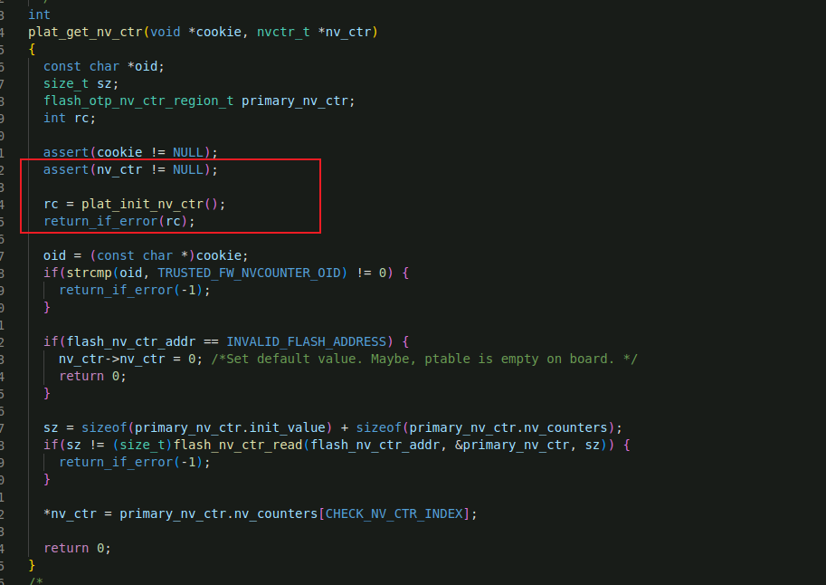
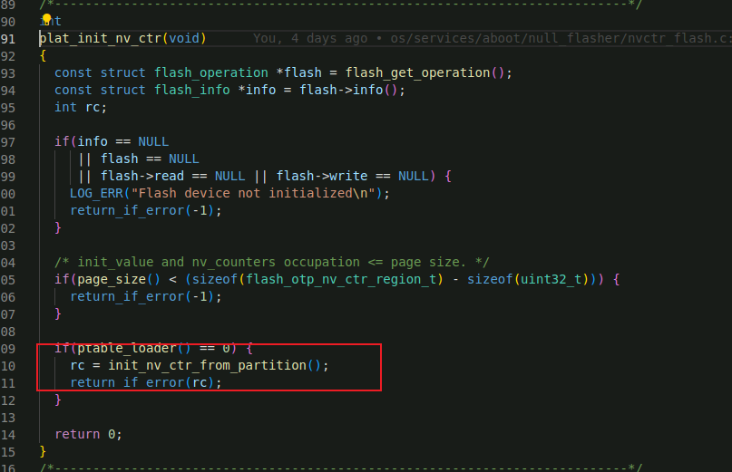
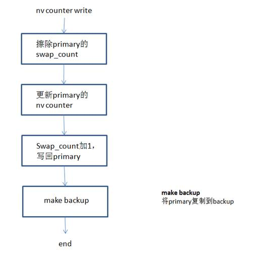
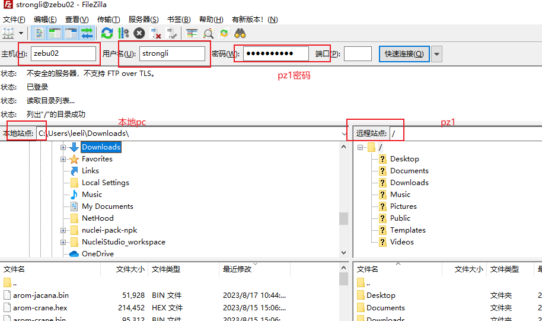
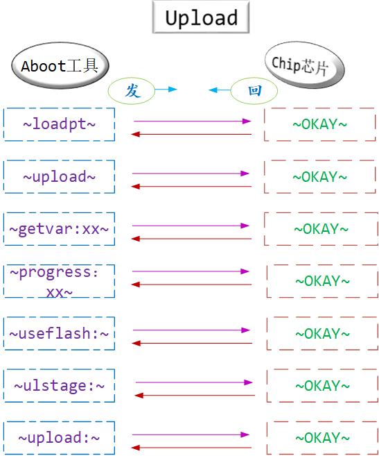
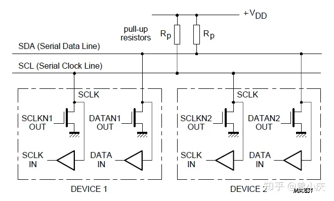

#### tips：

1. 常用命令可以写成脚本，省时省力

2. 脚本使用的时候注意，尽量写死生成文件，不要出现 $1 等传入参量，若有必要，则需要 echo 进行说明

3. 脚本名称一定要看出是做什么

4. 使用脚本完毕后，要通过时间来确定一下是否成功运行了(目前采用的是通过延时 2s，看是否复制成功了)

5. 整体的框架并不能有效建立起护城河，真正的护城河都隐藏在不起眼的细节中

   比如将大象转入冰箱需要几步这个经久话题，答案是三步，第一步，打开冰箱门，第二步，将大象放进冰箱，第三步，关上冰箱门。流程就这么简单，一看大概就知道，但其中的奥秘只有第二步——怎么将大象放进冰箱，才是护城河

   

6. 可以用错误码(宏定义）来反向说明出现的数字的含义

7. 养成总结的习惯，使用 START，总结一定是要 简单的，确定的，清晰的

8. 函数的参数一定要 check 类型

9. 改 addr size，首先要检查是否越界

10. 

---

#### 项目bug:

- 5316 flash 烧写后无法启动：clk 频率不对，下次首先检查手册中的频率
- hoopoe pcie下载失败：pcie 的 ctrl_bar 不对，需要首先检查 bar 的映射， fw 的 size 不对

---

#### burn flash


流程：bootrom -> bootloader

arom-jacana:bootrom

vector.s -> startup.c -> contiki-main.c  # vector.s, startup.c 启动代码，设置必要的中断向量号，中断入口等

-> platform_stage1 -> clock_init -> ...  # stage1：interrupt_init, dma_init, 另外与 process 有关的移步 contiki-ng 介绍

-> platform_stage2					   # stage2: smux_init(**uart**, **usb**), print_chip_info(打印一些必要log)

-> platform_stage3					   # stage3: flash_probe_init, download_key_detect, **bootctl_prepare**, set_boot_mode

-> main_process 						 # get_boot_mode(previous set)


接下来，区分下载和启动

download:

-> smux_register_preamble_callback	   # 注册 main_preamble_callback，用于接收到 UUUU 后回复

-> smx_running_mode_set				  # 用与检测 uart 还是 usb

​	->**uart_check_process**				 # 检测串口波特率，用于 下载、打 log

-> aboot_cmd_exit/aboot_cmd_init		 # 初始化 cmd_list

-> aboot_download_scratch_set			# 设置 download_base, download_size, division

-> sb_bl2_image_setup					# 设置 image 的 addr， size

-> aboot_start						   # 用于注册 aboot_cmd_cb，aboot_data_cb, aboot_boot_cb, start aboot_process

   aboot_process:						# uart_rev_irq 用于判断接收到是 cmd 还是 data

   if cmd -> fastboot_cmd_loop_once     # call cmd_xxx

   else -> fast_download_data 		  # 用于将 aboot 工具发送的数据 copy 到指定区域（memory），下载需要在 bootloader 里面

现在开始 aboot 工具跟 chip 交互，具体请移步 burn flash 介绍

简单总结就是，依次 发送 getvar, download, verify 等

-> cmd_download 						 # 用于设置 downloa_base = alloc = lds(scratch)

-> cmd_verify							# 用于验证 hash，signature 等，同时将 decode lzma 解压到指定位置

-> cmd_call                            # call main(可以是 flash main，也可以是 preboot main，看 aboot 发送的是哪个 bin)

执行完 main 后又回到 bootrom，aboot 工具再次发送 bin

如此反复，直到 all done


boot：

-> bl1_main()							 # 用于导入 preboot，boot2 等来执行

​	-> exec_image						 # 执行 image

​										  # 此时分情况是否返回，boot2 进入后可能就直接 call firmware 了

整个流程：bootrom -> bootloaer(flasher) -> firmware(execute)


> 注意：每个 cmd 格式：如`~}#download~`，为方便，省略最后的 `~`
>
> bootrom 流程中，getvar有多个选项，依次为 version，version-bootrom，platform，boardid，product，progress，max-download-size(bootloader 中 sz)，chip 依次回复各个信息
>
> 具体查看下面的详细流程

---

bootrom运行：

- chip 从 contiki-main.c 开始顺序执行

- 首先进行必要初始化，如 platform， etimer，process 等

  - platform_init_stage_one(): 进行 interrupt_init()
  - platfrom_init_stage_two(): 进行 smux_init()，print_chip_info()
  - platform_init_stage_three(): sys_boot_mode_set()

- 打印 INFO 后，执行 autostart_start()，会 call main_process(arom-jacana.c)

- main_process 中先 register main_preamble_callback，执行 sys_boot_mode_get()，mode 在 platform_three 中有设置；接着等待 ev

- aboot 工具发送 ~UUUU~(*2)，chip 在 smux.c 接收数据并做判断

  - smux_process_incoming_data: call _end_fo_frame，根据 ~ 检测是否协议头？若是，call main_preamble_callback
  - main_preamble_callback: 当接收到 ~ 时，判断 1）~UUUU~ ？若是，则回复 ~UABT~，2）~UABT~ ？若是则 post main_process，回复 ~UABT~， 3)否则标识为 unknown

- sumx 处理接收到的指令: smux_process_incoming_data 和 _end_of_farme

  - smux_process_incoming_data: 当接收到指令后，调用
    1) '~' -> in_frame: framesize = 0；
    2) '}' -> sumx->state = IN_ESCAPE
    3) '#' -> smux->frametype = SMUX_FARME_TYPE_ABOOT_CMD
    4) 'x' -> 进入 _handle_char，smux->rxbuf 保存收到的 cmd
    5) '~' -> framesize ≠ 0，call _end_of_frame
  - _end_of_frame: 判断指令是 cmd 或者 data 还是其他，callback

- aboot 工具发送 ~UABT~，chip 回复 ~UABT~，并 post main_process

- main_process 继续执行，会先进入 sum_write_heart_beat()，然后执行下个 case

  - smux_write_heart_beat(): 输出 ~}%H，etimer 每 300ms 触发一次
  - aboot_command_init(): 注册 cmd ，同时注册 chip 基本信息到 varlist 
  - aboot_download_scratch_setup(): fastboot_block_init，设置下载的基本信息
  - sb_bl2_image_setup(): 设置 image 基本信息，主要是设置地址，其余是预设的
  - null_flasher_init(): register flasher_process，一个基本 process，不跑
  - 执行 aboot_start()

- aboot_start 中 依然是进行初始化，如 flasher_msg, aboot_callback 等，最后执行 flasher_process 和 aboot_process 

  - flasher_message_pool_init(): 主要在 bootloader 中等 msg
  - smux_register_cmd_callback(): 当收到 cmd 命令的时候，post aboot_process
  - smux_register_data_callback(): 当收到 data 后， post aboot_process

- aboot_process 主要等待 aboot 工具发送指令，检测到 ~}# 后，'#'-> cmd

- aboot 工具发送 #getvar:version，chip 回复 #OKAY_0.6 

- aboot 工具发送 #getvar:version-bootrom，chip 回复 #OKAY_2023.04.20

- aboot 工具发送 #getvar:platform，chip 回复 #OKAY_FPGA

- aboot 工具发送 #getvar:boardid，chip 回复 #OKAY_(空)(未定下来)

- aboot 工具发送 #getvar:product，chip 回复 #OKAY_arom-tiny

- aboot 工具发送 #progress:87000， chip 回复 #OKAY_(空)

- aboot 工具发送 #getvar:max-download-size，chip 回复 #OKAY_size

  - cmd_getvar: 用于打印 chip 的基本信息，通过 fastboot_publish 来注册

- aboot 工具发送 #download:size(实际上~}#xxx~，简写，下同)，chip 回复 #DATA:xxxh，base 地址为 fast_block_alloc 中获取

  - cmd_download: 解析并设置 download_base 地址，与回复 #DATA:xxxh

- aboot 工具发送 data，aboot_process 收到 data 类型，将其 memcpy 到指定位置，回复 #OKAY

- aboot 工具发送 #verify:，chip 验证 fip，hash，signature，并 decode lzma 到指定位置，回复 #OKAY

  - cmd_verify: call auth_load_memory_image，验证 lzma 解压，解压完成后 memmove 到指定地址

- aboot 工具发送 #call：，chip 回复 INFO

  - cmd_call: 直接 call bootloader(flash main/ preboot main)，执行结束后返回 bootrom

  

- 重复执行 download, verify, call 流程，直到 all done，循环 发送心跳包

- 

  


---


bootloader运行：

- 首先，bootrom 中 call flasher 的地址，该地址是 lds 中规定好的，即call scrach_fip 地址

- 接着，运行 main.c, 主要功能是注册一系列 callback 函数，并post flasher_process

  - 此时 BR 中也运行了一个 flash_process，将其退出，并 start this flash_process

  - BR 中必须要有一个 null_flash_process，不然编不过

- flash_process 中 ev = DOWNLOAD_SCRATCH_SETUP，call aboot_downlaod_scratch_setup() -> call fastboot_init()(bootrom)

- aboot 工具发送 #getvar:max-download-size，chip 回复 #OKAY_size

- aboot 工具发送 #download(实际上是~}#download~:，简写，下同)，chip 回复 #DATAxxxh，aboot 工具发送从包里面解析出来的数据，chip 收到所有数据后，回复 #OKAY

- aboot 工具发送 #partition，进行 flash_init 和 flash_probe，回复INFO          -->       主要是获取 flash_info 信息

  - flash_init(): 完成对 g_flash_info 的设置

  - flash_probe(): g_flash_operation_p->erase = flash_erase，->write = flash_write 

- aboot 工具发送 #getvar:max-download-size，chip 回复 #OKAY_size

- aboot 工具发送 #download，chip 回复 #DATAxxxh

- aboot 工具发送 data，chip 回复 #OKAY

- aboot 工具发送 #partition，进行 ptable_init，publish_getvar_partition_info()，ptable_back()，chip 回复 #OKAY    --> 获取 patble

  - ptable_init(): 获取 partition table size、start 等信息

  - publish_getvar_partition_info(): fastboot 注册 partition 等信息

- aboot 工具发送 #getvar:max-download-size, chip 回复 #OKAY_size

- aboot 工具发送 #getvar:partition-type:firmware，chip 回复 #OKAY_raw

- aboot 工具发送 #enable，chip 回复 #OKAY

- aboot 工具发送 #download，同上

- aboot 工具发送 #flash:firmware，call bootrom 中的 cmd_flash()，作用是 register program_msg，并 poll flash_process，chip 回复 #OKAY

- flasher_process msg = FLASH_CMD_PROGRAM，call partition_prepare()，partition_write()，PRCESS_PT_SPAWN()(生成一个新 process并运行)

  - partition_prepare: 进行 partition_raw_init()

  - partition_raw_init: g_partiton_driver->flash = partition_raw_flash()

    g_raw_partition_info(start, size, add) = ptentry(start, size, add)

  - partiton_write: state.flash = flash_op =  g_partiton_driver->flash

- sparse.c 中 FLASH_WRITE_TASK()，spawn paration_raw_flash

- partition_raw_flash 中 执行 PARTITION_RAW_ERASE_TASK() 和 RAW_FLASH_TASK()

  - partition_raw_erase: flash = g_flash_operation_p，则 flash->erase = flash_erase，info = g_raw_partition_info，则 info->start = ptentry->start
  - raw_flash: 同 erase

- call mem_flash.c 中的 flash_erase()，flash_write()

- end 

- preboot 跟 flash 都是加载到同一地址执行，先 preboot 后 flasher，执行完丢掉 

---

Q: 下载的时候，aboot 工具如何区分 mem 跟 nor flash？

A: 在 flash_layout.json文件中(partition 文件夹下)，定义了 partition 的 name，format 属性。流程中在 cmd_partition中，会对 flash 进行解析，而后 flash_probe 中会对解析到 flash 信息进行比对，这样选择初始化哪种 flash


Q: partition_erase 跟 flash_erase 有何区别？

A: 包含关系，partition_erase 中 call flash_erase

------------------

#### nv_couter

ARM non-volatile counter实现用一种非易失存储里保存数据，有两种实现方式 otp（即fuse）和 flash，针对 flash 和 otp 分别实现了nv counter

★ flash: 可进行上万次擦除

直接返回读出的字节。

★ otp(fuse): One Time Programming

返回读出字节里bit为1的位数，系统假设otp初始值为0，只能将bit为从0写成1，且只能写一次。

如果使用OTP来保存nv counter，默认使用128字节，共1024bit，所以nv counter的值为0~1023。

✦ 数据结构：

- init_value在初始化后为一个固定的magic num，用于判断nv counter是否初始化过
- nv counter为一个32bit整数，作为当前软件版本号保存在板子上，只能增加，不能减少
  - 为什么设置了一个数组？每个 image 都有自己的 nv_counter，所以为了以后的扩展，实际上我们只用了一个 image

- swap_count初始化后为1，每次更新nv counter，先将swap_count擦除，最后将 swap_count + 1 后写回去
- 如果更新被打断，意外掉电或写 flash 失败等，那么 swap_count 就没能被写回，其值为擦除后的值（bit位全0或者1）
- 烧写新版本时，release evb.json 时会带有个 nv_counter 值，将其与板子上的进行对比


- 系统启动时对nv counter初始化，初始化成功后，primary一定是一个有效的nv counter，如果初始化失败，则启动失败，进入强烧模式。

- 如果是在烧写新版本的过程中，下载的bootloader（preboot、flasher）的nv counter比保存在板子上的nv counter小，验证失败，无法继续烧写新版本，从而防止烧写软件的旧版本。







- 更新到primary上，如果更新成功，再将primary复制到backup。如果更新失败，primary为无效状态，backup为有效状态，为更新前的值

  **注意：**当 primary_swap 为 0 或者 1 的时候，证明有错误，否则 swap 应该是一个正常数值，非 0 非 1 的数

  

- 下次初始化时primary可以从backup恢复




---

#### GPIO Q&A

Q: 引脚悬空，不接电平时状态是？

A: 引脚悬空时，则该引脚为默认状态，即硬件电路分配是高即高，是低即低；一般情况下，引脚上电都为0，所以悬空也就是0；当引脚上电为1时，悬空也即默认，为1

Q: gpio 手册里面的pull down/up 做什么用？

A: 用来标志寄存器的设置: 1/0 对应 i/o

download-key-arch.c


---

#### pz1

1. 首先登录 pz1， 账号密码为申请到的， ssh -X z1

2. 在 /for_sw 目录下建立自己的文件夹，打开终端

   ```shell
    zz queue -s # 查看排队情况
    zz queue --num 1 --time 2 # 申请使用 1 块板子 2小时
    zz queue -c # 退出使用
   ```

3. copy 项目基本工程到自己的路径下，/for_sw/astrong/xxx

   

4. 运行环境变量

   

5. 添加 database

   

   

6. 替换 bin 文件

   

7. 运行 mkrun

   

8. 如何上传 bin 到 z1

   

9. 如何添加函数？

   A: 在 run.tcl 中，设置 GPIO 为 1 / 0

   

10. pz1 全0/1: 

    1. 首先将 soc 给的 database 添加到如下目录：

       

       

    2. 更改 makefile 中 RUN_MODE 为 ice

       

       

    3. 设为全 1/0 模式：

       

11. 

12. 

    

---

#### Jlink

```bat
cls
@echo -------------------------------------
@echo -----------To Run JLink  ------------
@echo -------------------------------------

JLink.exe  -if JTAG -Device RISC-V -speed 4000 -jtagconf -1,-1 -AutoConnect 1 -Log .\jlink_con.log   -CommandFile .\load_bin.jlink 
```

```shell
// si 0
// speed 2000
// Device CORTEX-M4
// jtagconfig -1 -1

log run.log

// toggle Trst
rt
tck0
tck1
tdi0
tdi1
tms0
tms1
trst0
trst1
r0
r1


IsHalted

loadbin  D:\astrong\Jlink-RISC-V\arom-jacana-force-download.bin 0x1E0000
//loadbin  D:\astrong\Jlink-RISC-V\arom-jacana.bin 0x1E0000
SetPc 0x1E0000

//SetBP 0x1e0180

//loadbin GNSS.bin 0x10000000
//SetPc 0x10000000
//SetBP 0x100000
g


```

---

#### upload



 前半部分与 bootrom 和 aboot工具的交互一致，后半部分如下：

- aboot 工具发送 #loadpt: ，chip 执行 cmd_load_ptable，回复 #OKAY

- aboot 工具发送 #upload: ，chip 执行 cmd_upload，回复 #OKAY

- aboot 工具发送 #getvar:partition-type:all，chip 回复 #OKAY

- aboot 工具发送 #getvar:partition-size:all，chip 回复 #OKAY

- aboot 工具发送 #getvar:partition-start:all，chip 回复 #OKAY

- aboot 工具发送 #progress:0xEA000000，chip 设置 weight = 0xEA000000， 回复 #OKAY

- aboot 工具发送 #useflash:qspi，chip 执行 useflash，回复 #OKAY

- aboot 工具发送 #ulstage:00000:4000000， chip 执行 cmd_ulstage，回复 #OKAY

- aboot 工具发送 #upload: ，chip 执行 cmd_upload，回复 #OKAY

- aboot 工具发送 #useflash:qspi，chip 执行 useflash，回复 #OKAY

- aboot 工具发送 #ulstage:00000:4000000， chip 执行 cmd_ulstage，回复 #OKAY

- aboot 工具发送 #upload: ，chip 执行 cmd_upload，回复 #OKAY

  一直循环到结束

---

jacana-riscv

v0.1: 实现了下载功能——将 firmware 下载到 sram

v1.1: 增加了 norflash，并实现了将 firmware 下载到 norflash

v1.2: 增加了 启动模式，通过 download-key 选择

----

如何替代 aboot 工具？aboot-tiny-mcu 生成 mcu.bin，转换成 lib 形式发给客户，该 bin 在主控 mcu 上运行，功能等同于 aboot 工具，但实际上是 aboot 工具的阉割版，仅实现 download 功能即可

像 jacana 这种芯片不是 mcu，所以多半是跟 其他 芯片共用 flash，也可能根据客户需要设计成的这种形式，相当于增加了对 jacana 的控制

---

(10.13)

#### Verify:


一般需要验证的fip包里有两个image：需要验证的image（BL2_IMAGE_ID = 1）和证书image（TRUSTED_BOOT_FW_CERT_ID=6）-> 工具生成的

正常的验证流程是：

1 验证证书image里的公钥（利用fuse）

2 验证证书image的完整性，包括image的hash（利用公钥）

3 验证image（利用证书image里的image hash）

1->公钥：这个是烧进去的 fuse，一旦 fuse 烧进去了，硬件自动置 1，这时候读出来即可

2->验证完整性：主要是验证书的签名

3->验证 hash：通过证书中的 hash 跟 image platform 上的 hash 对比

------------------------

(10.31)

#### try-download:

​	chip 上电后直接进入 启动模式(normal mode)，在 boot2 中实现了检测是否要进入下载模式，如果检测到 UUUU，就进入下载；否则 boot2_loader，但是，boot2_loader 失败了，还需要返回 下载模式

Q: 在 boot2_loader 失败后，返回下载模式会 chip 挂掉

A: usb_init 两次后，总线会挂掉，这里 usb_exit 后并没有恢复成默认配置，在某些 case 情况下，usb exit 会让 PC 挂掉；解决方案是：在每次 init 之前读一下 reg 状态，如果不是默认值，就恢复成默认值

---

(2024.3.5)

#### BUS PROTOCOL:

通信协议之 IIC(I²C)：主要用于 同一个板子上 2 个 IC 之间通信

- IIC使用两根信号线进行通信：一根时钟线SCL，一根数据线SDA

- IIC将 SCL 处于 **高** 时 SDA **拉低** 的动作作为**开始信号**，SCL 处于 **高** 时 SDA **拉高** 的动作作为**结束信号**

- 传输数据时，SDA 在 SCL **低** 电平时**改变数据**，在 SCL **高** 电平时 **保持数据**，每个 SCL 脉冲的高电平传递 1 位数据

- SDA 和SCL 都是双向线路，都通过一个电流源或上拉电阻连接到正的电源电压。当总线空闲时，这两条线路都是高电平

- ACK: 协议规定数据传输过程必须包含应答(ACK)



- 只有在 SCL 为低电平时， SDA 才能变化，SCL 为高时，SDA 也为高


- SCL 为高时：SDA 由高变低，代表开始；SDA 由低变高，代表结束

- 在开始后，总线进入 **忙状态**，停止后，过段时间才被认为是 **空闲状态**

  

- 在发送 8bit 数据后，会插入一个 ack，用于回应主机

- 接收器通过 ACK 告知发送的字节已被成功接收，之后发送器可以进行下一个字节的传输

- **主机产生数据传输过程中的所有时钟**，包括用于应答的第 9 个时钟

- 发送器在应答时钟周期内释放对 SDA 总线的控制，这样接收器可以通过将 SDA 线**拉低**告知发送器：数据已被成功接收

- 应答信号分为两种：

  - 当第 9 位(应答位)为 低电平 时，为 ACK  （Acknowledge）   信号
  - 当第 9 位(应答位)为 高电平 时，为 NACK（Not Acknowledge）信号
  - 主机发送数据，从机接收时，ACK 信号由从机发出。当在 SCL 第 9 位时钟高电平信号期间，如果 SDA 仍然保持高电平，则主机可以直接产生 STOP 条件终止以后的传输或者继续 ReSTART 开始一个新的传输
  - 从机发送数据，主机读取数据时，ACK 信号由主机给出。主机响应 ACK 表示还需要再接收数据，而当主机接收完想要的数据后，通过发送 NACK 告诉从机读取数据结束、释放总线。随后主机发送 STOP 命令，将总线释放，结束读操作


-  
-  数据传输


通信协议之 SPI:

- SPI是一个同步的数据总线，也就是说它是用**单独的数据线**和**一个单独的时钟信号**来保证**发送端和接收端的完美同步**。

- 常见 pin 定义：

  - clk 时钟信号，一般由 master 提供，slave 接收
  - MISO master out-> slave input
  - ss slave 设备线

- spi mode = 时钟极性 + 时钟相位

  - 时钟极性：默认电平，0->低电平，1->高电平

  - 时钟相位：选择跳变，0(第一个跳变)，1(第二个跳变，与第一个跳变相反，若第一个跳变为 低->高，则第二个为 高->低)

    

- QSPI 是在 SPI 基础上，对其缺点的改进，改成了类似于半双工的工作模式

  - 主机发送/接收时，使用半双工模式（全双工不常用），同时增加 2 根线，用 4 线发送/接收
  - SDR 模式，仅在 下降沿传输数据；DDR 模式，在下降和上升沿都传输


---

---

---

（4.18）

#### fip & ubi

fip: firmware image package

使用固件映像包(FIP)允许将引导加载程序映像（以及可能的其他 payloads）打包到单个文件中，TF-A 可以从非易失性平台存储中加载该文件

从 FIP 加载镜像的驱动程序已添加到 storage 层，并允许从支持的平台 storage 读取该 package


FIP Layout由随后的 payload data 的 tab 表组成(table of contents : ToC)

ToC 本身有一个标题，后跟一个或多个表条目。ToC 由结束标记条目终止，并且由于 ToC 的大小为 0 字节，因此偏移量等于 FIP 文件的总大小

所有 ToC 条目都描述了一些已附加到二进制包末尾的 payload data

使用 ToC 条目中提供的信息，可以检索相应的 payload date


```
------------------
| ToC Header     |
|----------------|
| ToC Entry 0    |
|----------------|
| ToC Entry 1    |
|----------------|
| ToC End Marker |
|----------------|
|                |
|     Data 0     |
|                |
|----------------|
|                |
|     Data 1     |
|                |
------------------

```

ToC 头文件和条目格式在头文件中描述 include/tools_share/firmware_image_package.h。该文件由工具和 TF-A 使用。

ToC 标头具有以下字段：

```
`name`: The name of the ToC. This is currently used to validate the header.

`serial_number`: A non-zero number provided by the creation tool

`flags`: Flags associated with this data.
    	Bits 0-31: Reserved
    	Bits 32-47: Platform defined
    	Bits 48-63: Reserved

```

ToC 条目具有以下字段：

```
`uuid`: All files are referred to by a pre-defined Universally Unique
        IDentifier [UUID] . The UUIDs are defined in
        `include/tools_share/firmware_image_package.h`. The platform translates
        the requested image name into the corresponding UUID when accessing the
        package.
        
`offset_address`: The offset address at which the corresponding payload data
         can be found. The offset is calculated from the ToC base address.
         
`size`: The size of the corresponding payload data in bytes.

`flags`: Flags associated with this entry. None are yet defined.

```

UBI: Unsorted Block Images，是一种原始 flash 设备的卷管理系统。

​	 这个系统能在一个物理的 flash 设备上管理多个卷并且能在整个 flash 芯片上实现损耗均衡


PEB: 物理擦除块，和 NAND FLASH 中的一个物理 block 是对应的，大小也是一致的。
LEB：逻辑擦除块，实际可用大小比 PEB 少 2 个 page 

​	 PEB 第一个 page 用于储存 EC 头，第二个 page 用于储存 VID 头，而且 LEB 和 PEB 的映射关系不确定。


UBI在每个非坏物理擦除块的开头存储 2 个 64 字节 headers：

- EC header: 包含物理擦除块（PEB）的擦除计数器和其他信息的擦除计数器头；擦除一个 PEB 后，立即写入 EC header，从而最大限度地减少由于意外重启而丢失擦除计数器的可能性
- VID header: 卷标识符头，存储卷 ID 和此 PEB 所属的逻辑擦除块 (LEB) 编号；当 UBI 将一个 PEB 与一个 LEB 相关联时，VID header被写入到 PEB


UBI volume table: 卷表是一个闪存数据结构，其中包含有关此 UBI 设备上每个卷的信息。

卷表是卷表记录的数组。每条记录都包含以下信息：

- 卷大小
- 卷名
- 卷类型（动态或静态）
- 卷对齐
- 更新标记（在启动更新时设置在卷上，并在成功完成时清除）
- auto-resize标志
- 此记录的 CRC-32 校验和
- 卷表中的记录总数受 LEB 大小的限制，不能大于 128，这意味着 UBI 设备的卷不能超过 128 个。

每次**创建、删除、调整大小、重命名或更新 UBI 卷**时，都会更改相应的卷表记录。出于可靠性和断电容错的原因，UBI 维护了卷表的两个副本。


layout volume:内部卷表位于特殊用途的 UBI 卷中，称为layout volume

该卷由 2个 LEB 组成(LEB0，LEB1) 每个卷表和副本各占一个。

UBI 在更新卷表记录时使用以下算法：

- 准备一个包含新卷表内容的内存缓冲区
- 取消映射layout volume的 LEB0
- 将新卷表写入 LEB0
- 取消映射layout volume的 LEB1
- 将新卷表写入 LEB1刷新 UBI 工作队列以确保PEB对应于未映射的LEB被擦除

attach MTD 设备时，UBI确保 2 个卷表副本是等效的。如果它们不相等，可能是由于不干净的重启导致，UBI 从 LEB0 中选择一个并将其复制到布局卷的 LEB1（因为根据上面指定的算法，LEB0 是最先更新的，因此被认为拥有最新的信息）。如果其中一个卷表副本损坏，UBI 会从另一个卷表副本中恢复它。

---

(5.20)

#### brief summary

Q: BR 是什么？

A: BR是固化在芯片内部的一小段程序，芯片每次上电都会从这里启动，目的是将 flash 中的 OS 搬移到片内 ram 中执行。BR 在执行结束之后，会恢复所有配置为默认值，将 PC 指针指向 OS 的地址。我们的 BR 依附于 contiki-ng OS，从这个角度说 BR 也是个 OS，需要将 chip 初始化，配置 clk，需要 lds，start.s 等。


Q: 为什么需要它？

A: 2 个作用，1 个是下载，1 个是启动。

​	FLASH 中会存放较大的 OS，比如 4G 大小，那么该 OS 是无法直接放在片内的——片内的资源不够，只能放在片外 flash中。

​	若放在片外 flash 中，那么首先要放进去，即下载功能，BR 提供了下载到 flash 的功能。

​	若片外 flash 中已经有了，那么就需要一个引导程序将 flash 中 OS 搬移到片内执行，即启动功能。


Q: BL ?

A: BL 起一个过渡作用。首先，BL 属于 BR 的系统中，BR 中去 call BL。BL 存在是为了扩展和补丁。当芯片外部更换 flash 后，BR 是无法即使更新的——BR 已经固化了，无法在改变，所有有关 flash 信息只能放到 BL 中去更新，所以 BL 负责将 OS 下载到 flash 中，以及 flash/ddr 等初始化，启动等。BL 可以开放给客户，定制专属的 BL。


Q: contiki-ng ?

A: 是一个使用 宏 定制的一个 OS，通过 while 模拟实现了 process 的过程。每个 process 退出的时候都记录下行号，当下进入的时候直接在该行号执行。


Q: BR 的具体流程？

A: 大体上分为几个阶段：

   **stage1：**芯片上电启动

​	1）lds 文件中定义了一些地址段

​			arom_base：芯片上电地址

​			sram：BR 运行时候，data，dma，heap，stack 都在此段

​			scratch：用于 load BL

​			lzma_alloc：解压代码到这个地址

​			ENTRY: 入口地址

​			还有一些如 bss 段，rodata 段等必要的地址	  

​    2）vector.s 是启动代码的文件，lds 中定义的起始入口在这里面，以 N309(core:riscv)为例，主要实现了两个功能。一个是中断异常处理，一个是 chip 启动，这部分主要是参考 Nuclei 的代码，N309 对标 arm-m 系列。

​	同样，N309 也可以设置中断向量表。N309 实现了两种模式，CLIC 和 CLINT。两种模式的区别在于 CLINT 依赖于 PLIC，RV的标准模式，中断/异常共用一个 trap common，且 不能绕过 mie 和 mip reg；而 CLIC 则是跳过了 mie 和 mip 实现了中断向量表。CLINT 推荐在 linux 应用程序或 对称多处理器中使用，CLIC 推荐在 实时 或 微控制应用 中使用。

​	这两个模式可以通过 mtvec 来设置。当 mtvec 是 exception 时，需要 64 byte 对齐；当是 interrupt 时，若 mtvec[mode] != 3，则为 CLINT，反之为 CLIC。

​	当共用一个 entry时，mcause 的最高位来区分是中断还是异常（中断为 1）。

​	CLIC 依赖于 ECLIC 实现了中断向量表。mtvt2 的最低位为 0 时，使用 non-vector mode，mtvec 此时为 中断/异常 common address；mtvt2[0] = 1，mtvt2 存放的是 interrupt address entry，mtvec 存放的是 exception entry。此模式下绕过了 CSR 中的 mie 和 mip reg。

​	所以，上电后启动的流程：

​			   call sw_branch: 用于进入睡眠模式后唤醒。上电后首先检查这个地址是否有效，有效的话直接 call，sw_branch 是个裸函数 属性

​			   load gp, sp

​			   set irq_entry/exception_entry: non-vector中断跟异常处理需要用汇编实现，因为要实现 SAVE_CONTEXT 和 RESTORE_CONTEXT

​			   call startup

​	另外中断函数的编写：使用的 attribute(interrupt) 关键字

​	3）startup.c 进行启动前的必要设置，这部分代码可以用 c 实现。主要是延续 启动代码，把 load code，load data，clear bss，call ctor 等摘出来放到这里了，最后是 call main。

​			  load code/data：将 arom(lma) 中的 rodata，ctext，data 都 copy 到 vma 中

​							  这里构建了一个 table，包含 `__start, __end, LDBL(ASCII), __rodata, __ctext, __data`

​								    start 是上电地址，将 arom 中的 rodata，ctext，data 搬移到 sram 中

​							  LDBL 在后面启动功能会使用到(检查对齐使用)

​	  		clear bss：.bss 中声明了一个 __bss_start		

​			  call ctor: .rodata 中声明了一个 ctor_list，将其转化为 函数指针运行即可	

   **stage2：**芯片进行初始化——此时运行在 contiki-ng 中。contiki-ng 是以事件驱动的小型多任务 IOT OS，每个任务都可以创建 process，且 process 都会加入到 process_list 中，通过 poll 轮询这个 list 来模拟多任务并行特点。

​	platform：做一些必要初始化，如 interrupt_init，smux_init，dma_init，

​				在最后增加了判断 BR 是启动模式还是下载模式，通过一个 gpio 来判断，

**下载**

​	main_process：BR 功能的主要 process

​		1）注册一些必要的函数，如 pc 和 chip 通信协议的 callback 等

​		2）打印必要的 log

​		3）检测 uart 波特率并适配，这里创建了一个 process，将我们支持的 波特率 循环 init，直到可以解析出来并适配

​		4）收到 UUUU 后回复 UABT，收到 UABT 回复 心跳包，进行下载通信 

​		5）post aboot_process，也即是下载的主要 process

​	**stage3：**交互阶段

​		1）PC 发送命令包跟数据包，在 aboot_process 中解析，他们以开头符号区分，#cmd，$data

​		2）getvar 获取下载 size，版本号，boardid 等

​		3）download:size，chip 解析 base address(fastboot_block_alloc)

​		4）PC 发送 $DATA，将收到的 data 放到指定位置 ram

​		5）verify 验证一下 fip 和 signature，主要保证完整性，并把其 decode，memmove 到指定地址

​		6）如果没发完，则继续重复 download 和 verify

​		7）call，直接我们将 BL 下载的地址

**启动**

​	platform3 中将 flash 初始化，解析 image

​	进入到 main_process，在 BL 地址，分别 call image 执行

​	image 执行完毕后，若进入 firmware，则 tranfer_param

---

Q: transfer_param ？

A: 主要用于更改 PC 指针，通过软件中断来实现。以 rv 为例，将 PC 更改到 0x100000 地址执行

​	首先设该函数属性为 noreturn，naked，`__attribute__((naked, noreturn))`

​	然后 load_table(rodata, ctext, data) copy 到 0x100000，是为了 内存对齐

​	接着设置 RV CSR_REG，设为与上电后寄存器的状态一致，如 mstatus，mepc，msubm(machine mode) 设置为默认值

​	最后添加返回代码，因为该函数使用的是 syscall(interrupt)，所以添加中断返回，`__asm("mret")`

Q: noreturn ?

A: 函数在执行完毕后不会返回到调用者，主要用于编译器优化

Q: naked?

A: 不会生成函数入口和退出，只有编译器生成的prolog和epilog序列的性质受到naked属性的影响，也是用于编译器优化，若要返回需要手动添加返回代码

---

Q: BL？

A: 类似于 BR，都是从 lds 中获得上电地址，找到启动函数

   lds：类似于 bootrom，规划 text，rodata，ctext，data，bss，stack，heap等

   start：正常清 bss，call ctor，call main

进入下载功能

​	flasher-main：配置必要的 flash 初始化信息，获取 flash partition table，size，下载地址 等信息

​				  判断是否需要 decode(一般都要)

​				  使用 BR 命令，download 到 mem

​	flasher-process：下载进 mem 后，再下载到 flash 中

启动

​	boot2-main：firmware 存放于 flash 中，需要获得 ptable 信息，从而知道 vstart 地址，即 firmware 地址

​				直接将 pc 指向 vstart 运行，利用 transfer_param 即可

---

Q: BL 中调用 BR 中的函数如何实现？

A: 利用 syscall 来实现。BR 中将需要用到的函数，注册成一个 函数指针数组，BL 开始运行后，首先利用 软件中断——syscall，来获得这个 table

​	当需要用到具体的函数，直接 call table[num] 的地址即可

​	利用 typeof 关键字，可以获得目标函数类型，并强转给变量

---

---

(6.4)

#### Gain

Q: 怎么判断 4 字节对齐？

A: 4-Byte = 32 bit，但其实跟 32 bit 没关系；1 个 内存地址为 1 个 Byte；字节对齐指的是 地址(本身数字)

   4 Byte 表示：0 -> 4 -> 8 -> C，均为 4 的倍数，所以

   判断 `addr & 0x3 == 0 ? TRUE：FALSE` 即可


Q: size，高位为 1，低位为 0，用 0 来代表有效值，且 1 是连续的，0 也是连续的

A: 采用反向赋值，让 size 为 2^n - 1，在给 size 取反即可


Q: 判断一个 val，是 2^n

A: `val & (val - 1) == 0 ? TRUE : FLASE`

​	全为 1 -> 2^n -1

​	只有一个 1 -> 2^n

---

(6.5)

#### SDIO/SDHC/EMMC

SD总线通信有三个元素：

- Command：由 host 发送到卡设备，使用 CMD 线发送
- Response：从 card 端发送到 host 端，作为对前一个 CMD 的相应，通过 CMD 线发送
- Data：即能从 host 传输到 card，也能从 card 传输到 host，通过 data 线传输


**Commands**

以下是四种用于控制卡设备的指令类型，每个 command 都是固定的 48 位长度：

1、broadcast commands(bc)， no response：广播类型的指令，不需要有响应;

2、broadcast commands with response(bcr)：广播类型的指令且需要响应;

3、addressed(point-to-point) commands(ac)：由 HOST 发送到指定的卡设备，没有数据的传输;

4、address(point-to-point) data transfercommands(adtc)：由 HOST 发送到指定的卡设备且伴随有数据传输。


**指令格式：Card register**

几个主要的寄存器：OCR, CID, CSD, RCA 和 SCR

Operation condition register(OCR)：32 位的 OCR 包含卡设备支持的工作电压表；

Card identification number register (CID)：包含用于在卡识别阶段的卡信息，包括制造商 ID，产品名等；

Card specific data register(CSD)：CSD 寄存器提供了如何访问卡设备的信息，包括定义了数据格式，错误校验类型，最大访问次数，数据传输率等；

Relative card address register(RCA)：存放在卡识别阶段分配的相对卡地址，缺省相对卡地址为 0000h；

SD card configuration register(SCR)：SCR 是一个配置寄存器，用于配置 SD memory card 的特殊功能。


**Response**

所有的 response 都通过 CMD 线发送到 host 端，R4 和 R5 响应类型是 SDIO 中特有的：

1、R1(normal response command)：用来响应常用指令；

2、R2(CID, CSD register)：用来响应 CMD2 和 CMD10 或 CMD9，并把 CID 或 CSD 寄存器作为响应数据；

3、R3(OCR register):用来响应 ACMD41 指令，并把 OCR 寄存器作为响应数据；

4、R6(published RCA response)：分配相对卡地址的响应；

5、R7(card interface condition)：响应 CMD8，返回卡支持的电压信息；

6、R4(CMD5)：响应 CMD5，并把 OCR 寄存器作为响应数据；

7、R5(CMD52)：CMD52 是一个读写寄存器的指令，R5 用于 CMD52 的响应；


**SD初始化流程**

当 host 上电后，使所有的卡设备处于卡识别模式，完成设置有效操作电压范围，卡识别和请求卡相对地址等操作。

1、发送指令 CMD0 使卡设备处于 idle 状态；

2、发送指令 CMD8，如果卡设备有 response，说明此卡为 SD2.0 以上；

3、发送指令 CMD55 + ACMD41，该指令是用来探测卡设备的工作电压是否符合 host 端的要求；在发送 ACMD41 这类指令之前需要先发送 CMD55 指令，在 SDIO 中 ACMD41 指令被 CMD5 替代。

4、发送指令 CMD11 转换工作电压到 1.8V；

5、发送指令 CMD2 获取 CIA；

6、发送指令 CMD3 获取 RCA(relative card address)


初始化步骤

1. 延时至少 74clock，等待SD卡内部操作完成，在MMC协议中有明确说明
2. CS低电平选中SD卡
3. 发送 CMD0 ，需要返回 0x01 ，进入 Idle 状态
4. 为了区别SD卡是2.0还是1.0，或是MMC卡，这里根据协议向上兼容的原理，首先发送只有SD2.0才有的命令CMD8，如果CMD8返回无错误，则初步判断为2.0卡，进一步发送命令循环发送 CMD55+ACMD41 ，直到返回 0x00 ，确定SD2.0卡初始化成功，进入Ready 状态，再发送CMD58命令来判断是HCSD还是SCSD，到此SD2.0卡初始化成功 。如果CMD8返回错误则进一步判断为1.0卡还是MMC卡，循环发送CMD55+ACMD41 ，返回无错误，则为SD1.0卡，到此SD1.0卡初始成功，如果在一定的循环次数下，返回为错误，则进一步发送CMD1进行初始化，如果返回无错误，则确定为MMC卡，如果在一定的次数下，返回为错误，则不能识别该卡，初始结束。
5. CS拉高


读步骤：

1. 发送 CMD17 （单块）或 CMD18 （多块）读命令，返回 0x00
2. 接收数据开始令牌 0xfe （或 0xfc ） + 正式数据 512Bytes + CRC 校验 2Bytes, 默认正式传输的数据长度是 512Bytes ，可用 CMD16 设置块长度。


写步骤

1. 发送 CMD24 （单块）或 CMD25 （多块）写命令，返回 0x00
2. 发送数据开始令牌 0xfe （或 0xfc ） + 正式数据 512Bytes + CRC 校验 2Bytes


擦除步骤：

1. 发送 CMD32 ，跟一个参数来指定首个要擦除的起始地址（ SD 手册上说是块号）
2. 发送 CMD33, ，指定最后的地址
3. 发送 CMD38 ，擦除指定区间的内容
4. **此 3 步顺序不能颠倒。**


---
