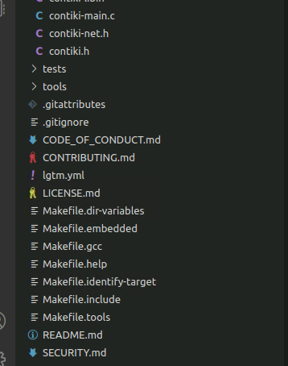

## CONTIKI

### 0.前言

  之前陆陆续续的看过 contiki-ng 的相关介绍与代码，但是从没有详细阅读过源码，看教程自己也是一知半解。但是所有的经验帖子都有一句，学习最快的方式是阅读源码！！阅读之后，发现是真tm爽，无比通透。所以无论是谁的总结，都没有阅读源码来的直观，建议有空多读。

### 1.简介

   Contiki是一个小型、开源、极易移植的多任务电脑操作系统。它专门设计以适用于一系列的内存受限的网络系统，包括从8位电脑到微型控制器的嵌入系统。 Contiki名称的灵感来源于Kon-Tiki(同音)，Kon-Tiki是一艘帆船的名称，该船用少量的资源横渡太平洋，旨在说明Contiki适应内存受限的传感器网络。

   Contiki只需几千字节的代码和几百字节的内存就能提供多任务环境和内建TCP/IP支持。作为基础的内核以及大部分的核心功能是瑞典计算机科学研究所的网络内嵌系统小组的Adam Dunkels开发的。程序代码量只有几K，存储器的使用量也只有几十Kb。因为嵌入式系统资源有限，故而开发出Contiki OS来适应它，由于uIPv6协议栈的原因，所以占用了很小的系统资源，许多资源有限的网络和设备都可以使用它。Contiki OS 运行原理如下：


### 2.主函数

​	主函数在 contiki-main.c 中，是 contiki-ng 上电后运行的入口，也是整套系统的依赖。

```c
//以下是截取了一部分用来分析
int
#if PLATFORM_MAIN_ACCEPTS_ARGS  //有这个宏的定义，main 有两个参数
main(int argc, char **argv)
{
  platform_process_args(argc, argv);
#else						  //否则正常使用
main(void)
{
#endif
  platform_init_stage_one();     //contiki-ng 的第一个stage，里面主要做些 中断，dma 等初始化

  clock_init();				   //时钟初始化，从这里开始，timer开始计时
  rtimer_init();			   //用来获取 timer 信息
  process_init();			   //process 初始化
  process_start(&etimer_process, NULL); //将etimer 开始加到 process_list 并且 start
  ctimer_init();			   // call-back timer 初始化（用的比较少，也是在 etimer 基础上实现的）
  watchdog_init();			   //看门狗初始化，不多谈

  energest_init();			   //目前没用到

#if STACK_CHECK_ENABLED
  stack_check_init();		    // 需要检查下堆栈，其中主要是防止栈溢出
#endif

  platform_init_stage_two();	// contiki-ng 的 stage2
 
/**
* 从这里开始，下面都是根据具体的工程项目，决定是否要实现下列的功能
*/
    
#if QUEUEBUF_ENABLED
  queuebuf_init();
#endif /* QUEUEBUF_ENABLED */
  netstack_init();
  node_id_init();

  LOG_INFO("Starting " CONTIKI_VERSION_STRING "\n");
  LOG_DBG("TARGET=%s", CONTIKI_TARGET_STRING);
  autostart_start(autostart_processes);

  watchdog_start();
//...
  platform_init_stage_three();   // contiki-ng 的 stage2
//... 
#if PLATFORM_PROVIDES_MAIN_LOOP  //这里区别不是很大，都是执行下面这个循环，做 process_run()
  platform_main_loop();
#else
  while(1) {
    uint8_t r;
    do {
      r = process_run();
      watchdog_periodic();
    } while(r > 0);

    platform_idle();
  }
#endif

  return 0;
}
```

#### 2.1 clock_init()

​	这个不多说，根据具体的芯片，配置具体的时钟，主要功能就是实现时钟。

#### 2.2 rtimer_init()

​	同上，看个人喜好，在哪里实现时钟

#### 2.3 process_init()

​	这个在 process 相关内容中会介绍，主函数剩下的部分也都是跟 process 有关，集中在那里介绍


### 3.process

#### 3.1 PROCESS

```c
//process.h
/**
* 整个process，就是一直在循环执行
* 当不满足条件时，记录下所在行号，返回
* 再次执行时，判断是否满足条件，满足，则继续执行
*
* 在返回后，该 process 相当于执行完了
* 再次执行时，需要手动 post，回到上次返回的行号
*/


typedef unsigned char process_event_t;
typedef void *        process_data_t;
typedef unsigned char process_num_events_t;


#define PROCESS_BEGIN()             PT_BEGIN(process_pt)


#define PROCESS_END()               PT_END(process_pt)

/**
 * Wait for an event to be posted to the process.
 */
#define PROCESS_WAIT_EVENT()        PROCESS_YIELD()


// 当满足条件的时候，继续执行
#define PROCESS_WAIT_EVENT_UNTIL(c) PROCESS_YIELD_UNTIL(c)


// 暂停当前process
#define PROCESS_YIELD()             PT_YIELD(process_pt)


// 当满足条件时继续执行
#define PROCESS_YIELD_UNTIL(c)      PT_YIELD_UNTIL(process_pt, c)


// 当满足条件的时候，暂停/执行
#define PROCESS_WAIT_UNTIL(c)       PT_WAIT_UNTIL(process_pt, c)
#define PROCESS_WAIT_WHILE(c)       PT_WAIT_WHILE(process_pt, c)


#define PROCESS_EXIT()              PT_EXIT(process_pt)


// spawn 一个 process，并等待其执行完成
#define PROCESS_PT_SPAWN(pt, thread)   PT_SPAWN(process_pt, pt, thread)


// 暂停当前进程一会
#define PROCESS_PAUSE()             do {				\
  process_post(PROCESS_CURRENT(), PROCESS_EVENT_CONTINUE, NULL);	\
  PROCESS_WAIT_EVENT_UNTIL(ev == PROCESS_EVENT_CONTINUE);               \
} while(0)

/** @} end of protothread functions */


/**
 * Specify an action when a process is polled.
 *
 * \note This declaration must come immediately before the
 * PROCESS_BEGIN() macro.
 *
 * \param handler The action to be performed.
 *
 * \hideinitializer
 */
#define PROCESS_POLLHANDLER(handler) if(ev == PROCESS_EVENT_POLL) { handler; }

/**
 * Specify an action when a process exits.
 *
 * \note This declaration must come immediately before the
 * PROCESS_BEGIN() macro.
 *
 * \param handler The action to be performed.
 *
 * \hideinitializer
 */
#define PROCESS_EXITHANDLER(handler) if(ev == PROCESS_EVENT_EXIT) { handler; }

/** @} */


// PROCESS_THREAD 定义
#define PROCESS_THREAD(name, ev, data) 				\
static PT_THREAD(process_thread_##name(struct pt *process_pt,	\
				       process_event_t ev,	\
				       process_data_t data))


#define PROCESS_NAME(name) extern struct process name


// PROCESS 定义，声明一个 PROCESS_THREAD 及相关变量
// PT_THREAD((* thread)(struct pt *, process_event_t, process_data_t)) = process_thread_##name
#if PROCESS_CONF_NO_PROCESS_NAMES
#define PROCESS(name, strname)				\
  PROCESS_THREAD(name, ev, data);			\
  struct process name = { NULL,		        \
                          process_thread_##name, {0}, 0, 0 }
#else
#define PROCESS(name, strname)				\
  PROCESS_THREAD(name, ev, data);			\
  struct process name = { NULL, strname,		\
                          process_thread_##name, {0}, 0, 0 }
#endif


// 定义 process 
struct process {
  struct process *next;
#if PROCESS_CONF_NO_PROCESS_NAMES
#define PROCESS_NAME_STRING(process) ""
#else
  const char *name;
#define PROCESS_NAME_STRING(process) (process)->name
#endif
  PT_THREAD((* thread)(struct pt *, process_event_t, process_data_t));
  struct pt pt;
  unsigned char state, needspoll;
};


// current process
#define PROCESS_CURRENT() process_current
extern struct process *process_current;


// context 
#define PROCESS_CONTEXT_BEGIN(p) {\
struct process *tmp_current = PROCESS_CURRENT();\
process_current = p

/**
 * End a context switch

 */
#define PROCESS_CONTEXT_END(p) process_current = tmp_current; }


```

```c
//pt.h

//lc-switch.h
typedef unsigned short lc_t;

#define LC_INIT(s) s = 0;

#define LC_RESUME(s) switch(s) { case 0:

#define LC_SET(s) s = __LINE__; case __LINE__: //记录下行号，当再次 switch 的时候，直接跳转到该 行号 执行

#define LC_END(s) }


//将行号 set 为 0
#define PT_INIT(pt)   LC_INIT((pt)->lc)


#define PT_THREAD(name_args) char name_args


//当 PT_BEGIN 的时候，一般 pt 是由 static 修饰，所以 pt->lc =0
#define PT_BEGIN(pt) { char PT_YIELD_FLAG = 1; if (PT_YIELD_FLAG) {;} LC_RESUME((pt)->lc)


#define PT_END(pt) LC_END((pt)->lc); PT_YIELD_FLAG = 0; \
                   PT_INIT(pt); return PT_ENDED; }

// 当满足 condition，继续执行
#define PT_WAIT_UNTIL(pt, condition)	        \
  do {						\
    LC_SET((pt)->lc);				\ /* 记录下行号 */  
    if(!(condition)) {				\ /* 不满足条件直接返回 */
      return PT_WAITING;			\  /* 否则继续执行 */
    }						\
  } while(0)

// 当满足条件时，暂停
#define PT_WAIT_WHILE(pt, cond)  PT_WAIT_UNTIL((pt), !(cond))

// 当 thread 执行完成后，继续执行
#define PT_WAIT_THREAD(pt, thread) PT_WAIT_WHILE((pt), PT_SCHEDULE(thread))

// 生成一个新 protothread，并等待执行完成
#define PT_SPAWN(pt, child, thread)		\
  do {						\
    PT_INIT((child));				\
    PT_WAIT_THREAD((pt), (thread));		\
  } while(0)


#define PT_RESTART(pt)				\
  do {						\
    PT_INIT(pt);				\
    return PT_WAITING;			\
  } while(0)


#define PT_EXIT(pt)				\
  do {						\
    PT_INIT(pt);				\
    return PT_EXITED;			\
  } while(0)

// f 是否执行完成
#define PT_SCHEDULE(f) ((f) < PT_EXITED)

// 暂停该 process
/* 
* 因为暂停是直接 return，所以要想再次回来，需要 post
* 在使用 spawn 的情景下，需要先 post，如下：
* 	post_process(PROCESS_CURRENT(), PROCESS_EVENT_CONTINUE, NULL);
*	PT_YIELD(pt);
*/ 
#define PT_YIELD(pt)				\
  do {						\
    PT_YIELD_FLAG = 0;				\
    LC_SET((pt)->lc);				\
    if(PT_YIELD_FLAG == 0) {			\
      return PT_YIELDED;			\
    }						\
  } while(0)

// 暂停，直到满足条件继续执行
#define PT_YIELD_UNTIL(pt, cond)		\
  do {						\
    PT_YIELD_FLAG = 0;				\
    LC_SET((pt)->lc);				\
    if((PT_YIELD_FLAG == 0) || !(cond)) {	\
      return PT_YIELDED;			\
    }						\
  } while(0)


```


#### 3.2 process function

##### 3.2.1 进程、PT状态

```c
#define PT_WAITING 0 /*被阻塞，等待事件发生*/
#define PT_YIELDED 1 /*主动让出*/
#define PT_EXITED  2 /*退出*/
#define PT_ENDED   3 /*结束*/

#define PROCESS_STATE_NONE 	0  /*类似于Linux系统的僵尸状态，进程已退出，只是还没从进程链表删除*/
#define PROCESS_STATE_RUNNING  1  /*进程需要执行，现在处于阻塞状态*/
#define PROCESS_STATE_CALLED  2  /*进程被调用*/
```

##### 3.2.2 process.c

```c

/**
* 将 process 插队执行，且加入到 process_list 中
*/
void
process_start(struct process *p, process_data_t data)
{
  struct process *q;

  /* First make sure that we don't try to start a process that is
     already running. */
  for(q = process_list; q != p && q != NULL; q = q->next);

  /* If we found the process on the process list, we bail out. */
  if(q == p) {
    return;
  }
  /* Put on the procs list.*/
  p->next = process_list;
  process_list = p;
  p->state = PROCESS_STATE_RUNNING;
  PT_INIT(&p->pt);

  PRINTF("process: starting '%s'\n", PROCESS_NAME_STRING(p));

  /* Post a synchronous initialization event to the process. */
  process_post_synch(p, PROCESS_EVENT_INIT, data);
}
/*---------------------------------------------------------------------------*/
// exit process 后 链表中的指针 不会丢失成为野指针，每个链表元素都是特定声明的
static void
exit_process(struct process *p, const struct process *fromprocess)
{
  register struct process *q;
  struct process *old_current = process_current;

  PRINTF("process: exit_process '%s'\n", PROCESS_NAME_STRING(p));

  /* Make sure the process is in the process list before we try to
     exit it. */
  for(q = process_list; q != p && q != NULL; q = q->next);
  if(q == NULL) {
    return;
  }

  if(process_is_running(p)) {
    /* Process was running */
    p->state = PROCESS_STATE_NONE;

    /*
     * Post a synchronous event to all processes to inform them that
     * this process is about to exit. This will allow services to
     * deallocate state associated with this process.
     */
    for(q = process_list; q != NULL; q = q->next) {
      if(p != q) {
        /**
        * 如果 q 中有 ev = event_exited, 则所有 process 都 call 一遍
        * 主要是用于 etimer 退出 timer_list, 其他地方不用
        */
        call_process(q, PROCESS_EVENT_EXITED, (process_data_t)p);
      }
    }

    if(p->thread != NULL && p != fromprocess) {
      /* Post the exit event to the process that is about to exit. */
      process_current = p;
      // 不是 process 自己退出，是在其他地方退出，检查一下自己拥有并触发 exit，（与上面不同，exited）
      // 使用 process_event_exit 一般是不退出，或者需要 释放变量
      p->thread(&p->pt, PROCESS_EVENT_EXIT, NULL);
    }
  }

  if(p == process_list) {
    process_list = process_list->next;
  } else {
    for(q = process_list; q != NULL; q = q->next) {
      if(q->next == p) {
        q->next = p->next;
        break;
      }
    }
  }

  process_current = old_current;
}
/*---------------------------------------------------------------------------*/
static void
call_process(struct process *p, process_event_t ev, process_data_t data)
{
  int ret;

#if DEBUG
  if(p->state == PROCESS_STATE_CALLED) {
    printf("process: process '%s' called again with event %d\n", PROCESS_NAME_STRING(p), ev);
  }
#endif /* DEBUG */

  if((p->state & PROCESS_STATE_RUNNING) &&
     p->thread != NULL) {
    PRINTF("process: calling process '%s' with event %d\n", PROCESS_NAME_STRING(p), ev);
    process_current = p;
    p->state = PROCESS_STATE_CALLED;
    ret = p->thread(&p->pt, ev, data);
     /* 一般不会执行完，大多数 process 有 while(1) */
    if(ret == PT_EXITED ||
       ret == PT_ENDED ||
       ev == PROCESS_EVENT_EXIT) {
      // 因为是 p 程序 自己执行完成，所以 exit_process(p, p), 不用在 post(p, event_exit, null)
      exit_process(p, p);
    } else {
      p->state = PROCESS_STATE_RUNNING;
    }
  }
}
/*---------------------------------------------------------------------------*/
//将 p 退出
void
process_exit(struct process *p)
{
  exit_process(p, PROCESS_CURRENT());
}
/*---------------------------------------------------------------------------*/
void
process_init(void)
{
  lastevent = PROCESS_EVENT_MAX;

  nevents = fevent = 0;
#if PROCESS_CONF_STATS
  process_maxevents = 0;
#endif /* PROCESS_CONF_STATS */

  process_current = process_list = NULL;
}
/*---------------------------------------------------------------------------*/
/*
 * Call each process' poll handler.
 */
/*---------------------------------------------------------------------------*/
static void
do_poll(void)
{
  struct process *p;

  poll_requested = 0;
  /* Call the processes that needs to be polled. */
  for(p = process_list; p != NULL; p = p->next) {
    if(p->needspoll) {
      p->state = PROCESS_STATE_RUNNING;
      p->needspoll = 0;
      call_process(p, PROCESS_EVENT_POLL, NULL);
    }
  }
}
/*---------------------------------------------------------------------------*/
/*
 * Process the next event in the event queue and deliver it to
 * listening processes.
 */
/*---------------------------------------------------------------------------*/
static void
do_event(void)
{
  process_event_t ev;
  process_data_t data;
  struct process *receiver;
  struct process *p;

  /*
   * If there are any events in the queue, take the first one and walk
   * through the list of processes to see if the event should be
   * delivered to any of them. If so, we call the event handler
   * function for the process. We only process one event at a time and
   * call the poll handlers inbetween.
   */

  if(nevents > 0) {

    /* There are events that we should deliver. */
    ev = events[fevent].ev;

    data = events[fevent].data;
    receiver = events[fevent].p;

    /* Since we have seen the new event, we move pointer upwards
       and decrease the number of events. */
    fevent = (fevent + 1) % PROCESS_CONF_NUMEVENTS;
    --nevents;

    /* If this is a broadcast event, we deliver it to all events, in
       order of their priority. */
    if(receiver == PROCESS_BROADCAST) {
      for(p = process_list; p != NULL; p = p->next) {

        /* If we have been requested to poll a process, we do this in
           between processing the broadcast event. */
        if(poll_requested) {
          do_poll();
        }
        call_process(p, ev, data);
      }
    } else {
      /* This is not a broadcast event, so we deliver it to the
         specified process. */
      /* If the event was an INIT event, we should also update the
         state of the process. */
      if(ev == PROCESS_EVENT_INIT) {
        receiver->state = PROCESS_STATE_RUNNING;
      }

      /* Make sure that the process actually is running. */
      call_process(receiver, ev, data);
    }
  }
}
/*---------------------------------------------------------------------------*/
int
process_run(void)
{
  /* Process poll events. */
  if(poll_requested) {
    do_poll();
  }

  /* Process one event from the queue */
  do_event();

  return nevents + poll_requested;
}
/*---------------------------------------------------------------------------*/
int
process_nevents(void)
{
  return nevents + poll_requested;
}
/*---------------------------------------------------------------------------*/
// 将 process 加入到 events 中
int
process_post(struct process *p, process_event_t ev, process_data_t data)
{
  process_num_events_t snum;
  // 打 log
 /*
  if(PROCESS_CURRENT() == NULL) {
    PRINTF("process_post: NULL process posts event %d to process '%s', nevents %d\n",
           ev, PROCESS_NAME_STRING(p), nevents);
  } else {
    PRINTF("process_post: Process '%s' posts event %d to process '%s', nevents %d\n",
           PROCESS_NAME_STRING(PROCESS_CURRENT()), ev,
           p == PROCESS_BROADCAST ? "<broadcast>" : PROCESS_NAME_STRING(p), nevents);
  }

  if(nevents == PROCESS_CONF_NUMEVENTS) {
#if DEBUG
    if(p == PROCESS_BROADCAST) {
      printf("soft panic: event queue is full when broadcast event %d was posted from %s\n", ev, PROCESS_NAME_STRING(process_current));
    } else {
      printf("soft panic: event queue is full when event %d was posted to %s from %s\n", ev, PROCESS_NAME_STRING(p), PROCESS_NAME_STRING(process_current));
    }
#endif // DEBUG
    return PROCESS_ERR_FULL;
  }
*/
  snum = (process_num_events_t)(fevent + nevents) % PROCESS_CONF_NUMEVENTS;
  events[snum].ev = ev;
  events[snum].data = data;
  events[snum].p = p;
  ++nevents;

#if PROCESS_CONF_STATS
  if(nevents > process_maxevents) {
    process_maxevents = nevents;
  }
#endif /* PROCESS_CONF_STATS */

  return PROCESS_ERR_OK;
}
/*---------------------------------------------------------------------------*/
// 插队执行
void
process_post_synch(struct process *p, process_event_t ev, process_data_t data)
{
  struct process *caller = process_current; // current_process 保存下来

  call_process(p, ev, data);			   // 执行 p 
  process_current = caller;				   // 返回执行 current_process
}
/*---------------------------------------------------------------------------*/
// 将进程设为 poll_requested，不需要传入ev，自动触发 process
void
process_poll(struct process *p)
{
  if(p != NULL) {
    if(p->state == PROCESS_STATE_RUNNING ||
       p->state == PROCESS_STATE_CALLED) {
      p->needspoll = 1;
      poll_requested = 1;
    }
  }
}
/*---------------------------------------------------------------------------*/
int
process_is_running(struct process *p)
{
  return p->state != PROCESS_STATE_NONE;
}
```


### 4 使用规则

#### 4.1 如何创建 PROCESS

```c
/*步骤1：包含需要的头文件*/
#include "contiki.h"
#include "debug-uart.h"

/*步骤2：用PROCESS宏声明进程执行主体，并定义进程*/
PROCESS(example_1_process, "Example 1"); //PROCESS(name, strname)    
PROCESS(example_2_process, "Example 1");

/*步骤3：用AUTOSTART_PROCESSES宏让进程自启动*/
AUTOSTART_PROCESSES(&example_1_process, &example_2_process); //AUTOSTART_PROCESSES(...)    

/*步骤4：定义进程执行主体thread*/
PROCESS_THREAD(example_1_process, ev, data) //PROCESS_THREAD(name, ev, data)
{
  PROCESS_BEGIN();  /*代码总是以宏PROCESS_BEGIN开始*/

  /*example_1_process的代码*/

  PROCESS_END();  /*代码总是以宏PROCESS_END结束*/
}

PROCESS_THREAD(example_2_process, ev, data)
{
  PROCESS_BEGIN();

  /*example_2_process的代码*/

  PROCESS_END();
}
```

#### 4.2 如何启动一个process

除了AUTOSTART_PROCESS 会自动触发process外，还可以使用process_satrt(process_name, NULL)

```c
/*******启动一个进程********/
void process_start(struct process *p, const char *arg) //可以传递arg给进程p，也可以不传，直接“NULL”
{
    struct process *q;
    /*参数验证：确保进程不在进程链表中*/
    for(q = process_list; q != p && q != NULL; q = q->next);
    if(q == p)
    {
        return;
    }
    /*把进程加到进程链表首部*/
    p->next = process_list;
    process_list = p;

    p->state = PROCESS_STATE_RUNNING;
    PT_INIT(&p->pt); //将p->pt->lc设为0，使得进程从case 0开始执行

    PRINTF("process: starting '%s'\n", PROCESS_NAME_STRING(p));

    //给进程传递一个PROCESS_EVENT_INIT事件，让其开始执行
    process_post_synch(p, PROCESS_EVENT_INIT, (process_data_t)arg);
}
```

### 5 etimer

#### 5.1 etimer.c

```c
// 截取了几个函数分析
static void
add_timer(struct etimer *timer)
{
  struct etimer *t;

  etimer_request_poll();

  if(timer->p != PROCESS_NONE) {
    for(t = timerlist; t != NULL; t = t->next) {
      if(t == timer) {
        /* Timer already on list, bail out. */
        timer->p = PROCESS_CURRENT();
        update_time();
        return;
      }
    }
  }

  /* Timer not on list. */
  timer->p = PROCESS_CURRENT();
  timer->next = timerlist;  // timerlist_init is NULL
  timerlist = timer;

  update_time();
}


PROCESS_THREAD(etimer_process, ev, data)
{

  struct etimer *t, *u;
  PROCESS_BEGIN();

  timerlist = NULL;

  while(1) {
    PROCESS_YIELD();
	
      // 退出 etimer，一般用于 process 退出时，从 timer_list 删掉 该 process 的 etimer
    if(ev == PROCESS_EVENT_EXITED) {
      struct process *p = data; // etimer_process

      while(timerlist != NULL && timerlist->p == p) { // 退出首部
        timerlist = timerlist->next;
      }

      if(timerlist != NULL) { 	// 退出其他部分
        t = timerlist;
        while(t->next != NULL) {
          if(t->next->p == p) {
            t->next = t->next->next;
          } else {
            t = t->next;
          }
        }
      }
      continue;
    } else if(ev != PROCESS_EVENT_POLL) {
      continue;
    }

again:

    u = NULL;

    for(t = timerlist; t != NULL; t = t->next) {
      if(timer_expired(&t->timer)) {
           /* process_post(add_timer_process, PROCESS_EVENT_TIMER, etimer）
              一般情况下只需要判断 ev = PROCESS_EVENT_TIMER 即可（进入 process）*/
        if(process_post(t->p, PROCESS_EVENT_TIMER, t) == PROCESS_ERR_OK) {
																	  
          /* Reset the process ID of the event timer, to signal that the
             etimer has expired. This is later checked in the
             etimer_expired() function. */
          t->p = PROCESS_NONE;
          if(u != NULL) {
            u->next = t->next;
          } else {
            timerlist = t->next;
          }
          t->next = NULL;
          update_time();
          goto again;
        } else {
          etimer_request_poll();
        }
      }
      u = t;
    }
  }

  PROCESS_END();
}
/*---------------------------------------------------------------------------*/
void
etimer_request_poll(void)
{
  process_poll(&etimer_process);
}
/*---------------------------------------------------------------------------*/
static void
add_timer(struct etimer *timer)
{
  struct etimer *t;

  etimer_request_poll();

  if(timer->p != PROCESS_NONE) {
    for(t = timerlist; t != NULL; t = t->next) {
      if(t == timer) {
        /* Timer already on list, bail out. */
        timer->p = PROCESS_CURRENT();
        update_time();
        return;
      }
    }
  }

  /* Timer not on list. */
  timer->p = PROCESS_CURRENT();
  timer->next = timerlist;
  timerlist = timer;

  update_time();
}
```


以etimer示例，在helloworld中实现

```c
#include "contiki.h"

#include <stdio.h> /* For printf() */
/*---------------------------------------------------------------------------*/
PROCESS(hello_world_process, "Hello world process");
AUTOSTART_PROCESSES(&hello_world_process);
/*---------------------------------------------------------------------------*/
PROCESS_THREAD(hello_world_process, ev, data)
{
  static struct etimer timer;

  PROCESS_BEGIN();

  /* Setup a periodic timer that expires after 10 seconds. */
  etimer_set(&timer, CLOCK_SECOND * 30);

  while(1) { 
    printf("Hello, strongli!!\n");

    /* Wait for the periodic timer to expire and then restart the timer. */
    PROCESS_WAIT_EVENT_UNTIL(etimer_expired(&timer));
    etimer_reset(&timer);
  }

  PROCESS_END();
}
//也可以
#include <etimer.h>
PROCESS_THREAD(hello_world_process, ev, data)
{

  PROCESS_BEGIN();
  process_start(&st_process, NULL);
  /* Setup a periodic timer that expires after 10 seconds. */

  while(1) { 
    printf("Hello, strongli!!\n");

    /* Wait for the periodic timer to expire and then restart the timer. */
  }

  PROCESS_END();
}
PROCESS_THREAD(st_process, ev, data)
{
  static struct etimer timer;

  PROCESS_BEGIN();

  /* Setup a periodic timer that expires after 10 seconds. */
  etimer_set(&timer, CLOCK_SECOND * 30);

  while(1) { 
    printf("test porcess_start!!\n");

    /* Wait for the periodic timer to expire and then restart the timer. */
    PROCESS_WAIT_EVENT_UNTIL(etimer_expired(&timer));
    etimer_reset(&timer);
  }

  PROCESS_END();
}


/* 使用 PT_SPAWN, PROCESS_PT_SPAWN */
PT_THREAD(bsx_test(bsx_state_t *state))
{
    PT_BEGIN(&state->pt);
    
    printf("bsx_test BEGIN\n");
    while(1){
        printf("bsx_test\n");
        process_post(PROCESS_CURRENT(), PROCESS_EVENT_CONTINUE, NULL); // post 被 call 的进程
    	PT_YIELD(&state->pt);
    }
    
    PT_END(&state->pt);
}

PROCESS_THREAD(hello_world_process, ev, data)
{
  	static bsx_state_t st_test;
    PROCESS_BEGIN();
    memset(&st_test, 0x0, sizeof(bsx_test));
    // PT_SPAWN(&hello_world_process.pt, &st_test.pt, bsx_test(&st_test));
    PROCESS_PT_SPAWN(&st_test.pt, bsx_test(&st_test));  // 传入的 pt 变量，除非 st_test 本身是 pt 类型
    printf("hello-world\n");
    PROCESS_END();
}
```

#### 5.2 ctimer

```c
// 利用 etimer 实现的 callback timer process
PROCESS(ctimer_process, "Ctimer process");
PROCESS_THREAD(ctimer_process, ev, data)
{
  struct ctimer *c;
  PROCESS_BEGIN();

  for(c = list_head(ctimer_list); c != NULL; c = c->next) {
    etimer_set(&c->etimer, c->etimer.timer.interval);
  }
  initialized = 1;

  while(1) {
    PROCESS_YIELD_UNTIL(ev == PROCESS_EVENT_TIMER); // event process: post_process
    for(c = list_head(ctimer_list); c != NULL; c = c->next) {
      if(&c->etimer == data) { 					  // etimer: post (et->p, timer_event, etimer)
        list_remove(ctimer_list, c);
        PROCESS_CONTEXT_BEGIN(c->p);
        if(c->f != NULL) {
          c->f(c->ptr);
        }
        PROCESS_CONTEXT_END(c->p);
        break;
      }
    }
  }
  PROCESS_END();
}
/*---------------------------------------------------------------------------*/
void
ctimer_init(void)
{
  initialized = 0;
  list_init(ctimer_list);
  process_start(&ctimer_process, NULL);
}
/*---------------------------------------------------------------------------*/
void
ctimer_set(struct ctimer *c, clock_time_t t,
           void (*f)(void *), void *ptr)
{
  ctimer_set_with_process(c, t, f, ptr, PROCESS_CURRENT());
}
/*---------------------------------------------------------------------------*/
void
ctimer_set_with_process(struct ctimer *c, clock_time_t t,
                        void (*f)(void *), void *ptr, struct process *p)
{
  PRINTF("ctimer_set %p %lu\n", c, (unsigned long)t);
  c->p = p;
  c->f = f;
  c->ptr = ptr;
  if(initialized) {
    PROCESS_CONTEXT_BEGIN(&ctimer_process);
    etimer_set(&c->etimer, t);
    PROCESS_CONTEXT_END(&ctimer_process);
  } else {
    c->etimer.timer.interval = t;
  }

  list_add(ctimer_list, c);
}
/*---------------------------------------------------------------------------*/
void
ctimer_reset(struct ctimer *c)
{
  if(initialized) {
    PROCESS_CONTEXT_BEGIN(&ctimer_process);
    etimer_reset(&c->etimer);
    PROCESS_CONTEXT_END(&ctimer_process);
  }

  list_add(ctimer_list, c);
}
/*---------------------------------------------------------------------------*/
void
ctimer_restart(struct ctimer *c)
{
  if(initialized) {
    PROCESS_CONTEXT_BEGIN(&ctimer_process);
    etimer_restart(&c->etimer);
    PROCESS_CONTEXT_END(&ctimer_process);
  }

  list_add(ctimer_list, c);
}
/*---------------------------------------------------------------------------*/
void
ctimer_stop(struct ctimer *c)
{
  if(initialized) {
    etimer_stop(&c->etimer);
  } else {
    c->etimer.next = NULL;
    c->etimer.p = PROCESS_NONE;
  }
  list_remove(ctimer_list, c);
}
/*---------------------------------------------------------------------------*/
int
ctimer_expired(struct ctimer *c)
{
  struct ctimer *t;
  if(initialized) {
    return etimer_expired(&c->etimer);
  }
  for(t = list_head(ctimer_list); t != NULL; t = t->next) {
    if(t == c) {
      return 0;
    }
  }
  return 1;
}
```


### 6. Makefile

#### 6.1 构建

- 在app文件夹中建立自己的项目文件夹以及文件夹中的必要文件；


- Makefile.target,以及Makefile：


- 在arch（架构）下建立文件夹，名称同4.中的TARGET名称，如下：


方框中的是路径，圆中的是具体文件，二者缺一不可，CFLAGS 是编译选项

   其中，必须包含的有`.lds`、`Makefile.jacana-riscv`文件，其余的看情况添加


- 在platform中同样建立同名文件夹，名称同4.中的TARGET名称，如下：


#### 6.2 各个模块如何调用

- 首先，app（即3.）项目文件下的Makefile中添加了`Makefile.incule`，该文件是CONTIKI-OS自带的——`Makefile.include`中实现了添加自带的所有Makefile，其中最有关联的是`Makefile.dir-variables`与`Makefile.identify-target`；

  

- `Makefile.identify-target`中实现了找TARGET的功能，如果找到了TARGET，则使用定义的Makefile；若没找到，则使用`TARGET = native`；所以4.中定义了`TARGET=jacana-riscv`

- 接着`Makefile.include`中通过以下命令在`platform`文件夹中找TARGET同名文件下的Makefile，如下：

  ```makefile
  target_makefile := $(wildcard $(CONTIKI_NG_RELOC_PLATFORM_DIR)/$(TARGET)/Makefile.$(TARGET) \
  $(foreach TDIR, $(TARGETDIRS), $(TDIR)/$(TARGET)/Makefile.$(TARGET)))
  ```

- 在`platform`中的`Makefile.jacana-riscv`（见6.）里面最后要包含arch(5.)中的`Makefile.jacana-riscv`路径，如下：

  

- 在arch下的目标文件下Makefile(见5.)中要包含文件所用的架构（如arm、riscv等）的Makefile，如下：

  

- 在`Makefile.riscv`中则定义了工具链，以及CFLGAS、LDFLAGS等编译参数

- `Makefile.dir-variables`中则包含了`OS`中的所有路径文件，这对于编译项目很有用，项目中一定会用到`OS`的文件，最终包含在Makefile.include 文件中

  

- 

---

