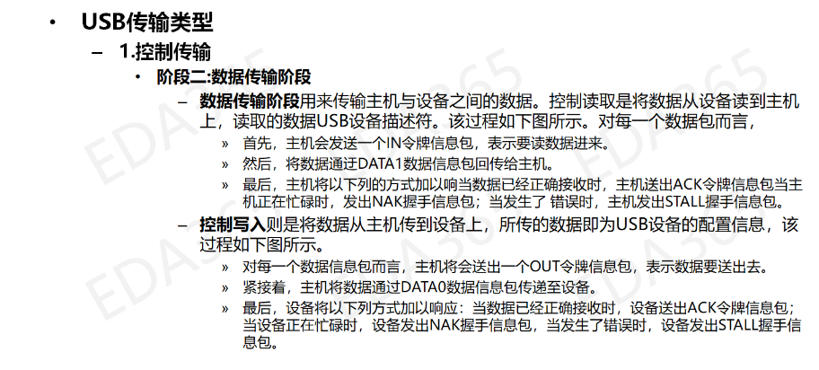

## 一，USB 2.0协议

### 1.1 USB 总线接口

- 根集线器为 USB 系统提供连接起点，用于给 USB 系统提供一个或多个端口
- 主控制器负责完成主机和 USB 设备之间数据的实际传输，包括对传输的数据进行串行解码、差错控制等

### 1.2 协议包





## 二，USB子系统


### 2.1 USB的传输类型

- 控制传输：控制传输是双向传输，数据量通常比较小，主要指由USB总线驱动程序用来进行查询、配置以及给USB设备发送通用的命令。控制传输典型地用在主计算机和USB外设之间的端点0(Endpoint 0)之间的传输，但是指定供应商的控制传输可能用到其它的端点。比如：USB设备的识别过程。
- 批量传输：主要应用在数据大量传输，同时又没有带宽和间隔时间要求的情况下，进行可靠传输。比如：U盘拷贝数据。
- 中断传输：中断传输主要用于定时查询设备是否有中断数据要传输，设备的端点模式器的结构决定了它的查询频率，从1到255ms之间。这种传输方式典型的应用在少量的、分散的、不可预测数据的传输，比如，键盘和鼠标就属于这一类型。中断传输是单向的并且对于host来说只有输入的方式。
- 实时传输：实时传输提供了确定的带宽和间隔时间，它被用于时间严格并具有较强容错性的流数据传输，或者用于要求恒定的数据传输率的即时应用中。比如：USB摄像头，麦克风等，但同时也会有丢包现象。

### 2.2 USB设备描述符

- 一个USB设备描述符中可以有多个配置描述符，即USB设备可以有多种配置；一个配置描述符中可以有多个接口描述符，即USB设备可以支持多种功能（接口）；一个接口描述符中可以有多个端点描述符。
- 一设备至少要包含设备描述符、配置描述符和接口描述符，如果USB设备没有端点描述符，则它仅仅用默认管道与主机进行数据传输。
- 接口，表示逻辑上的设备，比如USB声卡可以分为接口1-录音设备，接口2-播放设备。
- 访问设备时，即访问某个接口，接口表示逻辑设备。
- 传输数据时，即读写某个端口，端口是数据通道。


```c
/* USB_DT_DEVICE: Device descriptor */
struct usb_device_descriptor {
    __u8  bLength; //该结构体大小
    __u8  bDescriptorType; //描述符类型 （此处应为0x01，即设备描述符）

    __le16 bcdUSB; //usb版本号 200 -> USB2.0
    __u8  bDeviceClass; //设备类 
    __u8  bDeviceSubClass; //设备类子类
    __u8  bDeviceProtocol; //设备协议，以上三点都是USB官方定义
    __u8  bMaxPacketSize0; //端点0最大包大小 （只能为8,16,32,64）
    __le16 idVendor; //厂家id
    __le16 idProduct; //产品id
    __le16 bcdDevice; //设备出厂编号
    __u8  iManufacturer; //描述厂商信息的字符串描述符的索引值
    __u8  iProduct; //描述产品信息的字串描述符的索引值
    __u8  iSerialNumber; //描述设备序列号信息的字串描述符的索引值 
    __u8  bNumConfigurations; //可能的配置描述符的数目
} __attribute__ ((packed));
```

### 2.3 配置描述符

```c
struct usb_config_descriptor {
    __u8  bLength; //该结构体大小
    __u8  bDescriptorType;//描述符类型（本结构体中固定为0x02)  

    __le16 wTotalLength; //该配置下，信息的总长度（包括配置，接口，端点和设备类及厂商定义的描述符）
    __u8  bNumInterfaces; //接口的个数
    __u8  bConfigurationValue; //Set_Configuration命令所需要的参数值，用来选定此配置
    __u8  iConfiguration; //描述该配置的字符串描述的索引值 
    __u8  bmAttributes;//供电模式的选择  
    __u8  bMaxPower;//设备从总线提取的最大电流
} __attribute__ ((packed));
```

### 2.4 接口描述符

> 配置描述符中包含了一个或多个接口描述符，这里的“接口”并不是指物理存在的接口，在这里把它称之为“功能”更易理解些，例如一个设备既有录音的功能又有扬声器的功能，则这个设备至少就有两个“接口”。

```c
struct usb_interface_descriptor {
    __u8  bLength;      //该结构体大小
    __u8  bDescriptorType;//接口描述符的类型编号(0x04）

    __u8  bInterfaceNumber;  //该接口的编号  
    __u8  bAlternateSetting; //备用的接口描述符编号  
    __u8  bNumEndpoints; //该接口使用的端点数，不包括端点0  
    __u8  bInterfaceClass; //接口类
    __u8  bInterfaceSubClass; //子类
    __u8  bInterfaceProtocol; //协议
    __u8  iInterface;//描述此接口的字串描述表的索引值  
} __attribute__ ((packed));
```

### 2.5 端点描述符

> 端点是设备与主机之间进行数据传输的逻辑接口，除配置使用的端点0（控制端点，一般一个设备只有一个控制端点）为双向端口外，其它均为单向。端点描述符描述了数据的传输类型、传输方向、数据包大小和端点号（也可称为端点地址）等。
> 除了描述符中描述的端点外，每个设备必须要有一个默认的控制型端点，地址为0，它的数据传输为双向，而且没有专门的描述符，只是在设备描述符中定义了它的最大包长度。主机通过此端点向设备发送命令，获得设备的各种描述符的信息，并通过它来配置设备。

```c
/* USB_DT_ENDPOINT: Endpoint descriptor */
struct usb_endpoint_descriptor {
    __u8  bLength;        //端点描述符字节数大小（7个字节）
    __u8  bDescriptorType;//端点描述符类型编号（0x05) 

    __u8  bEndpointAddress; //此描述表所描述的端点的地址、方向 : 
                            // bit3~bit0:端点号，bit6~bit4:保留，
                            // bit7:方向，如果是控制端点则忽略，0-输出端点（主机到设备）1-输入端点（设备到主机）
    __u8  bmAttributes; // 端点特性，bit1~bit0 表示传输类型，其他位保留
                        // 00-控制传输  01-实时传输   10-批量传输 11-中断传输
    __le16 wMaxPacketSize;  //端点收、发的最大包大小
    __u8  bInterval; // 中断传输模式中主机查询端点的时间间隔。
                     // 对于实时传输的端点此域必需为1，表示周期为1ms。对于中断传输的端点此域值的范围为1ms到255ms

    /* NOTE:  these two are _only_ in audio endpoints. */
    /* use USB_DT_ENDPOINT*_SIZE in bLength, not sizeof. */
    __u8  bRefresh;
    __u8  bSynchAddress;
} __attribute__ ((packed));
```

### 2.6 字符串描述符

```c
struct usb_string_descriptor {
    __u8  bLength;  // 此描述表的字节数（bString域的数值N＋2）
    __u8  bDescriptorType; // 字串描述表类型（此处应为0x03）

    __le16 wData[1];        /* UTF-16LE encoded */  
} __attribute__ ((packed));
```

### 2.7 人机接口描述符

USB 设备中有一大类就是 HID 设备，即 Human Interface Devices，人机接口设备。这类设备包括鼠标、键盘等，主要用于人与计算机进行交互。 它是 USB 协议最早支持的一种设备类。 HID 设备可以作为低速、全速、高速设备用。由于 HID 设备要求用户输入能得到及时响应，故其传输方式通常采用中断方式。 在 USB 协议中， HID 设备的定义放置在接口描述符中， USB 的设备描述符和配置描述符中不包含 HID 设备的信息。因此，对于某些特定的 HID 设备，可以定义多个接口，只有其中一个接口为 HID 设备类即可。


## 三，USB总线驱动程序

### 3.1 USB Core

初始化内核USB总线提供USB相关API，为设备驱动和HCD的交互提供桥梁。

> Linux启动阶段，通过**subsys_initcall**会完成USB Core的加载

```c
subsys_initcall(usb_init);
```

####  1）注册 USB 总线

USB是基于总线-驱动-设备模型的框架，其初始化阶段一个重点任务就是完成USB总线的创建。usb_bus_type提供了驱动和设备匹配的匹配函数，后面注册设备和驱动时会调用到。

```c
retval = bus_register(&usb_bus_type);
if (retval) 
    goto bus_register_failed;

struct bus_type usb_bus_type = {
    .name =     "usb",
    .match =    usb_device_match,
    .uevent =   usb_uevent,
    .suspend =  usb_suspend,
    .resume =   usb_resume,
};
```

使用bus_register接口注册USB总线，会创建出两条链表用来分别存放向USB总线注册的设备和驱动。

```c
klist_init(&bus->klist_devices, klist_devices_get, klist_devices_put);
klist_init(&bus->klist_drivers, NULL, NULL);
```

#### 2）注册USB接口驱动

一个设备可以有多个接口，每个接口对应着不同的功能。

```c
// 在usb总线注册USB接口驱动，该驱动被放在usb总线的驱动链表中。
retval = usb_register(&usbfs_driver);
if (retval)
    goto driver_register_failed;

struct usb_driver usbfs_driver = {
    .name =     "usbfs",
    .probe =    driver_probe,
    .disconnect =   driver_disconnect,
};
```

#### 3）初始化USB Hub

初始化一个USB设备集线器，用来检测USB设备的连接和断开。

```c
// linux-2.6.22.6/drivers/usb/core/usb.c
retval = usb_hub_init();
if (retval)
    goto hub_init_failed;


// linux-2.6.22.6/drivers/usb/core/hub.c
int usb_hub_init(void)
{
    // 在usb总线注册一个hub驱动，该驱动被放在usb总线的驱动链表中。
    if (usb_register(&hub_driver) < 0) {
        printk(KERN_ERR "%s: can't register hub driver\n",
            usbcore_name);
        return -1;
    }

    // 创建一个线程，用来处理USB设备的断开、连接等事件
    khubd_task = kthread_run(hub_thread, NULL, "khubd");
    if (!IS_ERR(khubd_task))
        return 0;

    /* Fall through if kernel_thread failed */
    usb_deregister(&hub_driver);
    printk(KERN_ERR "%s: can't start khubd\n", usbcore_name);

    return -1;
}

static struct usb_driver hub_driver = {
    .name =     "hub",
    .probe =    hub_probe,
    .disconnect =   hub_disconnect,
    .suspend =  hub_suspend,
    .resume =   hub_resume,
    .pre_reset =    hub_pre_reset,
    .post_reset =   hub_post_reset,
    .ioctl =    hub_ioctl,
    .id_table = hub_id_table,
    .supports_autosuspend = 1,
};


static int hub_thread(void *__unused)
{
    do {
        /*
        hub_events()是一个死循环，其任务是解析hub_event_list，
        来一个一个处理发生在hub上的事件，比如插入，拔出。
        当hub_event_list事件被处理完后，break跳出while，
        通过wait_event_freezable使进程进入休眠态。
        一旦hub_event_list上有新事件需要处理，此处khubd_wait会在事件中断中被唤醒，
        重新执行到此处的hub_events()来遍历执行事件，完成处理。
        */
        hub_events();
        wait_event_interruptible(khubd_wait,
                !list_empty(&hub_event_list) ||
                kthread_should_stop());
        try_to_freeze();
    } while (!kthread_should_stop() || !list_empty(&hub_event_list));

    pr_debug("%s: khubd exiting\n", usbcore_name);
    return 0;
}
```

**khubd_wait 的唤醒**

```c
hub_probe ->    
    hub_configure ->
        usb_fill_int_urb(hub->urb, hdev, pipe, *hub->buffer, maxp, hub_irq,
                hub, endpoint->bInterval);
        // usb_fill_int_urb 接口创建了一个中断类型的 USB请求控制块
            hub_irq -> 
                kick_khubd(hub) ->
                    wake_up(&khubd_wait);
```

hub_probe 在后面向USB总线注册一个和hub驱动匹配的hub设备时会被调用。

#### 4）注册USB设备驱动

```c
// 在usb总线注册USB设备驱动，该驱动被放在usb总线的驱动链表中。
retval = usb_register_device_driver(&usb_generic_driver, THIS_MODULE);
if (!retval)
    goto out;

struct usb_device_driver usb_generic_driver = {
    .name = "usb",
    .probe = generic_probe,
    .disconnect = generic_disconnect,
#ifdef  CONFIG_PM
    .suspend = generic_suspend,
    .resume = generic_resume,
#endif
    .supports_autosuspend = 1,
};
```

#### 5）usb_register / usb_register_device_driver

usb_register 注册一个USB接口驱动，一个设备可以有多个接口，一个接口表示一种功能。比如USB声卡设备，有两个接口，一个播放接口，一个录音接口。

```c
// linux-2.6.22.6/include/linux/usb.h
static inline int usb_register(struct usb_driver *driver)
{
    return usb_register_driver(driver, THIS_MODULE, KBUILD_MODNAME);
}

// linux-2.6.22.6/drivers/usb/core/driver.c
int usb_register_driver(struct usb_driver *new_driver, struct module *owner,
            const char *mod_name)
{
    int retval = 0;

    if (usb_disabled())
        return -ENODEV;

    new_driver->drvwrap.for_devices = 0;
    new_driver->drvwrap.driver.name = (char *) new_driver->name;
    new_driver->drvwrap.driver.bus = &usb_bus_type;
    // 对应的usb接口“设备”被匹配时，首先会调用usb_probe_interface，然后在该接口中调用driver的probe
    new_driver->drvwrap.driver.probe = usb_probe_interface;
    new_driver->drvwrap.driver.remove = usb_unbind_interface;
    new_driver->drvwrap.driver.owner = owner;
    new_driver->drvwrap.driver.mod_name = mod_name;
    spin_lock_init(&new_driver->dynids.lock);
    INIT_LIST_HEAD(&new_driver->dynids.list);

    retval = driver_register(&new_driver->drvwrap.driver);

    if (!retval) {
        pr_info("%s: registered new interface driver %s\n",
            usbcore_name, new_driver->name);
        usbfs_update_special();
        usb_create_newid_file(new_driver);
    } else {
        printk(KERN_ERR "%s: error %d registering interface "
            "   driver %s\n",
            usbcore_name, retval, new_driver->name);
    }

    return retval;
}
```

usb_register_device_driver 注册一个通用USB设备驱动，而不是USB接口驱动。

```c
// linux-2.6.22.6/drivers/usb/core/driver.c
int usb_register_device_driver(struct usb_device_driver *new_udriver,
        struct module *owner)
{
    int retval = 0;

    if (usb_disabled())
        return -ENODEV;
    // for_devices = 1 将和USB设备匹配成功
    new_udriver->drvwrap.for_devices = 1;
    new_udriver->drvwrap.driver.name = (char *) new_udriver->name;
    new_udriver->drvwrap.driver.bus = &usb_bus_type;
    // 对应的usb设备被匹配时，首先会调用usb_probe_device，然后在该接口中调用driver的probe
    new_udriver->drvwrap.driver.probe = usb_probe_device;
    new_udriver->drvwrap.driver.remove = usb_unbind_device;
    new_udriver->drvwrap.driver.owner = owner;

    retval = driver_register(&new_udriver->drvwrap.driver);

    if (!retval) {
        pr_info("%s: registered new device driver %s\n",
            usbcore_name, new_udriver->name);
        usbfs_update_special();
    } else {
        printk(KERN_ERR "%s: error %d registering device "
            "   driver %s\n",
            usbcore_name, retval, new_udriver->name);
    }

    return retval;
}
```

#### 6) 总结

USB core注册了一个USB总线，并向USB总线中注册了三个驱动，分别是USB接口驱动、HUB驱动、USB设备驱动。其中在注册HUB驱动前创建了一个hub_thread线程，用来处理hub上USB设备事件，比如插入和拔出；在HUB驱动的probe函数中，创建了一个urb并为其注册了一个中断处理函数hub_irq，用来唤醒hub_thread线程来处理USB设备事件。

### 3.2 USB主机控制器驱动(HCD)

USB HCD注册在平台总线上。用来处理主机控制器的初始化以及数据的传输，并监测外部设备插入、拔出，完成设备枚举。

#### 1) USB主机控制器-设备

```c
// linux-2.6.22.6/arch/arm/mach-s3c2440/mach-smdk2440.c 
// 这个流程和之前分析的lcd、tp一致。
MACHINE_START(S3C2440, "SMDK2440")
    /* Maintainer: Ben Dooks <ben@fluff.org> */
    .phys_io    = S3C2410_PA_UART,
    .io_pg_offst    = (((u32)S3C24XX_VA_UART) >> 18) & 0xfffc,
    .boot_params    = S3C2410_SDRAM_PA + 0x100,

    .init_irq   = s3c24xx_init_irq,
    .map_io     = smdk2440_map_io,
    .init_machine   = smdk2440_machine_init,
    .timer      = &s3c24xx_timer,
MACHINE_END


static void __init smdk2440_machine_init(void)
{
    s3c24xx_fb_set_platdata(&smdk2440_lcd_cfg);

    platform_add_devices(smdk2440_devices, ARRAY_SIZE(smdk2440_devices));
    smdk_machine_init();
}

static struct platform_device *smdk2440_devices[] __initdata = {
    &s3c_device_usb,
    &s3c_device_lcd,
    &s3c_device_wdt,
    &s3c_device_i2c,
    &s3c_device_iis,
    &s3c2440_device_sdi,
};

// linux-2.6.22.6/arch/arm/plat-s3c24xx/devs.c
struct platform_device s3c_device_usb = {
    .name         = "s3c2410-ohci",
    .id       = -1,
    .num_resources    = ARRAY_SIZE(s3c_usb_resource),
    .resource     = s3c_usb_resource,
    .dev              = {
        .dma_mask = &s3c_device_usb_dmamask,
        .coherent_dma_mask = 0xffffffffUL
    }
};
```

#### 2) USB主机控制器-驱动

```c
// linux-2.6.22.6/.config
CONFIG_ARCH_S3C2410=y

// linux-2.6.22.6/drivers/usb/host/ohci-hcd.c
#ifdef CONFIG_ARCH_S3C2410
#include "ohci-s3c2410.c"
#define PLATFORM_DRIVER     ohci_hcd_s3c2410_driver
#endif

static int __init ohci_hcd_mod_init(void)
{
    int retval = 0;

    if (usb_disabled())
        return -ENODEV;

    printk (KERN_DEBUG "%s: " DRIVER_INFO "\n", hcd_name);
    pr_debug ("%s: block sizes: ed %Zd td %Zd\n", hcd_name,
        sizeof (struct ed), sizeof (struct td));

#ifdef PS3_SYSTEM_BUS_DRIVER
    if (firmware_has_feature(FW_FEATURE_PS3_LV1)) {
        retval = ps3_system_bus_driver_register(
                &PS3_SYSTEM_BUS_DRIVER);
        if (retval < 0)
            goto error_ps3;
    }
#endif

#ifdef PLATFORM_DRIVER
    retval = platform_driver_register(&PLATFORM_DRIVER);
    if (retval < 0)
        goto error_platform;
#endif

#ifdef OF_PLATFORM_DRIVER
    retval = of_register_platform_driver(&OF_PLATFORM_DRIVER);
    if (retval < 0)
        goto error_of_platform;
#endif

#ifdef SA1111_DRIVER
    retval = sa1111_driver_register(&SA1111_DRIVER);
    if (retval < 0)
        goto error_sa1111;
#endif

#ifdef PCI_DRIVER
    retval = pci_register_driver(&PCI_DRIVER);
    if (retval < 0)
        goto error_pci;
#endif

    return retval;

    /* Error path */
#ifdef PCI_DRIVER
 error_pci:
#endif
#ifdef SA1111_DRIVER
    sa1111_driver_unregister(&SA1111_DRIVER);
 error_sa1111:
#endif
#ifdef OF_PLATFORM_DRIVER
    of_unregister_platform_driver(&OF_PLATFORM_DRIVER);
 error_of_platform:
#endif
#ifdef PLATFORM_DRIVER
    platform_driver_unregister(&PLATFORM_DRIVER);
 error_platform:
#endif
#ifdef PS3_SYSTEM_BUS_DRIVER
    if (firmware_has_feature(FW_FEATURE_PS3_LV1))
        ps3_system_bus_driver_unregister(&PS3_SYSTEM_BUS_DRIVER);
 error_ps3:
#endif
    return retval;
}
module_init(ohci_hcd_mod_init);

// linux-2.6.22.6/drivers/usb/host/ohci-s3c2410.c
static struct platform_driver ohci_hcd_s3c2410_driver = {
    .probe      = ohci_hcd_s3c2410_drv_probe,
    .remove     = ohci_hcd_s3c2410_drv_remove,
    .shutdown   = usb_hcd_platform_shutdown,
    /*.suspend  = ohci_hcd_s3c2410_drv_suspend, */
    /*.resume   = ohci_hcd_s3c2410_drv_resume, */
    .driver     = {
        .owner  = THIS_MODULE,
        .name   = "s3c2410-ohci",
    },
};
```

#### 3) USB主机控制器设备和驱动的匹配

```c
platform_driver_register->
    driver_register->
        bus_add_driver->
            driver_attach->
                bus_for_each_dev-> // 从平台总线的的设备链表中，取出每一项设备进行匹配
                    __driver_attach->
                        driver_probe_device->
                            // 此总线类型为平台总线，其存在match函数，即调用platform_match进行匹配
                            if (drv->bus->match && !drv->bus->match(dev, drv))                            

// 平台总线                            
struct bus_type platform_bus_type = {
    .name       = "platform",
    .dev_attrs  = platform_dev_attrs,
    .match      = platform_match,
    .uevent     = platform_uevent,
    .suspend    = platform_suspend,
    .suspend_late   = platform_suspend_late,
    .resume_early   = platform_resume_early,
    .resume     = platform_resume,
};              

static int platform_match(struct device * dev, struct device_driver * drv)
{
    struct platform_device *pdev = container_of(dev, struct platform_device, dev);

    // 平台总线匹配设备和驱动的名称
    return (strncmp(pdev->name, drv->name, BUS_ID_SIZE) == 0);
}

// ohci 设备   name = "s3c2410-ohci"
struct platform_device s3c_device_usb = {
    .name         = "s3c2410-ohci",
    .id       = -1,
    .num_resources    = ARRAY_SIZE(s3c_usb_resource),
    .resource     = s3c_usb_resource,
    .dev              = {
        .dma_mask = &s3c_device_usb_dmamask,
        .coherent_dma_mask = 0xffffffffUL
    }
};

// ohci 驱动 name = "s3c2410-ohci"
static struct platform_driver ohci_hcd_s3c2410_driver = {
    .probe      = ohci_hcd_s3c2410_drv_probe,
    .remove     = ohci_hcd_s3c2410_drv_remove,
    .shutdown   = usb_hcd_platform_shutdown,
    /*.suspend  = ohci_hcd_s3c2410_drv_suspend, */
    /*.resume   = ohci_hcd_s3c2410_drv_resume, */
    .driver     = {
        .owner  = THIS_MODULE,
        .name   = "s3c2410-ohci",
    },
};
```

匹配成功调用驱动的probe函数。

```c
driver_probe_device-> // 在此函数中匹配成功的话，就会去调用驱动的probe函数
    really_probe->
        drv->probe(dev)
```

#### 4) USB主机控制器驱动的probe函数

```c
ohci_hcd_s3c2410_drv_probe -> 
    usb_hcd_s3c2410_probe ->
        usb_add_hcd -> 
            rhdev = usb_alloc_dev
            hcd->self.root_hub = rhdev
            register_root_hub -> 
                usb_new_device ->
                    device_add ->     
                        bus_attach_device ->
                            device_attach -> 
                                bus_for_each_drv -> // 从usb总线的的驱动链表中，取出每一项驱动进行匹配
                                    __device_attach ->
                                        driver_probe_device ->
                                            // 此总线类型为USB总线，其存在match函数，即调用usb_device_match进行匹配
                                            if (drv->bus->match && !drv->bus->match(dev, drv)) 
                                                driver_probe_device-> // 在此函数中匹配成功的话，就会去调用驱动的probe函数
                                                    really_probe->
                                                        drv->probe(dev)
```

**usb_device_match**

```c
static inline int is_usb_device(const struct device *dev)
{
    return dev->type == &usb_device_type;
}

/* Do the same for device drivers and interface drivers. */

static inline int is_usb_device_driver(struct device_driver *drv)
{
    // struct device_driver 中 struct usbdrv_wrap 中的for_devices变量为1，则为USB设备驱动
    // 上节USB Core中向USB总线注册的USB设备驱动中有将该变量设置为1（new_udriver->drvwrap.for_devices = 1;）
    return container_of(drv, struct usbdrv_wrap, driver)->
            for_devices;
}

static int usb_device_match(struct device *dev, struct device_driver *drv)
{
    // USB设备 和 USB接口“设备”分开处理 
    /* devices and interfaces are handled separately */
    if (is_usb_device(dev)) {
        // 处理USB设备
        /* interface drivers never match devices */
        if (!is_usb_device_driver(drv))
            return 0;

        /* TODO: Add real matching code */
        return 1;

    } else {
        // 处理USB接口设备
        struct usb_interface *intf;
        struct usb_driver *usb_drv;
        const struct usb_device_id *id;

        /* device drivers never match interfaces */
        if (is_usb_device_driver(drv))
            return 0;

        intf = to_usb_interface(dev);
        usb_drv = to_usb_driver(drv);

        id = usb_match_id(intf, usb_drv->id_table);
        if (id)
            return 1;

        id = usb_match_dynamic_id(intf, usb_drv);
        if (id)
            return 1;
    }

    return 0;
}
```

probe 向USB总线注册一个root hub 设备，从usb总线的的驱动链表中，取出每一项驱动进行匹配。在USB Core中已经向总线注册了三个驱动（USB设备驱动、USB接口驱动、USB hub驱动），根据条件匹配到USB设备驱动，则去调用USB设备驱动的probe函数。

**USB设备驱动的probe函数**

```c
generic_probe(struct usb_device *udev) -> // 从上分析流程知udev为USB root hub设备 
    usb_set_configuration ->
        device_add ->  // 创建USB接口设备，USB root hub接口设备被创建
```

之后匹配到USB Core中注册的USB hub驱动，执行USB hub驱动的probe函数，该probe函数中，创建了一个urb并为其注册了一个中断处理函数hub_irq，用来唤醒hub_thread线程来处理USB设备事件（插入、拔出）。至此，系统启动初始化时关于USB的内容分析完成。USB Core和USB HCD的成功建立联系，为之后的USB设备驱动提供API。

## 四，USB设备驱动 -- USB鼠标

用于和枚举到的USB设备进行绑定，完成特定的功能。 比如USB鼠标设备，驱动开发主要是这一块代码的coding。

### 4.1 注册一个USB接口驱动

向USB总线注册一个USB接口驱动

```c
// linux-2.6.22.6/drivers/hid/usbhid/usbmouse.c

static struct usb_driver usb_mouse_driver = {
    .name       = "usbmouse",
    .probe      = usb_mouse_probe,
    .disconnect = usb_mouse_disconnect,
    .id_table   = usb_mouse_id_table,
};

static int __init usb_mouse_init(void)
{
    int retval = usb_register(&usb_mouse_driver);
    if (retval == 0)
        info(DRIVER_VERSION ":" DRIVER_DESC);
    return retval;
}
```

### 4.2 USB接口设备的创建

当一个USB 鼠标设备插入后，主机USB控制器检测到后，触发USB设备集线器中的"中断"处理函数hub_irq。在hub_irq中会获取USB鼠标设备的设备描述符，根据设备描述符创建USB接口设备，从而和这边的USB接口驱动匹配，调用其probe函数，通过USB总线驱动程序（USB Core和USB HCD）和USB鼠标设备建立联系，进而操作（读写控制）该设备。

```c
hub_irq
    kick_khubd // 唤醒hub_thread线程
        hub_thread
            hub_events // 处理USB设备插入事件
                hub_port_connect_change

                    udev = usb_alloc_dev(hdev, hdev->bus, port1);
                                dev->dev.bus = &usb_bus_type;

                    choose_address(udev); // 给新设备分配编号(地址)                                       
                    hub_port_init   // usb 1-1: new full speed USB device using s3c2410-ohci and address 3

                        hub_set_address  // 把编号(地址)告诉USB设备

                        usb_get_device_descriptor(udev, 8); // 获取设备描述符
                        retval = usb_get_device_descriptor(udev, USB_DT_DEVICE_SIZE);

                        usb_new_device(udev)   
                            err = usb_get_configuration(udev); // 把所有的描述符都读出来，并解析
                            usb_parse_configuration

                            device_add  // 把device放入usb_bus_type的dev链表, 
                                        // 从usb_bus_type的driver链表里取出usb_driver，
                                        // 把usb_interface和usb_driver的id_table比较
                                        // 如果能匹配，调用usb_driver的probe
```

### 4.3 USB接口驱动和USB接口设备的匹配

USB设备插入后根据获取到的设备描述符所创建的USB 接口设备和开发的USB接口驱动匹配： 对于设备： 将获取到的USB设备描述符信息保存在其id_table中。 对于驱动： 驱动的id_table中存放，期望该驱动适用的USB设备。

```c
// linux-2.6.22.6/drivers/hid/usbhid/usbmouse.c

static struct usb_device_id usb_mouse_id_table [] = {  
    /*
    匹配 HID 设备
    USB 设备中有一大类就是 HID 设备，即 Human Interface Devices，人机接口设备。
    这类设备包括鼠标、键盘等，主要用于人与计算机进行交互。 
    它是 USB 协议最早支持的一种设备类。 
    HID 设备可以作为低速、全速、高速设备用。
    由于 HID 设备要求用户输入能得到及时响应，故其传输方式通常采用中断方式。
    */
    { USB_INTERFACE_INFO(USB_INTERFACE_CLASS_HID, USB_INTERFACE_SUBCLASS_BOOT,
        USB_INTERFACE_PROTOCOL_MOUSE) },
    { } /* Terminating entry */
};
```

匹配成功后调用该驱动的probe函数，具体的过程和前面分析的差不多。接下来就是在probe函数中，和USB总线驱动程序建立联系，以达到操作USB 鼠标设备的目的。

### 4.4 创建数据传输管道

根据数据传输类型，有几个接口可供调用

```c
/* Create various pipes... */
// 控制传输
#define usb_sndctrlpipe(dev,endpoint)   \
    ((PIPE_CONTROL << 30) | __create_pipe(dev,endpoint))
#define usb_rcvctrlpipe(dev,endpoint)   \
    ((PIPE_CONTROL << 30) | __create_pipe(dev,endpoint) | USB_DIR_IN)
// 实时传输
#define usb_sndisocpipe(dev,endpoint)   \
    ((PIPE_ISOCHRONOUS << 30) | __create_pipe(dev,endpoint))
#define usb_rcvisocpipe(dev,endpoint)   \
    ((PIPE_ISOCHRONOUS << 30) | __create_pipe(dev,endpoint) | USB_DIR_IN)
// 批量传输
#define usb_sndbulkpipe(dev,endpoint)   \
    ((PIPE_BULK << 30) | __create_pipe(dev,endpoint))
#define usb_rcvbulkpipe(dev,endpoint)   \
    ((PIPE_BULK << 30) | __create_pipe(dev,endpoint) | USB_DIR_IN)
// 中断传输
#define usb_sndintpipe(dev,endpoint)    \
    ((PIPE_INTERRUPT << 30) | __create_pipe(dev,endpoint))
#define usb_rcvintpipe(dev,endpoint)    \
    ((PIPE_INTERRUPT << 30) | __create_pipe(dev,endpoint) | USB_DIR_IN)
```

对于USB 鼠标设备，使用中断传输方式

```c
// linux-2.6.22.6/drivers/hid/usbhid/usbmouse.c

struct usb_device *dev = interface_to_usbdev(intf);
struct usb_host_interface *interface;
struct usb_endpoint_descriptor *endpoint;
struct usb_mouse *mouse;
struct input_dev *input_dev;
int pipe, maxp;
int error = -ENOMEM;

interface = intf->cur_altsetting;

if (interface->desc.bNumEndpoints != 1)
    return -ENODEV;

endpoint = &interface->endpoint[0].desc;
if (!usb_endpoint_is_int_in(endpoint))
    return -ENODEV;

// 端点是USB设备数据传输对象
pipe = usb_rcvintpipe(dev, endpoint->bEndpointAddress);
maxp = usb_maxpacket(dev, pipe, usb_pipeout(pipe));
```

### 4.5 分配urb

urb（USB Request Block）是Linux内核中USB驱动实现上的一个数据结构，用于组织每一次的USB设备驱动的数据传输请求。

```c
mouse->irq = usb_alloc_urb(0, GFP_KERNEL);
if (!mouse->irq)
    goto fail2;
```

### 4.6 urb数据结构初始化

根据传输类型，有几个接口可供调用。

```c
// 控制
static inline void usb_fill_control_urb(struct urb *urb,
                    struct usb_device *dev,
                    unsigned int pipe,
                    unsigned char *setup_packet,
                    void *transfer_buffer,
                    int buffer_length,
                    usb_complete_t complete_fn,
                    void *context)
// 中断
static inline void usb_fill_int_urb(struct urb *urb,
                    struct usb_device *dev,
                    unsigned int pipe,
                    void *transfer_buffer,
                    int buffer_length,
                    usb_complete_t complete_fn,
                    void *context,
                    int interval)
// 批量

static inline void usb_fill_bulk_urb(struct urb *urb,
                     struct usb_device *dev,
                     unsigned int pipe,
                     void *transfer_buffer,
                     int buffer_length,
                     usb_complete_t complete_fn,
                     void *context)

// 实时   
// 实时urb 没有和中断、控制、批量urb 类似的初始化函数，因此它们在提交到USB核心之前，需要在驱动程序中手动的初始化
```

对于USB鼠标设备，采用中断传输方式

```c
usb_fill_int_urb(mouse->irq, dev, pipe, mouse->data,
             (maxp > 8 ? 8 : maxp),
             usb_mouse_irq, mouse, endpoint->bInterval);
mouse->irq->transfer_dma = mouse->data_dma;
mouse->irq->transfer_flags |= URB_NO_TRANSFER_DMA_MAP;
```

### 4.7 提交USB请求块

调用usb_submit_urb接口以获取USB设备数据。

```c
// linux-2.6.22.6/drivers/hid/usbhid/usbmouse.c

static int usb_mouse_open(struct input_dev *dev)
{
    struct usb_mouse *mouse = input_get_drvdata(dev);

    mouse->irq->dev = mouse->usbdev;
    if (usb_submit_urb(mouse->irq, GFP_KERNEL))
        return -EIO;

    return 0;
}
```

该USB鼠标设备驱动还涉及输入子系统的内容，之前已经分析过，不在此再次记录。

### 4.8 总结

USB驱动开发，针对某一个USB设备的某个功能（接口）构建的驱动程序。USB驱动并不直接和USB设备进行数据交互，而是通过USB总线驱动程序（USB Core和USB HCD）来操作USB设备的。一般构建USB设备驱动的流程为：

- 根据期望适用的USB设备信息构建一个id_table。
- 根据需要的数据传输类型，调用相应的接口创建数据传输管道。
- 分配一个urb(USB请求块)。
- 根据需要的数据传输类型，调用相应的接口进行urb数据结构初始化。
- 提交urb

## 五，实现一个USB设备驱动程序

```c
#include <linux/kernel.h>
#include <linux/slab.h>
#include <linux/module.h>
#include <linux/init.h>
#include <linux/usb/input.h>
#include <linux/hid.h>

static struct input_dev *uk_dev;
static char *usb_buf;
static dma_addr_t usb_buf_phys;
static int len;
static struct urb *uk_urb;

static struct usb_device_id usbmouse_as_key_id_table [] = {
    // 匹配HID，鼠标设备
    { USB_INTERFACE_INFO(USB_INTERFACE_CLASS_HID, USB_INTERFACE_SUBCLASS_BOOT,
        USB_INTERFACE_PROTOCOL_MOUSE) },
    //{USB_DEVICE(0x1234,0x5678)},
    { } /* Terminating entry */
};

static void usbmouse_as_key_irq(struct urb *urb)
{
    static unsigned char pre_val;

    /* USB鼠标数据含义
     * data[0]: bit0-左键, 1-按下, 0-松开
     *          bit1-右键, 1-按下, 0-松开
     *          bit2-中键, 1-按下, 0-松开 
     *
     */

    if ((pre_val & (1<<0)) != (usb_buf[0] & (1<<0)))
    {
        /* 左键发生了变化 */
        input_event(uk_dev, EV_KEY, KEY_L, (usb_buf[0] & (1<<0)) ? 1 : 0);
        input_sync(uk_dev);
    }

    if ((pre_val & (1<<1)) != (usb_buf[0] & (1<<1)))
    {
        /* 右键发生了变化 */
        input_event(uk_dev, EV_KEY, KEY_S, (usb_buf[0] & (1<<1)) ? 1 : 0);
        input_sync(uk_dev);
    }

    if ((pre_val & (1<<2)) != (usb_buf[0] & (1<<2)))
    {
        /* 中键发生了变化 */
        input_event(uk_dev, EV_KEY, KEY_ENTER, (usb_buf[0] & (1<<2)) ? 1 : 0);
        input_sync(uk_dev);
    }

    pre_val = usb_buf[0];

    /* 重新提交urb */
    usb_submit_urb(uk_urb, GFP_KERNEL);
}

static int usbmouse_as_key_probe(struct usb_interface *intf, const struct usb_device_id *id)
{
    struct usb_device *dev = interface_to_usbdev(intf);
    struct usb_host_interface *interface;
    struct usb_endpoint_descriptor *endpoint;
    int pipe;

    interface = intf->cur_altsetting;
    endpoint = &interface->endpoint[0].desc;

    /* a. 分配一个input_dev */
    uk_dev = input_allocate_device();

    /* b. 设置 */
    /* b.1 能产生哪类事件 */
    set_bit(EV_KEY, uk_dev->evbit);
    set_bit(EV_REP, uk_dev->evbit);

    /* b.2 能产生哪些事件 */
    set_bit(KEY_L, uk_dev->keybit);
    set_bit(KEY_S, uk_dev->keybit);
    set_bit(KEY_ENTER, uk_dev->keybit);

    /* c. 注册 */
    input_register_device(uk_dev);

    /* d. 硬件相关操作 */
    /* 数据传输3要素: 源,目的,长度 */
    /* 源: USB设备的某个端点 */

    // 创建数据传输管道
    pipe = usb_rcvintpipe(dev, endpoint->bEndpointAddress);

    /* 长度: */
    len = endpoint->wMaxPacketSize;

    /* 目的: */
    usb_buf = usb_buffer_alloc(dev, len, GFP_ATOMIC, &usb_buf_phys);

    /* 使用"3要素" */
    /* 分配usb request block */
    uk_urb = usb_alloc_urb(0, GFP_KERNEL);
    /* 使用"3要素设置urb" */
    // 初始化urb数据结构
    usb_fill_int_urb(uk_urb, dev, pipe, usb_buf, len, usbmouse_as_key_irq, NULL, endpoint->bInterval);
    uk_urb->transfer_dma = usb_buf_phys;
    uk_urb->transfer_flags |= URB_NO_TRANSFER_DMA_MAP;

    /* 使用URB */
    // 提交urb，以读取usb设备数据。
    usb_submit_urb(uk_urb, GFP_KERNEL);

    return 0;
}

static void usbmouse_as_key_disconnect(struct usb_interface *intf)
{
    struct usb_device *dev = interface_to_usbdev(intf);

    //printk("disconnect usbmouse!\n");
    usb_kill_urb(uk_urb);
    usb_free_urb(uk_urb);

    usb_buffer_free(dev, len, usb_buf, usb_buf_phys);
    input_unregister_device(uk_dev);
    input_free_device(uk_dev);
}

/* 1. 分配/设置usb_driver */
static struct usb_driver usbmouse_as_key_driver = {
    .name       = "usbmouse_as_key_",
    .probe      = usbmouse_as_key_probe,
    .disconnect = usbmouse_as_key_disconnect,
    .id_table   = usbmouse_as_key_id_table,
};


static int usbmouse_as_key_init(void)
{
    /* 2. 注册 */
    usb_register(&usbmouse_as_key_driver);
    return 0;
}

static void usbmouse_as_key_exit(void)
{
    usb_deregister(&usbmouse_as_key_driver);    
}

module_init(usbmouse_as_key_init);
module_exit(usbmouse_as_key_exit);

MODULE_LICENSE("GPL");
```


