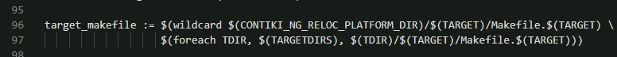
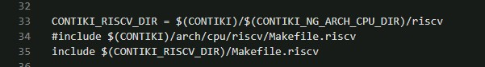
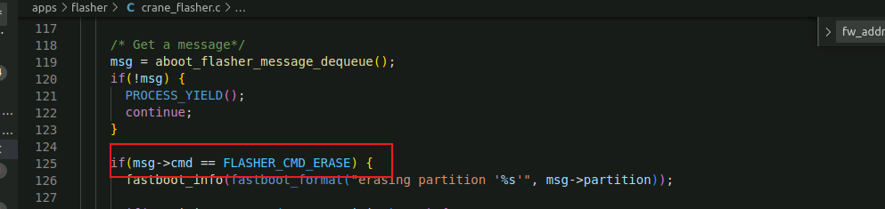

Internet:

```html
https://sh2-cis01.asrmicro.com/guacamole/#/client/MjUAYwBwb3N0Z3Jlc3Fs
https://sh2-cis01.asrmicro.com/jenkins/view/gerrit/
```

[jenkins](https://sh2-cis01.asrmicro.com/jenkins/view/gerrit)  

[server](https://sh2-cis01.asrmicro.com/guacamole)


7.20

> 1. About Burn : Use  Aboot, click Release, choose correspond file, click download.  
> 2. How to know burn successsful? Add flag in log.  
> 3. Map network dirve. Click network, find ip in service.

---

 7.21

1. burn craneG:
   
   - Use the compiled code in gerrrit, for the code in ubuntu cannot download in PC.
   - Run sscom.exe and press RESET buttton, then you can see the version.Replace the old file with the new file in version folder.  
   - Run Aboot.exe and click Release dashboard, choose the correspond chip, click Release button. After release finished, click the Download button. Specially, press the RESET button and the DOWNLOAD button in DKB and the chip will enter burn program mode.
   - Note: You can read the log output of sscom to check the code.  

2. git command:
   
3. cd command:  
   
   ```linux
   cd /        : root
   cd --
   cd ~        : home
   cd -        : return to before dir when enter this dir.
   cd ..       : return to the previous dir.
   cd ../..    : return to the dir before previous dir.
   ```

---

 7.22

1. STAR PROCESSOR  
   
   - LSR : logical shift right
   
   - ASR : arithmetic shift right
   
   - ROR : rotote right
     
     > Note : the difference between LSR and RSR is the sign bit. ASR  sign bit is contant, while LSR donot have sign bit, and its highest bit is 0.

2. Saturating Instruction. This instruction is to prevent the calculation results overflow.

3. Contiki-NG OS.

---

 7.25

1. Learn concepts and advantages about Contiki OS, and details log in notebook.
2. Create hello-world project. The initial OS has example folder, but also has hello-world.c file. Just follow the tutorial.

---

 7.26

1. Complie project in Ubuntu, generate .out file and run the file.
2. PROCESS_THREAD used list type to design

---

 7.27

Today did one thing: write a bug.

---

 7.28

1. Do not use numbers in code; use the macro replace it. The numbers is called devil numbers.

2. "_A" : use in library function 
   
   ```c
   _func_ : const char type array, storage the current function name.
   _FILE_ : string type, storage file name.
   _TIME_ : string type, storage compile time.
   _LINE_ : int type, storage line number.
   _DATE_ : string type, storage complie data
   ```

5. 
   
   ```c
   ... // args list
   _VA_ARGS_ ;//various macro
   ```

4. LOG : use output info via comport. Note: rank different log, then when accomplished can omit low-level log.

> **Note：** Log detailed after today. 

---

7.29

1. Learn how to output log in flasher mode.
2. Read the revelant code in emmc, understand read codes and write codes.
3. Read macro code in project.

---

8.1

1. Make test code successful.

2. Be familiar with PROCESS, and make clear the PROCESS how to run.

3. The last task: test access 0xd1f00000 via DMA in eMMC.   
   **Note:** the most important part is accessing the memory via DMA, by means of read().  

4. TASK:

   > - ARM->RISC-V.

---

 8.2

1. Modify test_process.c file
   - printf should not addr of *p at the same as printf content of *p.
   - 32bit OS, 0xAA, 0x00, 0x00, 0x00.
2. eMMC file write() and read() means write data to eMMC nor flash and read to assigned addr.

---

 8.3

1. > Note:
   > - probe is init in project.  
   > - make cmd: add cmd as `USEMODULE += FLASH` and `CFLAG += -DUSE` in makefile. 
2. >  Aboot:
   > - when burn in ③, press RST at the same time press DWL **all the time**.
   > - when burn in ②, press DWL **all the time** at the same time press RST.

---

 8.4(Thu.)

---

 8.5(Fri.)

---

 8.8(Mon.)

---

 8.9(Tue.)

---

8.10(Wed.)

1. Read some summaries and write down.

---

 8.11(Thu.)

1. New Targets: Replace cm4 in cpu/arch/jacana with RISC-V.

---

 8.12(Fri.)

1. Read some material about RISC-V.

---

 8.15(Mon.)

1. Learn the book named RISC-V Reader.   

---

 8.16(Tue.)

1. Read book about RISC-V.
2. Write relevant content down.

---

 8.17(Wed.)

1. Read book about asm.
2. Write relevant content down.

---

 8.18(Thu.)

1. Install RISC-V compile environment.

---

 8.19(Fri.)

1. Install RISC-V compile environment totally.
2. Run a test program in RVE.

---

 8.22(Mon.)

1. Try to figure out the problem that raised in meeting yesterday.

---

 8.23(Tue.)

1. Go on.(The task were not accomplished yesterday).

---

 8.24(Wed.)

1. Go on.
2. Read RISC-V ISA.

---

---

 8.26(Fri.)~9.1(Thu.)

1. Log in note book.

---

---

---

9.16

1. 用uart输出函数示例

```c
ssize_t _write(int fd, const void *ptr, size_t len)
{
    const uint8_t *current = (const char *)ptr;
    if (isatty(fd)) {
        for (size_t jj = 0; jj < len; jj++)  {
            while (UART0_REG(UART_REG_TXFIFO) & 0x80000000); //等待UART的TXFIFO有空
            //向 UART 的 TXFIFO 寄存器写入字符，从而使字符通过 UART 输出
            UART0_REG(UART_REG_TXFIFO) = current[jj];
            if (current[jj] == '\n') {
                while (UART0_REG(UART_REG_TXFIFO) & 0x80000000);
                UART0_REG(UART_REG_TXFIFO) = '\r';
            }
        }
        return len;
    }
    return _stub(EBADF);
}
```

---

2. RISCV 启动代码草稿

```assembly
.section .init;
    .globl _start;
    .type _start,@function

_start:
.option push
.option norelax
	la gp, __global_pointer$
.option pop
	la sp, _sp
#ifdef SIMULATION
    li x26, 0x00
    li x27, 0x00
#endif

	/* Load data section */
	la a0, _data_lma
	la a1, _data
	la a2, _edata
	bgeu a1, a2, 2f
1:
	lw t0, (a0)
	sw t0, (a1)
	addi a0, a0, 4
	addi a1, a1, 4
	bltu a1, a2, 1b
2:

	/* Clear bss section */
	la a0, __bss_start
	la a1, _end
	bgeu a0, a1, 2f
1:
	sw zero, (a0)
	addi a0, a0, 4
	bltu a0, a1, 1b
2:

    call _init
    call main

#ifdef SIMULATION
    li x26, 0x01
#endif

loop:
    j loop
```

---

 10.24(Mon.)

    Read makefile in arm, cortex-m, cm4. 

---

10.25(Tue.)

**书写Makefile总结：**

1. Makefile中PROJECT名称要跟该项目下的.c文件相同

2. 在Makefile中的include要记得看路径是否正确

3. Makefile中管道符-->`|`

   有时，需要定义一个这样的规则，在更新目标（ 目标文件已经存在）时只需要根据依赖文件中的部分来决定目标是否需要被重建，而不是在依赖文件的任何一个被修改后都重建目标。为了实现这一目的，相应的就需要对规则的依赖进行分类，一类是在这些依赖文件被更新后，需要更新规则的目标；另一类是更新这些依赖的，可不需要更新规则的目标。我们把第二类称为：“ order-only”依赖。书写规则时，“ order-only”依赖使用管道符号“ |”开始，作为目标的一个依赖文件。规则依赖列表中管道符号“ |”左边的是常规依赖，管道符号右边的就是“ order-only”依赖。这样的规则书写格式如下：  
   TARGETS : NORMAL-PREREQUISITES | ORDER-ONLY-PREREQUISITES

   - $(Q) 变量的本质就是 Makefile中的命令显示与否

   - |grep就是指把上个命令运行的结果通过管道命令带入到grep的参数里执行，
     所以单纯的grep没什么意义，一般使用都是通过管道符来使用grep

   - -*v* 表示反向选择 "*^\s*#*" 表示匹配以S开头的字符串

   - (\s*)表示连续空格的字符串

4. 在Makefile中的include要记得看路径是否正确，为了方便都是使用宏来代替的，记得要查看宏的定义，每个人定义方式不同

5. make命令可以显式定义DEFINES，为c预处理设定任意的变量：**make TARGET=esb DEFINES=MYTRACE,MYVALUE=4711**

   还可以保存默认的DEFINES到**Makefile.$(TARGET).DEFINES**中：**make TARGET=esb DEFINES=MYTRACE,MYVALUE=4711 savedefines**

6. 通过变量“VPATH”可以指定依赖文件的搜索路径

7. 在Makefile中输出信息：`$(info information)`

8. export VARITOU: 表示将改变量传给下层

​	unexport VARIOUS: 表示不将变量传给下层

9. `-`表示忽略执行过程中的错误
9. 在Makefile中所有出现的宏，有且只能有一次定义为 `.`，也就相当于固定了基准地址
9. Makefile 包含目录时要包含到具体文件所在的分级目录
9. 代码规范：`.`(表示当下目录)最好单写一行，不然阅读时候很容易漏掉

---

10.26(Wed.)

1. 出现问题的地方可能与make的隐含规则或者默认规则有关

2. ```makefile
   $(strip <string> )
   #去掉<string>字串中开头和结尾的空字符,包括 空格, tab 等不可显示的字符
   #并将中间的多个连续空字符(如果有的话)合并为一个空字符
   
   $(wildcard PATTERN...)
   #展开为已经存在的、使用空格分开的、匹配此模式的所有文件列表
   #如果不存在任何符合此模式的文件，函数会忽略模式字符并返回空
   
   $(words TEXT)
   #计算字符串“ TEXT”中单词的数目
   #返回“ TEXT”字串中的单词数
   
   $(filter PATTERN…,TEXT)
   #过滤函数— filter,过滤掉字串“ TEXT”中所有不符合模式“PATTERN”的单词
   #返回所有符合此模式的单词
   
   $(call FUNCTION)
    #call”函数可以实现对用户自己定义函数引用
   
   
   $(addprefix PREFIX,NAMES…)
   #加前缀函数— addprefix
   
   $(shell syntax)
   #函数“ shell”所实现的功能和shell中的引用（``）相同，实现对命令的扩展
   
   $(info information)
   #在Makefile中实时输出信息
   
   $(abspath NAME)
   #将NAME中的各路径转换成绝对路径，并返回
   
   $(patsubst PATTERN,REPLACEMENT,TEXT)
   #将TEXT中所有符合PATTERN的单词替换成REPLACEMENT
   ```
   
   
   
3. Try to make clear helloWord in contiki-os

---

 10.27(Thus.)

1. Understand the helloworld as example how to work

2. The "contiki-conf.h" 在platform中native文件夹目录下


---

10.28(Fri.)

**contiki-os的使用：**

1. 在app文件夹中建立自己的项目文件夹；

2. 文件夹中包含Makefile，Makefile.target,以及同项目名称的.c文件；如下：

   

3. 上图中的Makefile中应该包含如下代码:

   ```makefile
   #默认代码如下：
   CONTIKI_PROJECT = arom-jacna-riscv #此处名称要与改目录下的.c文件一致
   all: $(CONTIKI_PROJECT)
   
   CONTIKI = ../..
   include $(CONTIKI)/Makefile.include
   # 公司添加了一些版本号代码等
   ```

4. Makefile.target中应该包含：

   ```makefile
   TARGET = jacana-riscv
   ```

---

5. 在arch（架构）下建立文件夹，名称同4.中的TARGET名称，如下：

   

        其中，必须包含的有`.lds`、`Makefile.jacana-riscv`文件，其余的看情况添加

---

6. 在platform中同样建立同名文件夹，名称同4.中的TARGET名称，如下：

   

        其中，两个文件都是要包含的，其余的文件看情况添加

---

7. 下面说一下各个文件是怎么内嵌的：
   
   - 首先，app（即3.）项目文件下的Makefile中添加了`Makefile.incule`，该文件是CONTIKI-OS自带的——`Makefile.include`中实现了添加自带的所有Makefile，其中最有关联的是`Makefile.dir-variables`与`Makefile.identify-target`；
   
   - `Makefile.identify-target`中实现了找TARGET的功能，如果找到了TARGET，则使用定义的Makefile；若没找到，则使用`TARGET = native`；所以4.中定义了`TARGET=jacana-riscv`
   
   - 接着`Makefile.include`中通过以下命令在`platform`文件夹中找TARGET同名文件下的Makefile，如下：
     
     ```makefile
     target_makefile := $(wildcard $(CONTIKI_NG_RELOC_PLATFORM_DIR)/$(TARGET)/Makefile.$(TARGET) \
     $(foreach TDIR, $(TARGETDIRS), $(TDIR)/$(TARGET)/Makefile.$(TARGET)))
     ```
   
   - 在`platform`中的`Makefile.jacana-riscv`（见6.）里面最后要包含arch(5.)中的`Makefile.jacana-riscv`路径，如下：
   
     
   
   - 在arch下的目标文件下Makefile(见5.)中要包含文件所用的架构（如arm、riscv等）的Makefile，如下：
   
     
   
   - 在`Makefile.riscv`中则定义了工具链，以及CFLGAS、LDFLAGS等编译参数
   
   - `Makefile.dir-variables`中则包含了`OS`中的所有路径文件，这对于编译项目很有用，项目中一定会用到`OS`的文件

---

10.31(Mon.)

1. `CONTIKI_TARGET_DIRS = .`先理解成已经将当前目录下的文件都添加进去了（还未得到验证，但由现象倒推的话，是这样的）

     更正:只是相当于将该目录下的文件进行了声明，使用时候可以直接添加，并不是上面所说的

2. 原项目中是如何包含头文件的？答：是通过一层层嵌套，包含在arm项目下，或者其他文件中。

3. Makefile中gcc参数的含义：

     - -g：可执行程序包含调试信息，-加个-g 是为了gdb 用，不然gdb用不到

     - -o：指定输出文件名

     - -c ：只编译不链接，产生.o文件，就是obj文件，不产生执行文件

     - -D：添加宏定义，如`-D DEFINES=CONDITION`；宏定义使用前缀-D，在编译过程中可以把宏定义追加到CFLAG中，如`-D DEFINES`

     - -w：关闭编译时的警告，也就是编译后不显示任何warning

     - -W：类似-Wall，会显示警告，但是只显示编译器认为会出现错误的警告。

     - -Wall：编译后显示所有警告

     - -O3：开启编译优化，等级为三
     - -l：用来指定程序要链接的库，-l参数紧接着就是库名
     - -L：-L参数跟着的是库文件所在的目录名
     - -Wl：紧跟的参数是传递给链接器ld的
     - "-f"/"-file"：指定特定的Makefile，如`make -f Make.Linux`
     - -I：可以看作是include的首字母大写，主要是包含对应的头文件路径
     - -Werror：要求GCC将所有的警告当成错误进行处理
     - -x：设定文件所使用的语言, 使后缀名无效, 对以后的多个有效, 如 -x c 
     - 


4. ```makefile
   $@	# 表示目标
   $^	# 表示所有的依赖
   $<	# 表示第一个依赖
   ```


---

11.1(Tue.)

1. Read Makefile.include totally.

2. c中变量出处：

   ```
   uint16_t		-->  包含在<stdint.h>
   size_t/ssize_t	 -->  包含在<stddef.h>
   ```

3. c中不必指定函数返回值类型，这样它默认是int类型，如下：

   ```c
   unsigned ringbuffer_add(ringbuffer_t rb, ...){
   	if(...)   return 0;
       size_t total = MIN(...);
   	return total; 
   }
   ```

4. "conflicting type"解决办法: 查看声明的参数与定义参数是否一致

---

11.2(Wed.)

1. `arm-none-eabi-gcc`：是 GNU 推出的的ARM交叉编译工具。可用于交叉编译ARM MCU（32位）芯片，如ARM7、ARM9、Cortex-M/R芯片程序； `riscv64-unknown-elk`表示是64位的编译，区别在于：32位的编译链中size_t为4个字节，而64位编译链中size_t为8个字节

1. 64位的工具链能编译32位的项目，但是区别在于上面64位的size_t跟32位中不一样

1. `riscv64-unknown-elf-gcc -mabi=ilp32 -march=rv32i`用64位编译工具编译32位工程，在`CFLAGS`中添加上述参数也可编译通过

---

11.3(Thu.)

1. GCC中arm参数(-m有关的)：

   ```shell
   -mabi= name 				    # 为指定的ABI生成代码 
   -mapcs-frame				    # 为所有功能生成符合ARM过程调用标准的堆栈框架 
   -mthumb-interwork				# 生成支持ARM和Thumb之间调用的代码 
   -mno-sched-prolog				# 防止对函数重新排序
   -mfloat-abi= name				# 浮点ABI
   
   -mlittle-endian       			 # 小端格式
   -mbig-endian					# 大端格式
   -mwords-little-endian
   -mcpu= name						# 指定处理器
   -mtune= name					# 指定ARM处理器可以优化
   -march= name					# ARM体系结构名称
   
   ```

2. GCC中riscv参数(-m有关的):

   ```shell
   -mbranch-cost=n  			
   # 将分支的成本设置为大约 n 条指令。
   
   -mplt					    
   -mno-plt
   # 允许或不允许使用PLT。默认是-mplt.
   
   -mabi=name
   # 指定整数和浮点调用约定。
   # 如 ‘-march = rv64ifd -mabi = lp64d’
   # 如，“-march = rv32if -mabi = ilp32d’
   
   -mfdiv
   -mno-fdiv
   # 是否使用硬件浮点除法和平方根指令
   
   -mdiv
   -mno-div
   # 是否使用硬件指令进行整数除法。
   
   -march=name
   # 包括“rv64i’，‘rv32g’，'rv32e’和’rv32imaf’
   # When-march=没有指定,则使用来自-mcpu.
   
   -mcpu=processor-name		
   # ‘sifive-e20’，‘sifive-e21’，‘sifive-e24’，‘sifive-e31’，‘sifive-e34’，‘sifive-e76’，‘sifive-s21’，‘sifive-s51’，‘sifive-s54’，‘sifive-s76’，'sifive-u54’和’sifive-u74’.
   
   
   -mtune=processor-name		
   # ‘rocket’，‘sifive-3-series’，‘sifive-5-series’，
   # ‘sifive-7-series’，‘size’，以及所有有效选项-mcpu=.
   # When-mtune=没有指定,则使用来自-mcpu, 默认为 ‘rocket’ 如果两者都没有指定。
   
   -mpreferred-stack-boundary=num
   # 尝试使堆栈边界与2对齐，以提高到 num 字节边界。
   # 如果-mpreferred-stack-boundary未指定,默认为4(16字节或128位)。
   
   -msmall-data-limit=n
   # 将小于 n 个字节的全局和静态数据放入一个特殊部分（在某些目标上）。
   
   -msave-restore
   -mno-save-restore
   # 是否使用较小但较慢的使用库函数调用的序言和结尾代码
   
   -mshorten-memrefs
   -mno-shorten-memrefs
   # 目前仅针对 32 位整数加载/存储。
   
   -mstrict-align
   -mno-strict-align
   # 不产生或不产生不对齐的内存访问。
   
   -mcmodel=medlow
   # 生成中低码模型的代码。
   
   -mcmodel=medany
   # 生成中任何代码模型的代码。
   
   -mexplicit-relocs
   -mno-exlicit-relocs
   # 使用或不使用汇编器重定位操作符
   
   -mrelax
   -mno-relax
   # 利用链接器松弛来减少实现符号地址所需的指令数量。
   
   -memit-attribute
   -mno-emit-attribute
   # 额外信息记录到ELF对象中。需要 binutils 2.32。
   
   -malign-data=type
   # 控制GCC如何对齐数组，持的 type 值为“xlen’使用x寄存器宽度作为对齐值，
   
   -mbig-endian
   # 生成大端代码。
   
   -mlittle-endian
   # 生成小端代码。
   
   -mstack-protector-guard=guard
   -mstack-protector-guard-reg=reg
   -mstack-protector-guard-offset=offset
   # 使用canary at guard 生成堆栈保护代码
   
   ```

3. lds文件的相关知识：

   - 装载地址(load memory addr.)：运行之前各段的地址；
   - 运行地址(virtual memory addr.)：运行时各段的地址
   - AT(ldadr)：定义本段存储（加载）的地址，如果不使用这个选项，则加载地址等于运行地址，通过这个选项可以控制各段分别保存于输出文件中不同的位置。
   - `-T`选项用以指定自己的链接脚本, 它将代替默认的连接脚本
   -  PROVIDE关键字，该关键字用于定义这类符号：在目标文件内被引用，但没有在任何目标文件内被定义的符号

   ```
   连接器有个默认的内置连接脚本, 可用`ld --verbose`查看。 连接选项`-r`和`-N`可以影响默认的连接脚本。
   你也可以使用<暗含的连接脚本>以增加自定义的链接命令
   
   链接器把一个或多个输入文件合成一个输出文件
   输入文件: 目标文件或链接脚本文件
   输出文件: 目标文件或可执行文件
   目标文件(包括可执行文件)具有固定的格式, 在UNIX或GNU/Linux平台下, 一般为ELF格式
   
   目标文件的每个section至少包含两个信息: 名字和大小
   一个section可被标记为“loadable(可加载的)”或“allocatable(可分配的)”
   loadable section: 在输出文件运行时, 相应的section内容将被载入进程地址空间中
   allocatable section: 内容为空的section可被标记为“可分配的”
   在输出文件运行时, 在进程地址空间中空出大小同section指定大小的部分
   某些情况下, 这块内存必须被置零
   如果一个section不是“可加载的”或“可分配的”, 那么该section通常包含了调试信息. 
   可用objdump -h命令查看相关信息
   
   在目标文件中, loadable或allocatable的输出section有两种地址: 
   VMA(virtual Memory Address)和LMA(Load Memory Address). 
   VMA是执行输出文件时section所在的地址, 而LMA是加载输出文件时section所在的地址
   在嵌入式系统中, 经常存在加载地址和执行地址不同的情况: 
   比如将输出文件加载到开发板的flash中(由LMA指定), 
   而在运行时将位于flash中的输出文件复制到SDRAM中(由VMA指定)
   
   可这样来理解VMA和LMA, 假设:
   data section对应的VMA地址是0x08050000, 该section内包含了3个32位全局变量, i、j和k, 分别为1,2,3，text section内包含由`printf( "j=%d ", j );`程序片段产生的代码
   连接时指定.data section的VMA为0x08050000, 产生的printf指令是将地址为0x08050004处的4字节内容作为一个整数打印出来.
   如果.data section的LMA为0x08050000，显然结果是j=2
   如果.data section的LMA为0x08050004，显然结果是j=1
   ---------------------------------------------------------------------------
   OUTPUT_FORMAT("elf32-littlearm", "elf32-littlearm", "elf32-littlearm")  
   					   #指定输出可执行文件是elf 格式,32位ARM 指令,小端(正常)
   OUTPUT_ARCH(arm) 		#指定输出可执行文件的平台为ARM
   ENTRY(_start)            #指定入口地址为_start标号所在的位置   
   
   SECTIONS
   {
       . = 0x00000000 ; 	#定位器定位到从0x0位置
       . = ALIGN(4)   ; 	#代码以4字节对齐
       .text: {
           start.o (.text)
           *(.text)
       }
       . = ALIGN(4)
       .rodata : { *(.rodata) }
       . = ALIGN(4);
       .data   : { *(.data) }
       . = ALIGN(4);
       .bss : {
           __bss_start = .;
           *(.bss)
           __bss_end = .;
       };
       . = ALIGN(4);
       _end = .;
   }
   
   ```

4. **RISC-V架构默认小端格式**，虽然也支持大端格式，但还不清晰。所以不需要特别指定

---

11.4(Fri.)

1. ```
   #push代码
   git push origin HEAD:refs/for/master
   git push asrmicro HEAD:refs/for/master
   ```
   
2. 在gnu中，除了o开头的（多个字母）参数外，’--‘与’-‘效果相同，如下：

   ```shell
   --specs=nano.specs --specs=nosys.specs
   -specs=nano.specs -specs=nosys.specs
   #上述在表达效果上相同
   
   -omagic    #输出文件名设置为'magic'
   --omagic   #设置 NMAGIC 标志在输出上
   #以小写“o”开头的多个字母选项只能用两个破折号
   
   ```


---

11.7(Mon.)

1. `#ifndef..., define ...,` 可以防止头文件重复包含

2. ```c
   int *p = (int *) 0x100; // 指针p指向0x100地址处
   ```

3. `_buildtin_clz`“：返回前面引导位 0 的个数，例 0->31, 2->30

4. ```c
   void *p; // 无类型指针，可指向任意类型的数据
   (void) data; // 表示下面未使用该变量
   ```

5. `extern`用于显示声明某个全局变量或者静态变量，方便函数调用

6. lds文件中参数的含义：

   ```
   -R: only read
   -W: write/read
   -A: allocate
   -L: initial partiment
   ```

7. makefile 中的makefile.include，在计算目录的时候都是从make(动作发起)的地方算起的，不是从.included 的目录算起，如下：

   在 arom-jacana 中输入 make，则 arom-jacana 目录作为起始目录, ../ 在此基础上执行

8. GCC在编译时可以使用 `-ffunction-sections` 和 `-fdata-sections` 将每个函数或符号创建为一个sections，其中每个sections名与function或data名保持一致。而在链接阶段， `-Wl,–gc-sections` 指示链接器去掉不用的section（其中`-wl`, 表示后面的参数 `-gc-sections` 传递给链接器）

---

11.8(Tue.)

1. stack frame（栈帧）是用来追踪代码的调用过程和调用时的参数，通过读取stack frame信息可以知道到执行到当前位置的函数调用链表（call stack)

   

   Stack frame的本质是每次函数调用都在stack里记录一个frame，每一次函数调用叫做一个frame。ARM里的fp寄存器实现此功能，fp总是指向当前函数堆栈的frame

   

   Stack frame的产生方法：gcc在生成可执行代码时，在每个函数入口的地方“放置”一个stack frame，如下

   ```shell
   -fomit-frame-point 		#让gcc不产生stack frame
   -fno-omit-frame-pointer  	#让gcc产生stack frame
   ```

2. 内置函数分为两类：
   
    一类与标准c库函数对应，例如strcpy()有对应的builtin_strcpy()内建函数；
    
    另一类是对库函数的拓展
    
    **内置函数名称：**通常以builtin_作为函数名前缀，老的版本还可能以__sync作为前缀。

   ```shell
   -fbuiltin     #这是默认选项，用于通过名字来识别内建函数
    
   -fno-builtin  #除非利用前缀 __builtin_ 进行引用，否则不识别所有内建 函数
   #例如，为了获得内建版本，应该调用 __builtin_strcpy() 而不是名为 strcpy() 的函数
   
   -fno-builtin-xxx  #-fno-builtin-fgets，想使用除fgets() 之外的所有内建函数 
   ```

3. 当变量定义但未使用时，使用**void**关键字来屏蔽警告，如下：

   ```c
   int a;
   (void) a;  //编译器不会提示warning或error(当时用Werror的时候)
   ```
---

11.9(Wed.)

1. 使用gcc的-E -P选项展开源代码中的宏

2. crt0.o: 'C' runtime library. 

3. 工具链中配置as为gcc，所以在编译的时候需要添加一系列的参数，同gcc一样

   ```shell
   ASFLAGS += $(CFLAGS)
   ASFLAGS += -c
   ```


---

11.10(Thu.)

1. `-Wunused-const-variable` 打开未使用 const 变量类型的警告 

    `-Wno-unused-const-variable` 关闭未使用 const 变量类型的警告
    
2. 在其他项目中，并没有添加`CFLAGS += -specs=...`，可能是原工程项目是arm有关，现项目下需要添加`CFLAGS += -specc=picolibc.specs`，才可

---

11.11(Fri.)

1. .S和.s这两种文件都是汇编代码，其区别在于：.s 格式的汇编文件中， **只能包含纯粹的汇编代码** ，汇编器只对其进行汇编操作，没有预处理操作；.S 格式的汇编文件中， 还可以使用预处理命令 ，汇编器会先进行预处理，然后再进行汇编
2. 汇编中的函数，在预编译，编译，都会将代码处理成汇编代码；所以汇编中调用的函数，相当于是在汇编中找标签，不用特别包含引用

---

11.14(Mon.)

1. “.option push”伪操作暂时将当前的选项设置保存起来，从而允许之后使用.option伪操作指定新的选项；而“.option pop”伪操作将最近保存的选项设置恢复出来重新生效。

   通过“.option push”和“.option pop”的组合，便可以在汇编程序中在不影响全局选项设置的情况下，为其中嵌入的某一段代码特别地设置不同的选项

2. GNU中attribute分为函数、结构体，变量属性

   - 常用函数属性：

     - noreturn: 无返回值

     - always_inline: 总是内联
     - noinline: 无内联
     - flatten: 每个函数调用作内联
     - pure: 只有返回值
     - const: 不读全局变量
     - sentinel: NUll作为最后一个参数
     - format: 按printf. scanf检查
     - section("name")
     - unused: 未使用，但不警告
     - used: 避免未使用优化掉参数
     - naked: 裸函数，编译器不会生成入口代码和退出代码
     - constructor: 在执行 main 函数之前执行此函数

   - 常用结构体属性：

     - aligned: 对齐，若超过，则选最大
     - packed: 让指定结构体按字节对齐

   - 常用变量属性：

     - aligned: 对齐
     - section("name")
     - at(0x0010): 按绝对地址写入

3. **在软件设计中不要总使用为真作为判断依据**

---

11.15(Tue.)

---

11.16(Wed.)

`#undef MACRO`: 取消前面的宏定义符号

---

11.17(Thu.)

如果没有形成新功能的话，使用`git commit --amend`进行提交，使用该命令后，虽然所有提交记录的内容没变化，但最后一次提交的commit id变化了。git不允许push改变提交历史的操作，可以新增或者减少commit但不能改变原来的commit历史，因此会报冲突

git commit --amend -m "info":这条命令本质上是两条，git commit --amend 跟 git commit -m "info"，所以在gerit上会显示一条新的commit记录，不是在patch上添加一笔提交，**慎用**

```shell
# github冲突后的解决方法
git pull origin master
git push origin master
```

---

11.18(Fri.)

---

11.21(Mon.)

1. RV约定的寄存器分配

   | 寄存器  | 汇编名称 | 功能描述                                               |
   | ------- | -------- | ------------------------------------------------------ |
   | x0      | zero     | 零寄存器                                               |
   | x1      | ra       | 返回地址                                               |
   | x2      | sp       | 栈指针                                                 |
   | x3      | gp       | 全局指针                                               |
   | x4      | tp       | 线程指针                                               |
   | x5      | t0       | 临时寄存器，或者用作替代链接寄存器                     |
   | x6      | t1       | 临时寄存器                                             |
   | x7      | t2       | 临时寄存器                                             |
   | x8      | s0/fp    | 该寄存器需要被调函数予以保存，或也可用作调用栈的帧指针 |
   | x9      | s1       | 该寄存器需要被调函数予以保存                           |
   | x10~x11 | a0~ a1   | 函数参数或返回值                                       |
   | x12~x17 | a2~a7    | 函数参数                                               |
   | x18~x27 | s2~s11   | 该寄存器需要被调函数予以保存                           |
   | x28~x31 | t3~t6    | 临时寄存器                                             |

2. bool类型，返回值用TRUE跟FALSE，不用0和1

3. CLINT: 处理器核局部中断控制器，Core Local Interrupts Controller，CLINT 是一个存储器地址映射的模块。**注意**：CLINT 的寄存器只支持`Size 32` 位的读写访问，主要用于产生计时器中断和软件中断

   PLIC: 平台级别中断控制器，Platform Level Interrupt Controller， PLIC将多个外部中断源仲裁为一个单比特的中断信号，送入处理器核作为机器模式外部中断

4. 外部中断、计时器中断和软件中断都会反映在CSR的mip中，通过对CSR寄存器mie进行配置，以屏蔽相应类型的中断

5. RISC-V标准CSR(部分)

   - misa(ISA): 1->RV32, 2->RV64, 3->RV128
   - mscratch: 用于机器模式下的程序临时保存某些数据, 退出异常时恢复至REG
   - mcause: 最高 1 位为中断位，低 31 位为异常
   - mtvec: 用于配置异常的入口地址，最低 2 位为MODE，其余为BASE
     - mode = 0, pc--> BASE
     - mode = 1, 狭义异常 pc->BASE, 狭义中断 pc->BASE+4*CAUSE(号:中->异)   
   - mepc: 用于记录异常之前的PC值

---

11.2(Tue.)

1. RV32C-->16位压缩格式，压缩格式中立即数位数更少，能使用的寄存器也比较少，有些指令只能用常用8个整数寄存器（x8-x15）或者(f8-f15)。16 位指令只对汇编器和链接器可见，并且是否以短指令取代对应的宽指令由它们决定，RV32C 中没有字节或半字指令  

2. 内联汇编：

   ```java
   _asm__ __violate__ ("movl %1,%0" : "=r" (result) : "m" (input));
   ```

   `movl %1,%0`是指令模板；`%0`和`%1`代表指令的操作数，称为占位符。内嵌汇编靠它们将 C 语言表达式与指令操作数相对应。指令模板后面用小括号括起来的是C语言表达式，本例中只有两个：`result`和`input`，他们按照出现的顺序分别与指令操作数`%0`，`%1`对应；注意对应顺序：第一个C表达式对应`%0`；第二个表达式对应`%1`，依次类推。操作数至多有10 个，分别用`%0`,`%1`….`%9`表示。在每个操作数前面有一个用引号括起来的字符串，字符串的内容是对该操作数的限制或者说要求。 `result`前面的限制字符串是`=r`，其中`=`表示`result`是输出操作数，`r` 表示需要将`result`与某个通用寄存器相关联，先将操作数的值读入寄存器，然后在指令中使用相应寄存器，而不是`result`本身，当然指令执行完后需要将寄存器中的值存入变量`result`，从表面上看好像是指令直接对`result`进行操作，实际上GCC做了隐式处理，这样我们可以少写一 些指令。`input`前面的`m`表示该表达式需要先放入某个寄存器，然后在指令中使用该寄存器参加运算。

   - a,b,c,d,S,D 分别代表 eax,ebx,ecx,edx,esi,edi 寄存器
   - r 上面的寄存器的任意一个（谁闲着就用谁）
   - m 内存
   - i 立即数（常量，只用于输入操作数）
   - g 寄存器、内存、立即数 都行（gcc你看着办）

4. 位域：

   ```c
   struct Date 
   {
      unsigned nWeekDay  : 3;    // 1..7   (3 bits)
      unsigned nMonthDay : 6;    // 1..31  (6 bits)
      unsigned           : 0;    // Force alignment to next boundary.
      unsigned nMonth    : 5;    // 1..12  (5 bits)
      unsigned nYear     : 8;    // 1..100 (8 bits)
   };
   //分配内存是按照既定好的位数
   //先忽略占位为0的代码
   //short类型为16位，则3+6+5+8>16, 超过16位则最后8占位不能连续存储，需从新的开始
   ```

5. - 

   **注意：**当宏定义中的参数是另一个宏，且该宏展开中有#符号，则该宏不会生效；解决办法是使用中间转换
   
5. **inline：**在编译的时候嵌在函数的每一个调用处，优点是会进行参数检查，缺点是会增加代码体积

---

11.23(Wed.)

1. 伪指令意味着它并不是一条真正的指令，而是对其他基本指令使用形式的一种别名，类似于宏
2. `#pragma`指令的作用是：用于指定计算机或操作系统特定的编译器功能
3. 以**单下划线**（_）表明是**标准库**的变量，而**双下划线**（__） 开头表明是**编译器**的变量
4. U: Unsigned int 的简写
5. RV：在s模式的系统中，medeleg 和 mideleg 寄存器必须存在；当发生在 s 模式或 u 模式时，在 medeleg 或 mideleg 中设置一个位，将代理相应的trap，送给 s 模式 trap程序处理。在没有 s 模式的系统中，medeleg 和 mideleg 寄存器不应该存在

---

11.24(Thu.)

1. 服务器卡住：
   - win服务器上打开putty
   - 输入lts服务器全称，然后ps aux | grep strongli, kill进程
   - ps -ef | grep strong

---

11.25(Fri.)

1. `git cherry-pick`可以理解为”挑拣”提交，它会获取某一个分支的单笔提交，并作为一个新的提交引入到你当前分支上

   `git checkout` 创建并切换到新的分支

2. 中断/异常过程大致如下：

   - 将 trap_entry 映射到 mevtc REG，trap_entry 负责实现保存现场，跳转，恢复
   - trap时，使能相关位
   - trap_entry 中，判断是中断还是异常，跳转到相关处理函数
   - 处理完成后，回到 trap_entry，并恢复现场--> mret

---

11.28(Mon.)

1. gcc 中的反汇编——`objdump`参数介绍

   ```
   -d: 将代码段反汇编 反汇编那些应该还有指令机器码的section
   -D :与 -d 类似，但反汇编所有section
   -S: 将代码段反汇编的同时，将反汇编代码和源代码交替显示，源码编译时需要加-g参数，即需要调试信息
   -C: 将C++符号名逆向解析
   -l: 反汇编代码中插入源代码的文件名和行号
   -j section: 仅反编译所指定的section，可以有多个-j参数来选择多个section
   ```

2. 由反汇编文件可知，RV工具链可以实现中断过程中的 “保存现场” 和 “恢复现场” 功能；通过使用`__atribute__((intertupt))`关键字实现

3. 代码注释是通过Doxgen生成的，其中 \brief 或者 @brief 都是其中包含的

4. 代码中使用宏定义目的是为了阅读更加方便

---

11.29(Tue.)

1. snippet: 代码模板，可减少重复代码的编写

   ```json
   // 尖括号包含内容表示自定义内容
   "<snippet name>": {
       "prefix": "<triggerText>",  //快捷键
       // 如果模板有多行，应该用字符串数组赋值，一个元素代表一行内容
       "body": "<template>", 
       "description": "<description of this snippet>" //用于提醒定义功能
   }
   
   //示例
   {
   	"Inset info template ": {
   	  "prefix": "wr", //这里是快捷键方法
   	  "body": [
   		"/**",
   		"* Name: strong",
   		"* Description: ",
   		"* Author: strong",
   		"* Date: $CURRENT_YEAR/$CURRENT_MONTH/$CURRENT_DATE $CURRENT_HOUR:$CURRENT_MINUTE:$CURRENT_SECOND",
   		"*/"
   	  ],
   	  "description": "Info template",
   	}
   }
   
   ```

2. 指令格式：rs + op 。CSR系列指令格式中的csr域表示的是CSR寄存器的地址，但该域只有12位，所以在指令计算时，需要扩展位32位进行运算

3. RV没有中断向量表，它只有一个trap

---

11.30(Wed.)

1. tools文件下 main 的 fix 是调整代码格式，使用方式：fix脚本+格式化文件

2. 函数指针数组：为了避免繁杂冗长的Switch语句

   ```c
   //函数指针
   int(*p)(int, int); // p 的数据类型是 int (*)(int, int)	
   p = func;         //p-->func(int, int)
   
   
   //函数指针数组
   int (*p[2])(int, int);  //p[0]-->f1(int, int), p[1]-->f2(int ,int)
   int f1(int, int);
   int f2(int, int);
   
   //指针数组和数组指针
   int*p[4];			   //p是一个指针数组，每一个指向一个int型的
   int (*q)[4]   		   //q是一个指针，指向int[4]的数组
       
   void(*)(void)  //--表示一个返回值为void，没有参数的函数指针
   (void(*)(void))//--表示类型转换
   //【将func这个函数强转成返回值为void，没有参数的函数】
   ```


---

12.1(Thu.)

1. PLIC 仲裁：需要一个仲裁决定谁先中断，存在个优先级的问题

2. PLIC 集成了若干 REG，需要asic自定义中断优先级配置寄存器：

   - 中断优先级配置寄存器：每个中断源的中断优先级
   - 中断等待位寄存器(IP)：每个中断源的中断等待（待处理）状态
   - 中断使能寄存器：设置启用每个上下文的中断源
   - 优先级阈值寄存器：每个上下文的中断优先级阈值
   - 中断请求寄存器：可读取每个上下文的中断源 ID(编号)
   - 中断完成寄存器：中断完成后向相关寄存器写入信息

3. PLIC 阈值指的是下限，即要响应的中断必须高于该阈值。将屏蔽优先级小于或等于阈值的所有 PLIC 中断，假设 a 中断阈值为 1，则 a 想响应，优先级必须设置为大于 1

4. PLIC 为每个中断源分配了不同的ID(编号)，ID为 0 表示中断源不存在，ID从 1 开始有效

5. PLIC 中断处理机制：中断通知(notification)->中断响应(claim)->中断完成(completion)，流程图如下：

   

6. PLIC 中断通知(notification)机制

   - 读寄存器：IE(使能) = 1, IP(等待) = 1, priority(优先级) > 0
   - 从所有**参与仲裁**的**中断源**中选择**优先级最高**的中断源，如果参与仲裁的多个中断源**具有相同的优先级**，仲裁时则选择 **ID 数字最小的中断源**

7. PLIC 中断响应(claim)

   当 PLIC 对特定中断目标存在有效中断请求，且优先级大于该中断目标的中断阈值时，会向该中断目标发起中断请求。当该中断目标收到中断请求，且可响应该中断请求时，需要向 PLIC 发送中断响应消息。中断响应机制如下：

   - 中断目标（即上下文，某一 HART 的某一特权级）向其对应的中断响应/完成寄存器发起一个读操作。该读操作将返回一个 ID，表示当前 PLIC 仲裁出的中断 ID。中断目标根据所获得的 ID 进行下一步处理。如果获得的中断 ID 为 0，表示没有有效中断请求，中断目标结束中断处理
   - 当 PLIC 收到中断目标发起的读操作，且返回相应 ID 后，会将该 ID 对应的中断源等待位清 0，且在中断处理完成之前屏蔽该中断源的后续采样

8. PLIC 定义的中断完成机制(completion)：

   - PLIC 实现了中断完成寄存器，target 向该REG中**写入 ID** 以告诉PLIC完成中断；PLIC**读出该 ID **后，硬件Gateway自动解除屏蔽以便该中断源下一次发送中断请求

9. PLIC将每个中断目标都做了编号，不同Hart的不同模式，作为一个编号

10. PLIC将每个中断目标都设置优先级阈值，当阈值高于目前的目标时，则转去执行高阈值的目标。优先级的数字越大，则表示优先级越高，优先级 0 意味着“不可能中断”，相当于将此中断源屏蔽；若多个中断源具有相同的优先级，仲裁时选择 ID 数字最小的中断源  

11. 硬件超线程（ Hyper-threading）技术，便是将一个处理器核中实现多份硬件线程，每套线程有自己独立的寄存器组等上下文资源，但是大多数的运算资源均被所有硬件线程复用，因此面积效率很高。在这样的硬件超线程处理器中，一个核内便存在着多个硬件线程(Hardware Thread)—— Hart  

---

12.2(Fri.)

---

12.5(Mon.)

1. 按位与的结果作为判断条件时：只要不为 0 都作 true 处理

2. typedef: typedef oldName newName

   ```c
   //有typedef时，pSum是一个指针类型，他可以初始化实例
   typedef int (*pSum)(int a,int b);
   
   //无typedef时，pSum仅仅是一个指针
   int(*pSum)(int a,int b); 
   
   /*----------------typedef 的基本用法如下--------------------------*/
   typedef struct Count{
      int x;
      int y;
      int c;
   }Num;    //用Num代替Count
   
   typedef struct Count{
      struct Count *p_Count;  
   }*pC; 	// <=> struct Count *pCount;
   	    // typedef pCount pC;
   
   
   /*----------------------复习一下struct用法------------------------*/
   //定义用法：
   struct strong {
       int age;
       int num;
   };
   
   struct strong st = { .age = 11, .num = 462 }; //也可以省略 .age 和 .num
   struct strong *p_st = &st;
   p_st->age = 123;
   
   //直接指向分配的空间
   struct strong *p_st2 = (struct strong*)malloc(sizeof(struct strong));
   p_st2->num = 1212;
   p_st2->age = 21;
   
   /*------------------------常用方式--------------------------*/
   struct strong {
       int age;
       int num;
   }st, *p_st; //<=>
   
   struct strong st;
   struct strong *p_st;
   
   /*typedef*/
   typedef struct strong{
     int age;
     int num;
   }st, *p_st; //<=>
   
   struct strong s;
   typedef s st;
   //指针
   struct strong* p;
   typedef p p_st;
   
   ```

---

12.6(Tue.)

Nuclei risc-v ISA: 

- Timer: 可以生成 定时器中断 和 软件中断
- CLIC: 不是reset后的默认模式，依赖于软件打开
- ECLIC: 增强型(Enhanced) CLIC，同PLIC一样，ECLIC为每个中断源分配了各自的中断级别和优先级寄存器
- 计时器中断也由ECLIC进行统一管理
- 中断分为两个模式：ECLIC 和 CLINT(PLIC)

---

12.7(Wed.)

- 中断向量表：类似于ARM，向量表存放的都是ISR的地址，由CSR mtvt 定义
- 中断抢占(preempt)：只有CLIC中有，CLINT中没有 
- 中断咬尾(Tail-chaining) ：减少了相邻中断处理时的保存现场，恢复现场的开销；也只有CLIC中有，CLINT中没有

- 在中断服务程序中，不推荐调用其他子程序在 vector mode ISR中
- 拥有特别模式——机器子模式，特别中断——NMI中断
- ECLIC: 管理所有外部、内部中断；最多支持4096个中断源
  - 0-18：internal中断，此外是external中断

---

12.8(Thu.)

1. 单独拉取代码使用git checkout，全部拉取使用git pull，git reset origin/master

---

12.9(Fir.) 

1. 数组命名方式：

   ```c
   int arr[3] = {
     [2] = 3;   
   };
   ```

2. hbird-sdk中注册函数使用的代码：

   ```c
   int irq_num[3]; 		//定义函数数组
   typedef void (*IRQ_HANDLER)(int , int);  //定义函数指针
   
   void func_isr(int a, int b){        //中断处理函数
     printf("yep!\n");
   }
   
   //先将数组中的数据绑定到每个函数首地址, 即num[0]中保存了地址
   void bind_ID_to_FUNC(unsigned long func){
   	irq_num[0] = func;   
   }
   
   //使用函数指针，调用ISR
   void register_interrupt(){
       //irq_handler指向 num[0] 地址出
   	IRQ_HANDLER irq_handler = (IRQ_HANDLER)(irq_num[0]); 
       irq_handler(1, 1);
   }
   
   
   void main(){
     bind_ID_to_FUNC((unsigned long)func_isr);
     register_interrupt();
   }
   ```

---

12.12(Mon.)

1. <sys/types.h> linux 中基本数据类型头文件，其中 size_t 反映内存中对象的大小，32位对应 unsigned int， 64位对应 unsigned long

2. 启动代码中，必须要有的是从 flash -> ram, 清空 bss 段, call constructors

3. rv中断和异常：中断来临的时候，先保存现场，读取 mcause 判断 trap 原因，接着 call trap_entry，调用 isr，最后恢复现场

4. Docker使用：
   - 创建Docker: docker run -u `id -u $USER`:`id -g $USER` -t -d --name strong-riscv -v [linux_dir]:[docker_dir(absolute dir)] mycr.asrmicro.com/buildsystem/abootbuilder:apline cat
   
     ```
     docker run -u `id -u $USER`:`id -g $USER` -t -d --name strong-riscv -v /home/strongli/contiki-ng:/contiki-ng -v /home/strongli/bootloader:/bootloader  mycr.asrmicro.com/buildsystem/abootbuilder:alpine cat
     ```
   
     注意：不是‘’，而是``
   
   - docker ps: 查看创建的docker
   
   - docker ps -a: 查看所有容器
   
   - docker start strong-riscv: 重新启动一个容器
   
   - exit: 退出
   
   - docker exec -it strongli /bin/bash
   
   - docker rm name: 删除
   
   - docker stop name: 停止
   
   - 更新：docker pull mycr.asrmicro.com/buildsystem/abootbuilder:riscv

---

12.13(Tue.)

1. 叶子函数是指在函数内部不分配栈空间，也不调用其它函数，也不存储非易失性寄存器，也不处理异常

2. 弱函数：如果在其他文件中没有定义，则执行本函数，如：

   ```
   _attribute_((weak)) void isr_handler(){}
   
   .weak default_intexc_handler
   Undef_Handler:
   default_intexc_handler:
   1:
       j 1b  
   ```

3. `__attribute((interrrup))__`gcc 语法：

   作用主要是检测 ISR 中是否调用子函数，如果调用子函数，则需要保存现场，恢复现场

---

12.14(Wed.)

---

12.15(Thu.)

---

12.16(Fri.)

1. trap 保存现场 和 恢复现场：

   栈：汇编中会使用通用寄存器入栈出栈，来读取存储需要的值-->C语言中实现：“曲线实现”，将需要保存的寄存器的值，保存到变量中，恢复时将将值写入即可，具体如下：

   ```asm
   store mcause, 1*REGBYTES(sp)
   store mepc, 2*REGBYTES(sp)
   
   load mepc, 2*REGBYTES(sp)
   load mcause, 1*REGBYTES(sp)
   ```

   ```c
   register rv_t __mcause = RV_CSR_READ(mcause);
   register rv_t __mepc = RV_CSR_READ(mepc);
   
   __RV_CSR_WRITE(mepc, __mepc);
   __RV_CSR_WRITE(mcause, __mcause);
   ```

2. pending:当中断来临的时候，该位自动置 1

3. 项目中所有的中断处理函数写成了函数指针形式，出发中断时调用irq_handle；在这个里面在调用不用的 isr，如下：

   ```c
   typedef void (*irq_handler_t)(void *arg);
   struct ihander  {
       irq_handler_t func;
       void *arg;
   };
   static struct ihandler handler[6];
   
   void register_int_handler(unsigned num, irq_handler_t func, void arg){
       handler[num].func = func;
       handler[num].arg = arg;
   }
   
   void timer_arch_init(){
   	register_int_hanler(irq_num, timer_irq, arg);
   }
   
   ```

4. ECLIC 中的 vector 和 non-vector 模式，详见 P35 图片跟 P39 图片

---

12.19(Mon.)

1. volatile: 精确地说就是，编译器在用到这个变量时必须每次都小心地重新读取这个变量的值，而不是使用保存在寄存器里的备份

2. 一个内存地址对应一个字节，即0x80000000~0x80000004中存放了32bit的数据

3. C语言的精髓都在指针上面了，其中不同类型的指针变量区别是读取内存时候访问的数据量不同，例如char类型指针一次读取 1 Byte，而int型指针可以读取 4 Byte

4. ```c
   char *p = 0;   // p = NULL
   ```

---

12.20(Tue.)

1. timer tick为系统的相对时间单位，也被称为系统的时基，来源于定时器的周期性中断（输出脉冲），一次中断表示一个tick，也被称做一个“时钟滴答”、时标
2. 举个例子说明定时器工作的基本原理，假设一个水瓶的容量为65536ml，现在以1ml/s的速度往水瓶里滴水，那么需要65536s才能将水瓶滴满，再滴一滴水就会溢出。从中得到的启发是只要速度一定，可以根据滴的次数可以知道时间。假设现在需要定时30000s，只需往空瓶子里滴30000滴水即可，但是这样的话需要一直盯着水滴数。其实还有更好的办法，可以预先往水瓶里滴35536ml的水，再往水瓶里滴水，只要发现水瓶里的水溢出表示30000s的时间到了

---

12.21(Wed.)

---

12.22(Thu.)

1. Contiki-OS：

   

2. 参数中有函数指针变量，可以传入函数名，如下：

   ```c
   void (*timer_t)(void *arg, int channel);  // 函数指针定义
   
   void func(void *arg, int channel){}   // 具体函数
   
   void timer_irq(timer_t func){} 		  // 定义函数指针作为参数
   
   void rtimer(){
       timer_irq(func);				 // 调用的时候传入具体函数名称
   }
   ```

---

12.23(Fri.)

1. （暂且这么理解）app 目录下面的文件是比较上层的，是在等 arch 中的初始化——包括硬件、定时器等执行结束后，才执行的功能

2. linux在命令中追加 > a.txt 表示将前面命令执行完成后保存到a.txt文件中

   \>> 是追加内容

   \> 是覆盖原有内容

---

阳了一周。。。

新年快乐！

---

2023.1.3(Tue.)

1. 函数指针声明后不能够直接使用，需要初始化

   函数指针的声明方式为：**函数返回值类型** (`*` **指针变量名**) (函数参数列表);

2. 回调函数：使用函数指针调用的函数

3. void型指针，可以指向任何类型；如果将`void*`类型指针赋给其他类型指针，则需要强制类型转换且`void*`指针不可解引用（取内容）

   如下：

   ```c
   int cmp_node_val(void *a, void *b){
       if(*(int*)a == *(int *)b){
   		return 1;
       }
       return 0;
   }
   typedef void (*ptr_t)(void *a, void *b);
   
   void main(void){
       int a = 10;
       void *arg = &a;
       ptr_t p = cmp_node_val;
       int ret = p(&node->val, arg);
       
   }
   
   ```

---

1.4(Wed.)

- 定时器中 `时间 = 计数器 * Ts = 计数器 * 1/fs` 

---

1.5(Thu.)

#if的作用：在编译一个程序时，如果我们可以选择某条语句或某组语句进行翻译或者被忽略，常常会显得很方便。只用于调试程序的语句就是一个明显的例子。它们不应该出现在程序的产品版本中，但是你可能并不想把这些语句从源代码中物理删除，因为如果需要一些维护性修改时，你可能需要重新调试这个程序，还需要这些语句。

---

1.6(Fri.)

---

1.9(Mon.)

---

1.10(Tue.)

---

1.11(Wed.)

---

1.12(Thu.)

中断的基本三个状态：pending，active，inactive；三个状态好好利用，可以解决很多问题

---

1.13(Fri.)

---

过年啦~

新年快乐~

---

1.28(Sat.)

新年第一天工作~

打包patch：

- 先将要提交的文件重新复制保存
- 运行 git log，找到要拆分的 log 之前 ID，运行 git rebase -i ID
- 将复制的文件重新 add，commit
- 最后 push 

怎么更改某一条的commit信息：

- 找到使用git log，找到要修改的commit，使用git rebase -i ID
- 将其前面的 pick -> e
- 接着git log，检查上次提交是否是需要更改的commit
- 使用git commit --amend，更改提交记录
- 运行git rebase --continue

---

1.29(Sun.)

***用函数指针实现、维护 函数形式一样，但是功能不同的函数***

用指针将结果返回：

```c
void isr_svc(syscall_t index, void **p){
  if(index == ...){
  }
   *p = syscall_get_handler(index);
}

static void *__syscall_get_handler(syscall_t index){
    void *func_ptr = NULL;
	isr_svc(index, &func_ptr); //实现了将 *p-> *func_ptr
    return func_ptr;
}
```

- typeof()关键字：gcc扩展语法，可以取得变量的类型，或者表达式的类型。用法如下：

  1. 不用知道函数返回什么类型，可以使用typeof()定义一个用于接收该函数返回值的变量

     ```c
     struct apple *get_apple_info()
     {
         struct apple *a1;
         a1 = malloc(sizeof(struct apple));
         if(a1 == NULL)
         {
             printf("malloc error.\n");
             return;
         }
     
         a1->weight = 2;
         a1->color = 1;
     
         return a1;
     }
     
     int main(int argc, char *argv[])
     {
         typeof(get_apple_info()) r1;//定义一个变量r1,用于接收函数get_apple_info()返回的值，由于该函数返回的类型是：struct apple *，所以变量r1也是该类型。注意，函数不会执行。
     
         r1 = get_apple_info();
     
         printf("apple weight:%d\n", r1->weight);
         printf("apple color:%d\n", r1->color);
     
         return 0;
     }
     
     ```

  2. 在宏定义中动态获取相关结构体成员的类型

     如下代码，定义一个和变量x相同类型的临时变量_max1，定义一个和变量y相同类型的临时变量_max2，再判断两者类型是否一致，不一致给出一个警告，最后比较两者

     ```c
     #define max(x, y) ({                \
         typeof(x) _max1 = (x);          \
         typeof(y) _max2 = (y);          \
         (void) (&_max1 == &_max2);      \//如果调用者传参时，两者类型不一致，在编译时就会发出警告。
         _max1 > _max2 ? _max1 : _max2; })
     
     ```

---

1.30(Mon.)

**不论剑宗、气宗优劣，先把功能跑通再反推代码原理和实现流程，还是先理清时序和原理再编码实现功能，短期内剑宗效率高，加工资快，但后期发展有限；气宗则面临前期可能被淘汰，尤其在势利的小公司，不注重新人培养，但前期积累，后期融会贯通，在技术方面成为权威。如果合二为一，项目紧急则拿来就用，空闲时专研总结，取长补短，则是高级程序员的素质。**

- 布尔值不参与与 0 比较，c中定义，任何 0 值为假，非 0 值为1
- 同样，整型不可以跟布尔类型做同样处理，一定要与 0 值比较
- 浮点型，使用 >= 或 <= 

---

1.31(Tue.)

bootloader 中 Makefile 的嵌套关系：app 中 Makefile-> bootloader 中 Makefile.include -> board 中 Makefile.include -> cpu 中 Makefile.include -> board 中 Makefile -> cpu 中 Makefile

相当于每个 module 都用 make 重新编译一下

怎么查看一个工程的Makefile嵌套关系，以contiki系统为例：

1. 首先查看apps，一般这个文件夹中包含了要具体实现的内容，找到Makefile
2. 上步中的Makefile最后一行包含了接下来的make文件，一般是该工程文件一级目录下的Makefile.include
3. 一般在.include中搜索 **Makefile**，**exist**等关键词，能找到接下来的包含关系

---

2.1(Wed.)

- INT3指令是专门用来支持调试的一条指令，它对应的机器码是0xCC。当cpu执行到这条指令是会产生异常并调用相应的异常处理程序（3号中断）进行进一步的处理

---

2.2(Thu.)

---

2.3(Fri.)

- bootloader最后没有显示table的原因：lds配置没配好

  lds中的rodata，data，sbss等都需要添加代码，感觉上是需要说明 start， end，还有特别变量的位置

---

2.6(Mon.)

- windows 下建立文件结尾格式化成 linux 格式： `set ff=unix`
- C语言函数汇编完成后，参数都保存在r0~r3中，剩余的参数使用堆栈来传递参数
- 子程序的返回结果为一个32位整数时，通过r0返回；返回结果为一个64位整数时，通过r0和r1返回

---

2.7(Tue.)

在riscv中找到支持系统调用的方法

ecall: ecall -> syscall_handle，直接跳转到系统调用处理函数

先介绍一下 ecall 指令。ecall 指令以前叫做 scall，用于执行环境的变更，它会根据当前所处模式触发不同的执行环境切换异常：

    in U-mode: environment-call-from-U-mode exception
    in S-mode: environment-call-from-S-mode exception
    in M-mode: environment-call-from-M-mode exception

Syscall 场景下是在 U-mode（用户模式）下执行 ecall 指令，主要会触发如下变更：

    处理器特权级别由 User-mode（用户模式）提升为 Supervisor-mode（内核模式）
    当前指令地址保存到 sepc 特权寄存器
    设置 scause 特权寄存器
    跳转到 stvec 特权寄存器指向的指令地址

简单来说，ecall 指令将权限提升到内核模式并将程序跳转到指定的地址。操作系统内核和应用程序其实都是相同格式的文件，最关键的区别就是程序执行的特权级别不同。所以 Syscall 的本质其实就是提升特权权限到内核模式，并**跳转到操作系统指定的用于处理 Syscall 的代码地址**。

ecall 指令规范中没有其他的参数，Syscall 的调用参数和返回值传递通过遵循如下约定实现：

- 调用参数
  - `a7` 寄存器存放系统调用号，区分是哪个 Syscall
  - `a0-a5` 寄存器依次用来表示 Syscall 编程接口中定义的参数
- 返回值
  - `a0` 寄存器存放 Syscall 的返回值

---

2.8(Wed.)

---

2.9(Thu.)

**如果一个假设确实走不通，那么就抛弃掉这个假设，重新假设-->曲线完成**

**中断：**停止当前操作-->保存现场，执行特别程序-->isr，恢复之前操作-->恢复现场

执行特别程序：中断/异常时cpu跳转到指定寄存器(mvtec)存放的地址执行

- `__attribute__(interrupt)`只是实现了save context，与 restore context，如必要的话，也可以手动实现
- 上面虽然简化了代码实现功能，但是增加了限制，isr 中不允许带参数
- 添加attribute后，函数实现中要有非汇编类的语句，否则不会执行save，restore

---

2.10(Fir.)

bootrom 和 bootloader 工程中，apps 下的文件是最后才运行的（在cpu、board之后）

猜测是 bootrom 中的contiki-main运行中，call bootloader中的部分函数，contiki-main结束后，执行 bootloader: apps下的main函数

---

2.13(Mon.)

- NMSIS 中的 SAVE_CONTEXT 跟 RESTROE_CONTEXT 是为了实现中断嵌套的功能，在中断嵌套的时候，不需要“mret”返回

---

2.14(Tue.)

---

2.15(Wed.)

做了个胃镜，没事平安

---

2.16(Thu.)

---

2.17(Fri.)

c转汇编时参数传递：

1.  父函数与子函数间的入口参数依次通过R0~R3这4个寄存器传递 。 父函数在调用子函数前先将 参数 存入 到 R0~R3中，若只有一个参数则使用R0传递，2个则使用R0和R1传递，依次类推，当超过4个参数时，其它参数通过栈传递 。 当子函数运行时，根据自身参数个数自动从R0~R3或者栈中读取参数。
2.  子函数通过R0寄存器将返回值传递给父函数 。 子函数返回时，将返回值存入R0，当返回到父函数时，父函数读取R0获得返回值。
3.  发生函数调用时，R0~R3是传递参数的寄存器，即使是父函数没有参数 需要 传递，子函数也可以任意更改R0~R3寄存器，无需考虑会破坏它们在父函数中保存的数值，返回父函数前无需恢复其值。AAPCS规定，发生函数调用 前 ，由父函数将R0\~R3中有用的数据压栈，然后才能调用子函数，以防止父函数R0~R3中的 有用 数据被 子函数 破坏。
4.  R4~R11为普通的通用寄存器，若子函数需要使用这些寄存器 ， 则需要将这些寄存器 先 压栈 然后再使用 ，以免破坏了这些寄存器中保存的父函数的数值，子函数返回父函数前需要 先 出栈恢复其数值，然后再返回父函数。AAPCS规定，发生函数调用时，父函数无需对这些寄存器进行压栈处理，若子函数需要使用这些寄存器，则由子函数负责压栈，以防止父函数R4~R11中的数据被破坏。
5.  编译器在编译时就确定了函数间的调用关系，它会使函数间的调用遵守3、4条规定 。 但编译器无法预知中断函数的调用，被中断的函数无法提前对R0~R3进行压栈处理，因此需要在中断函数里对它所使用的R 0 ~R11压栈。对于中断函数，不遵守第3条规定，遵守第5条规定。
6.  R12寄存器在某些版本的编译器下另有它用，用户程序不能使用，因此我们在编写汇编函数时也必须 对它进行压栈处理，确保 它的数值不能被破坏。
7.  R13寄存器是 堆栈 寄存器（SP）， 用来保存堆栈的当前指针 。
8.  R14寄存器是链接寄存器（LR），用来保存函数的返回地址。
9.  R15寄存器是程序寄存器（PC）， 指向程序当前的地址 。

---

2.20(Mon.)

- 在C语言中如果要对绝对地址进行数据操作可以使用：

  ```c
  /* 将0x10000000地址的值修改为1234 */
  *(int *)0x10000000 = 1234; //先将 0x10000000 强转成整型指针变量，然后赋值
  
  ```

- 如果要让程序跳转到指定绝对地址去执行，可以通过将绝对地址强转为函数指针的方法：

  ```C
  //程序的跳转是通过寻找函数名(函数指针)指向的地址来完成的，
  //因此可以使用如下代码来实现让程序跳转到0x100000000处执行
  
  *((void (*)())0x100000000)(); //()-->执行  void (*)() 无参数 无返回值 函数指针
  通过typedef更加直观：
  typedef (void (*)()) func;  //返回值为void 参数为空的函数指针
  *((func)0x100000000)();
  
  //数据类型是 void (*)()
  ```

- load_talbe_move_to_target: 其中的 LOAD_TABLE_MAGIC 是使用的数据标志，规定而已，下面使用的 dst[-2]，dst[-1]是因为table中规定了 start-->end-->magic，只有magic是人为定义，用于查找到此位置

---

2.21(Tue.)

- 上层接口：SystimerSW_IRQn --> 用于实现某个具体的功能，硬件触发中断后， mtie_irq --> 用于具体功能的实现

---

2.22(Wed.)

- 中断另一操作：需要更新pc等reg，退出的时候在恢复这些reg的值

----

2.23(Thu.)

CSR域规格
Reserved Writes Preserve Values, Reads Ignore Values (WPRI)

WPRI: 保留一些完整的读/写字段来供将来使用。软件应该忽略从这些字段读取的值，并在写寄存器的其他字段时，应该保证被标记为WPRI的字段的值不变。

Write/Read Only Legal Values (WLRL)

WLRL: 被标记为WLRL的字段，只能读写合法的值。如果试图写入不合法的值，将会出现指令异常

Write Any Values, Reads Legal Values (WARL)

---

2.24(Fri.)

- 指针：包含三个内容，分别是 自身地址，存储内容，解引用内容
- 二级指针：简单理解就是嵌套，`*a->*b->c`

```c
//自身地址：是系统分配的
//存储内容：是初始化时候设置的
//解引用内容：是 存储内容 指向区域 中的内容

int a = 10;
int b = 100;
int* q;
//int **p, 在函数内依然会重新 malloc 一个指针，p 的内容是穿进来指针的地址
void func(int** p) {
	printf("------------------func-----------------------\n");
	printf("p = %x, &p = %x, *p = %x, **p= %d\n\n", p, &p, *p, **p);
	*p = &b;
	printf("p = %x, &p = %x, *p = %x, **p = %d\n\n", p, &p, *p, **p);
	printf("------------------end-------------------------\n");
}

int main(void) {


	printf("&a = 0x%x, &b = 0x%x, &q = 0x%x\n\n", &a, &b, &q);
	q = &a;
	printf("&a = %x, &b = %x, &q = %x, q = %x, *q = %d,\n", &a, &b, &q, q, *q);
	func(&q);
	printf("&a = %x, &b = %x, &q = %x, q = %x, *q = %d,\n", &a, &b, &q, q, *q);

	return 0;
}
```


- 二级指针转一级指针时：传入的&q，转化的时候应该用&a，不是&q

---

2.27(Mon.)

**ASIC**(Application Specific Integrated Circuit) 专用集成电路：是指应特定用户要求和特定电子系统的需要而设计、制造的集成电路。 目前用**CPLD**（复杂可编程逻辑器件）和 **FPGA**（现场可编程逻辑阵列）来进行ASIC设计是最为流行的方式之一，它们的共性是都具有**用户现场可编程特性**，都支持边界扫描技术，但两者在集成度、速度以及编程方式上具有各自的特点。ASIC是对特定算法定制的芯片，所以效率是最高的，但是一旦算法改变，芯片就无法使用。

现代ASIC常包含整个32-bit处理器,类似ROM、RAM、EEPROM、Flash的存储单元和其他模块. 这样的ASIC常被称为**SoC(片上系统)**。

**SoC** (System On Chip) **片上系统**：MCU只是芯片级芯片，SOC是系统级芯片，它既像MCU那样有内置RAM，ROM的同时，又像MPU那样强大的不单单是放简单的代码，而是可以放系统级代码，也就是说可以运行操作系统。将MCU集成化与MPU强处理力各优点二合一。

**MPU** (Microprocessor Unit)**微处理器**：微机中的中央处理器（CPU）称为微处理器（MPU），是构成微机的核心部件，也可以说是微机的心脏。它起到控制整个微型计算机工作的作用，产生控制信号对相应的部件进行控制，并执行相应的操作。在微机中，CPU被集成在一片超大规模集成电路芯片上，称为微处理器（MPU），微处理器插在主板的cpu插槽中。通常所说的16位机、32位机是指该计算机中微处理器内部数据总线的宽度，也就是CPU可同时操作的二进制数的位数。目前常用的CPU都是64位的，即一次可传送64位二进制数。微处理器的功能结构主要包括:**运算器**、**控制器**、**寄存器**三部分：**运算器**的主要功能就是进行算术运算和逻辑运算。**控制器**是整个微机系统的指挥中心，其主要作用是控制程序的执行。包括对指令进行译码、寄存，并按指令要求完成所规定的操作，即指令控制、时序控制和操作控制。**寄存器**用来存放操作数、中间数据及结果数据。

**MCU** (Microcontroller) **单片机** ：包括了**CPU**、随机存储器**RAM**、只读存储器**ROM**、多种I/O口和中断系统、定时器/计数器等功能集成到一块硅片上构成的一个小而完善的微型计算机系统，在工业控制领域广泛应用。

**CPU**(Central Processing Unit) **中央处理器**：作为计算机系统的运算和控制核心，是信息处理、程序运行的最终执行单元。CPU 自产生以来，在逻辑结构、运行效率以及功能外延上取得了巨大发展。


---

2.28(Tue.)

Jlink读取寄存器的值：readcsr + 地址

---

3.1(Wed.)

参数是二级指针，传入的可以是一级指针，最后强转回来不影响使用，如下：

```c
typedef struct{
    int pc;
    int ms;
}trans;

void pri(trans *p){
    printf("\n p->pc:\n", p->pc);
    printf("\n p->ms:\n", p->ms);
}

void func(void **arg){
	pri((trans*)arg);
}

int main(void){
	trans tp = {
      100,
      200
    };
    func(&tp);
}


```

---

3.2(Thu.)

定时器的频率配置太小的话，导致进中断的时间非常小（毫秒级别），对测试会有影响

---

3.3(Fri.)

etimer: event timer

```c
#include "sys/etimer.h"
 
 PROCESS_THREAD(example_process, ev, data)
 {
   static struct etimer et;//声明etimer
   PROCESS_BEGIN();
 
   /* Delay 1 second */
   etimer_set(&et, CLOCK_SECOND);//初始化etimer，即一秒钟后到期，并将process设置为example_process
 
   while(1) {
    //等待事件，并且当条件etimer_expired(&et)成立时
    //从上文，我们知道etimer到期时，etimer_process会将相应的etimer的p设置为PROCESS_NONE，并向相应的process发送PROCESS_EVENT_TIMER事件
     PROCESS_WAIT_EVENT_UNTIL(etimer_expired(&et));
     /* Reset the etimer to trig again in 1 second */
     etimer_reset(&et);
     /* ... */
   }
   PROCESS_END();
 }
```

---

3.6(Mon.)

现象：做时钟测试的时候，不加syscall的代码，不打log

原因：exception需要8字节对齐，不声明默认是4字节对齐

**aligned**

---

3.7(Tue.)

- `csrrw ra, CSR_JALMNXTI, ra  ` 有可能会使用寄存器，从而影响__attribute__((interrupt))恢复时候出错
- a[4]，p是指向数组a的指针，那么能将a赋值给pa吗？答案是不行的！因为a是数组首元素首地址，pa存放的却是数组首地址，a是char 类型，a+1，a的值会实实在在的加1，而pa是char[4]类型的，pa+1，pa则会加4，虽然数组的首地址和首元素首地址的值相同，但是两者操作不同，所以类型不匹配不能直接赋值，但是可以这样：pa = &a，pa相当与二维数组的行指针，现在它指向a[4]的地址。
  

---

3.8(Wed.)

- void * 数组，需要先转化成函数指针才能实现调用函数的功能，详情查看 hbird 的使用

- void 不可以初始化实体

- typeof：gcc编译，使用隐式的函数指针调用函数，**优势**在于不用给函数指针初始化便可以直接调用。例如：sys_table[74] = get_sys_table，只能使用该方式调用函数

  - 语法： `（typeof(func)*）table[n]()`，其中typeof获取的类型（func，包括参数类型）都会赋给后面的指针数组中的元素。
  - **注意：**只有当func参数为void的时候，调用的函数是可以传入参数的，且传入的实参可以 < 形参
  
  ```c
  void* sys_ta[3];
  void** sys_get_talbe(void);
  
  void sys_register() {
  	printf("there is register\n");
  }
  
  void **sys_get_talbe() {
  	printf("there is table\n");
  	return sys_ta;
  }
  
  void sys_test(int a, int b, void *data) {
  	printf("test\n");
  }
  
  void* sys_ta[3] = {
  	sys_register,
  	sys_get_talbe,
  	sys_test,
  };
  
  void* get_sys(int index) {
  	return sys_ta[index];
  }
  
  typedef void(*f_p) ();
  
  //void ** res = ((typeof(函数名)*)(指针数组元素))() 
  int main(void) {
  	//两种方式：第一种，通过函数指针强转
  	f_p p = (f_p)sys_ta[2];
  	p();
  
  	//第二种：通过typeof转换
  	void **ret = ((typeof(sys_get_talbe)*) get_sys(1))();
  	((typeof(sys_test)*) get_sys(0))();//也可以实现调用
  	((typeof(sys_register)*) get_sys(2))(1); //传入的实参个数 < 形参个数
  
  }
  ```
  
  函数指针值与函数地址值相等。
  
  对于函数名func来说，不管是*func还是func还是&func，编译器都认为他是函数指针，一般情况下你无法得知函数指针的地址。
  
  而对于这个函数指针的地址（或者说是函数指针存放的位置我们无法知道），也只有
  
  借助函数指针数组，你才能知道函数指针的地址。

---

3.9(Thu.)

`(void (*)(void))func`: 将func这个函数强转成返回值为void，没有参数的函数

```c
//其他代码同上（typeof）
int main(void) {

	void (*func)(void);   //定义一个函数指针
	void** t_c = &sys_ta;	//用 t_c 指向 sys_ta 的地址
	func = (void (*)(void))(*(t_c+2)); //func 指向 sys_ta中的元素
	func();
}
```

[链接脚本](https://www.cxymm.net/article/feiying0canglang/99652414)：

```
以下脚本将输出文件的text section定位在0×10000, data section定位在0×8000000:
SECTIONS
{
  . = 0×10000;
  .text : { *(.text) }
  . = 0×8000000;
  .data : { *(.data) }
  .bss : { *(.bss) }
 } 
 解释一下上述的例子:
   . = 0×10000 : 把定位器符号置为0×10000 (若不指定, 则该符号的初始值为0).
   .text : { *(.text) } : 将所有(*符号代表任意输入文件)输入文件的.text section合并成一个.text section, 该section的地址由定位器符号的值指定, 即0×10000.
   . = 0×8000000 ：把定位器符号置为0×8000000
   .data : { *(.data) } : 将所有输入文件的.data section合并成一个.data section, 该section的地址被置为0×8000000.
   .bss : { *(.bss) } : 将所有输入文件的.bss section合并成一个.bss section，该section的地址被置为0×8000000+.data section的大小.
   连接器每读完一个section描述后, 将定位器符号的值*增加*该section的大小. 注意: 此处没有考虑对齐约束.
   

```

- ENTRY(SYMBOL) ：将符号SYMBOL的值设置成入口地址。
  入口地址(entry point)是指进程执行的第一条用户空间的指令在进程地址空间的地址
  ld有多种方法设置进程入口地址, 按一下顺序: (编号越前, 优先级越高)

  1, ld命令行的-e选项
  2, 连接脚本的ENTRY(SYMBOL)命令
  3, 如果定义了start符号, 使用start符号值
  4, 如果存在.text section, 使用.text section的第一字节的位置值
  5, 使用值0

- GROUP(files) : 指定需要重复搜索符号定义的多个输入文件
      file必须是库文件, 且file文件作为一组被ld重复扫描，直到不在有新的未定义的引用出现。

- OUTPUT(FILENAME) : 定义输出文件的名字
      同ld的-o选项, 不过-o选项的优先级更高. 所以它可以用来定义默认的输出文件名. 如a.out

- SEARCH_DIR(PATH) ：定义搜索路径，
      同ld的-L选项, 不过由-L指定的路径要比它定义的优先被搜索。

- STARTUP(filename) : 指定filename为第一个输入文件
      在链接过程中, 每个输入文件是有顺序的. 此命令设置文件filename为第一个输入文件。

- OUTPUT_FORMAT(BFDNAME) : 设置输出文件使用的BFD格式
      同ld选项-o format BFDNAME, 不过ld选项优先级更高.

- OUTPUT_FORMAT(DEFAULT,BIG,LITTLE) : 定义三种输出文件的格式(大小端)
      若有命令行选项-EB, 则使用第2个BFD格式; 若有命令行选项-EL，则使用第3个BFD格式.否则默认选第一个BFD格式.

- TARGET(BFDNAME)：设置输入文件的BFD格式
      同ld选项-b BFDNAME. 若使用了TARGET命令, 但未使用OUTPUT_FORMAT命令, 则最用一个TARGET命令设置的BFD格式将被作为输出文件的BFD格式.

- ASSERT(EXP, MESSAGE)：如果EXP不为真，终止连接过程

- EXTERN(SYMBOL SYMBOL …)：在输出文件中增加未定义的符号，如同连接器选项-u

- FORCE_COMMON_ALLOCATION：为common symbol(通用符号)分配空间，即使用了-r连接选项也为其分配

- NOCROSSREFS(SECTION SECTION …)：检查列出的输出section，如果发现他们之间有相互引用，则报错。
      对于某些系统，特别是内存较紧张的嵌入式系统，某些section是不能同时存在内存中的，所以他们之间不能相互引用。

- OUTPUT_ARCH(BFDARCH)：设置输出文件的machine architecture(体系结构)，BFDARCH为被BFD库使用的名字之一。可以用命令objdump -f查看。

>   *：表示任意多个字符
>   ? ：表示任意一个字符
>   [CHARS] ：表示任意一个CHARS内的字符，可用-号表示范围，如：a-z
>
> ​    ：表示引用下一个紧跟的字符
>
> 在连接命令行内使用了选项–gc-sections后，连接器可能将某些它认为没用的section过滤掉，此时就有必要强制连接器保留一些特定的 section，可用KEEP()关键字达此目的

---

3.10(Fir.)

---

3.13(Mon.)

Jlink读取寄存器的值：readcsr + 地址

Jlinkcommand常用命令简介：

- mem 读内存

- mem8 读8字节内存
- mem16 读16字节内存
- mem32 读32字节内存
- w1 写8字节内存
- w2 写16字节内存
- w4 写32字节内存
- h 停止cpu运行的程序
- setbp 设置断点
- g 跳到代码段地址执行
- s 单步执行（调试用）
- r 复位

---

3.14(Tue.)

---

3.15(Wed.)

---

3.16(Thu.)

gcc: linux 环境下编译生成可执行文件的工具

arm-none-eabi-gcc: arm 环境下编译生成可执行文件的工具

riscv32-unknown-elf-gcc: rv 环境下编译生成可执行文件的工具

---

3.17(Fir.)

- %x的意思是以十六进制显示

- %3x：以十六进制显示，且3位对齐，不够用空格补齐

- %0数字x跟%数字x的意思差不多，区别在于不够长度补0

**timer问题：**etimer打印几次后，会连续重复打印，且时间间隔不对

原因：mtip_handler中，中断少计数一次，导致 read 出来的时间 < 正确时间，timer.c中的 timer_expired, clock_time() - t->start < 0, 而这个减法运算的两个数都是无符号数，这个结果用于if判断是为真，所以会重复打印

```c
int
timer_expired(struct timer *t)
{
  /* Note: Can not return diff >= t->interval so we add 1 to diff and return
     t->interval < diff - required to avoid an internal error in mspgcc. */
  clock_time_t diff = (clock_time() - t->start) + 1;
  return t->interval < diff;

}

void 
mtip_handler(void)
{
  cnt += MAX_LAOD；
  if(pending_cnt){
 	cnt += MAX_LAOD; 
  }
}

unsigned int
time_arch_read(unsigned dev)
{
  uint64_t val;
  int_master_status_t status = critical_enter();
  while(1){
  	val = (cnt + pending_cnt + SysTimer_GetLoadValue()) * 1000 / _freq;
    if(ECLIC_GetPendingIRQ(SysTimer_IRQn)){
        pending_cnt += MAX_LOAD;
        ECLIC_ClearPendingIRQ(SysTimer_IRQn);
    }else{
	  break;
    }
  } 
    critical_exit();
    return val;
}
```

---

3.20(Mon.)

如何将log实时打印出来，而不通过uart中断

**方法：**将需要打印的数据，直接送到uart的THR寄存器(transmit holding reg)吐log，同时需要注意，将所有的printf的信息，全部采用此方式吐log

puts的功能更单一，只能输出字符串，而printf可以根据给定的格式输出多种类型的数据

---

3.21(Tue.)

Makefile 变量赋值

- **` 简单赋值(:=) 只对当前语句的变量有效,`**

  **换句话说，前面你对这个变量怎么赋值的我不管，我在这里对它赋值，那它就等于我赋给它的值**

- **`递归赋值(=)`**

  **这么理解，每次调用变量时，变量的值都会被动态计算**

- **`条件赋值 ( ?= )`**
  **如果变量未定义，则使用符号中的值定义变量。如果该变量已经赋值，则该赋值语句无效。**

- **` 追加赋值 ( += )`**
  **原变量用空格隔开的方式追加一个新值**

---

3.22(Wed.)

**ringbuffer**称作**环形缓冲区**，也称作环形队列（circular queue），是一种用于表示一个固定尺寸、头尾相连的缓冲区的数据结构，适合缓存数据流，如下：


环形缓冲区的一些使用特点如下：

- 当一个数据元素被读取出后，其余数据元素不需要移动其存储位置；
- 适合于事先明确了缓冲区的最大容量的情形。缓冲区的容量（长度）一般固定，可以用一个静态数组来充当缓冲区，无需重复申请内存；
- 如果缓冲区的大小需要经常调整，就不适合用环形缓冲区，因为在扩展缓冲区大小时，需要搬移其中的数据，这种场合使用链表更加合适；
- 因为缓冲区成头尾相连的环形，写操作可能会覆盖未及时读取的数据，有的场景允许这种情况发生，有的场景又严格限制这种情况发生。选择何种策略和具体应用场景相关。


取余运算：

`当x = 2 ^ n, 有 a % x = a & (x - 1)`，因为高位都是靠2进位上去的，取余一定为0，比如 0x10 % 2 = 0，所以只看最低位是多少即可

---

3.23(Thu.)

riscv中的PC寄存器：

PC寄存器是有的，但是不跟寄存器组在一起，使用的时候也不像 arm：`move PC，rs1`，需要使用指令：`jalr rs`1

---

3.25(Fri.)

现在bootloader中也有main函数，那么如何与之前的理解统一起来：

bootrom中在os/lib/trustboot/bl1 中实现了直接call flash 的地址

---

3.27(Mon.)

---

3.28(Tue.)

**枚举类型不连续，则无法进行遍历**

一些变量的默认值：

```c
bool flag; // default is false/0
enum {MON, TUE,} DAY; //default is random
```

---

3.29(Wed.)

---

3.30(Thu.)

---

3.31(Fri.)

---

4.3(Mon.)

很可能是riscv新加的代码哪里出了错，比如内存泄漏，收到大数据将别的变量地址覆盖了等等。测试发现发送小数据不出错，大数据出错。

---

4.4(Tue.)

---

4.5(Wed.)

---

4.6(Thu.)

检查是否编译到：头文件是否包含到Makefile中的.c文件里

---

4.10(Mon.)

---

4.11(Tue.)

---

4.12(Wed.)

---

4.13(Thu.)

bootrom 和 bootloader 为什么单独编译？

因为两个部分承担的功能不同，bootrom嵌在芯片中，一般不做大的调整，只做一些基本的初始化和底层接口的实现；而bootloader需要根据需求不同而进行优化，调整，更新，所以两个不能一起编译

BTW，bootloader的调用方式是在bootrom中直接 call booloader的地址执行


- nm 用于查看某个变量编译地址，如 `nm arom-jacana.elf | grep __global_pointer`

- static: 声明的函数无效，不能包含到头文件中后，在其他文件使用，使用时，需要重新定义

----

4.14(Fri.)

如果一个函数，没有实现任何功能，类似于空实现，那么此函数是为了兼容其他模块而必要存在的

---

4.17(Mon.)

为什么那么中转宏定义？为什么函数跳来跳去？

有些代码是copy来的，比如cmsis或者nmsis官方提供的接口，但是到我们实现的代码中，大家的接口定义不一定一样，所以中转用来更好的兼容代码

函数跳来跳去是为了增强通用性，流程上可能有的项目不跑某个模块，则通过跳转--函数里面实现为空，来跳过此个模块

---

4.18(Tue.)

查看编译器定义的宏 `gcc -E -dM - </dev/null`

---

4.19(Wed.)

---

4.20(Thu.)

---

4.21(Fri.)

---

4.23(Sun.)(调休)

---

4.24(Mon.)

---

4.25(Tue.)

---

4.26(Wed.)

---

4.27~5.4(happy holiday)

---

5.5(Fri.)

---

5.6(Sat.)

用户名：haps/sv

密码：AAbbcc123

---

5.8(Mon.)

裸函数是编译器自动忽略入口与返回，如要添加返回：`asm volatile("ret")`

bat语法：

```cmd
#if ..., else
if exist filename
echo yep
else 
echo no~yep

#set
set board_id=12345
set str=listrong
#调用
%str%
%board_id%

# %1 %2 分别代表第几个参数，
call test.cmd liqing #liqiang 可以作为第一个参数传入

#if [not] "参数" == "字符串" 待执行的命令

Sample: if "%1" == "a" format a:

Sample: if {%1} == {} goto noparms
```


---

5.9(Tue.)

check 地址 -> 查看lds文件中规定的地址

如：bootloader需要在0x10_0000处运行，则看lds中是否一致，看反汇编出来的文件地址是否一致，最后，也是最重要的是，看jlink装载地址跟反汇编内容是否一致

---

5.10(Wed.)

#define SET_STATIC_PARAM_HEAD(_p,... )

---

5.11(Thu.)

json文件格式

```json
{
  "name": "ASR5311_EVB",
  "version": "0.5",
  "version-bootrom": "2021.05.31",
  "template": "ASR5311_TEMPLATE",
  "flashes": [
    {
      "name": "memory",
      "port": "MEM",
      "flash": "MEM_SIMULATION_FLASH"  //注意这里不加‘,’
    }
  ],
  "layout": "ASR5311_MEM_FLASH_LAYOUT",
  "keyAlg": "rsa",
  "hashAlg": "sha256",
  "secureBoot": false,
  "firmwareGenerator": {
    "name": "jacana",
    "call-max-download-size": "32KiB",
    "flash-max-download-size": "32KiB",
    "use-lzma-compression": true
  },
  "variants": [
    {
      "name": "ASR5311_MEM"
    }
  ]
}

```


bootloader部分：

> **bootloader 系统调用部分要 回看 bootrom**
>
> bootloader 是 bootrom 在 bl_common.c 中直接 call
>
> bootloader 中主要功能是完成 flash 下载 firmware，解析打包的 partition
>
> 首先，main.c 中注册好 callback 函数，post flasher_process
>
> 接着，等触发事件，执行 PRCESS_PT_SPWN()
>
> 然后，进入 partition_raw.c 中的 partition_raw_flash() -> erase and write
>
> 最后，调用 mem_flash.c 中的 flash_erase 和 flash_write

bootrom部分：

> 首先，在contiki-main中，执行调用process_autostart后，转到apps下面的函数；
>
> 接着，在process中，执行aboot_start()；
>
> 然后，aboot_process 中开始轮询之前添加的事件；
>
> 最后，在fastboot中 call loop_once函数，使用函数指针依次调用cmd_xxx命令
>
> 注意： cmd_downlaod 中赋值了 download_base 地址，然后通过 #DATA 命令进行下载
>
> cmd_call 用于 call bootloader 


---

5.12(Fri.)

firmware文件地址设置在flash_layout.json文件中，需要计算好地址开头

---

5.15(Mon.)

- unsigned char是无符号字节型，且属于**整型**

- process_poll: 进程可以通过调用函数`process_poll()`请求被轮询，尽快触发

- process_post: 异步事件通过函数`process_post()`发出，直接触发

cmd部分：

> - rename flasher-jacana.bin  flasher.bin
> - copy \out\flasher-jacana.bin \str\out\flasher.bin
> - set id=12345 //id=12345 不要有空格

---

5.16(Tue.)

- 怎么快速查看一个函数的功能？

  函数功能的实现占了代码的大概10%，剩下的全是维护性代码，阅读的时候可以忽略维护代码

- 就目前来看，所有的流程都不是直接调用函数功能，一定是在某个流程中调用了函数功能，所以要先找到 流程function

只列出了 burn flash 关键函数，还有许多细节函数需要细看

> 1. fastboot.c 里面的 fastboot_loop_once 执行 cmd->handle
> 2. 执行 cmd->download, cmd->verify, cmd->call， 最后直接 call bootloader 地址执行
> 3. flash_process 中执行 PROCESS_PT_SPAWN(&state.pt, sparse_write_image_data)
> 4. sparse.c 中执行 ERASE_FLASH_TASK(state, flash, target_addr, data, (uint32_t)chunk_data_sz)
> 5. partition_raw.c 中调用 partition_raw_flash_task, 此函数中继续调用 PARTITION_RAW_ERASE_TASK，RAW_FLASH_TASK

----

5.17(Wed.)

FLASH_ERASE_TASK(state, flash->erase, info->start, info->size);

执行 flash->erase process

AROM_BASE 地址跟 sram 地址不能设置为一样的，arom_base 是运行地址，sram 是存放地址

---

5.18(Thu.)

==ptable==(partition table)😉

----

5.19(Fri.)

**burn flash** 整个流程：bootrom -> bootloaer(flasher)

下载流程：burn_flash -> firmware(execute) 


> 注意：每个 cmd 格式：如`~}#download~`，为方便，省略最后的 `~`
>
> bootrom 流程中，getvar有多个选项，依次为 version，version-bootrom，platform，boardid，product，progress，max-download-size(bootloader 中 sz)，chip 依次回复各个信息
>
> 具体查看下面的详细流程


---

5.22(Mon.)

bootrom运行：

- chip 从 contiki-main.c 开始顺序执行

- 首先进行必要初始化，如 platform， etimer，process 等
  - platform_init_stage_one(): 进行 interrupt_init()
  - platfrom_init_stage_two(): 进行 smux_init()，print_chip_info()
  - platform_init_stage_three(): sys_boot_mode_set()
  
- 打印 INFO 后，执行 autostart_start()，会 call main_process(arom-jacana.c)

- main_process 中先 register main_preamble_callback，执行 sys_boot_mode_get()，mode 在 platform_three 中有设置；接着等待 ev

- aboot 工具发送 ~UUUU~(*2)，chip 在 smux.c 接收数据并做判断

  - smux_process_incoming_data: call _end_fo_frame，根据 ~ 检测是否协议头？若是，call main_preamble_callback
  - main_preamble_callback: 当接收到 ~ 时，判断 1）~UUUU~ ？若是，则回复 ~UABT~，2）~UABT~ ？若是则 post main_process，回复 ~UABT~， 3)否则标识为 unknown

- sumx 处理接收到的指令: smux_process_incoming_data 和 _end_of_farme

  - smux_process_incoming_data: 当接收到指令后，调用
    1) '~' -> in_frame: framesize = 0；
    2) '}' -> sumx->state = IN_ESCAPE
    3) '#' -> smux->frametype = SMUX_FARME_TYPE_ABOOT_CMD
    4) 'x' -> 进入 _handle_char，smux->rxbuf 保存收到的 cmd
    5) '~' -> framesize ≠ 0，call _end_of_frame
  - _end_of_frame: 判断指令是 cmd 或者 data 还是其他，callback

- aboot 工具发送 ~UABT~，chip 回复 ~UABT~，并 post main_process

- main_process 继续执行，会先进入 sum_write_heart_beat()，然后执行下个 case
  - smux_write_heart_beat(): 输出 ~}%H，etimer 每 300ms 触发一次
  - aboot_command_init(): 注册 cmd ，同时注册 chip 基本信息到 varlist 
  - aboot_download_scratch_setup(): fastboot_block_init，设置下载的基本信息
  - sb_bl2_image_setup(): 设置 image 基本信息，主要是设置地址，其余是预设的
  - null_flasher_init(): register flasher_process，一个基本 process，不跑
  - 执行 aboot_start()

- aboot_start 中 依然是进行初始化，如 flasher_msg, aboot_callback 等，最后执行 flasher_process 和 aboot_process 

  - flasher_message_pool_init(): 主要在 bootloader 中等 msg
  - smux_register_cmd_callback(): 当收到 cmd 命令的时候，post aboot_process
  - smux_register_data_callback(): 当收到 data 后， post aboot_process

- aboot_process 主要等待 aboot 工具发送指令，检测到 ~}# 后，'#'-> cmd

- aboot 工具发送 #getvar:version，chip 回复 #OKAY_0.6 

- aboot 工具发送 #getvar:version-bootrom，chip 回复 #OKAY_2023.04.20

- aboot 工具发送 #getvar:platform，chip 回复 #OKAY_FPGA

- aboot 工具发送 #getvar:boardid，chip 回复 #OKAY_(空)(未定下来)

- aboot 工具发送 #getvar:product，chip 回复 #OKAY_arom-tiny

- aboot 工具发送 #progress:87000， chip 回复 #OKAY_(空)

- aboot 工具发送 #getvar:max-download-size，chip 回复 #OKAY_size

  - cmd_getvar: 用于打印 chip 的基本信息，通过 fastboot_publish 来注册

- aboot 工具发送 #download:(实际上~}#xxx~，简写，下同)，chip 回复 #DATA:xxxh

  - cmd_download: 设置 download_base 地址，与回复 #DATA:xxxh

- aboot 工具发送 data(从包里解析），chip 回复 #OKAY

- aboot 工具发送 #verify:，chip 回复 #OKAY

  - cmd_verify: call auth_load_memory_image，验证 lzma 解压

- aboot 工具发送 #call：，chip 回复 INFO

  - cmd_call: 直接 call bootloader 的地址并 execute

  ···(bootloader)

- 执行完bootloader后，要么 execute firmware，要么 keep status

  


---

5.23(Tue.)

bootloader运行：

- 首先，bootrom 中 call flasher 的地址，该地址是 lds 中规定好的，即call main.c

- 接着，运行 main.c, 主要功能是注册一系列 callback 函数，并post flasher_process

- flash_process 中 ev = DOWNLOAD_SCRATCH_SETUP，call aboot_downlaod_scratch_setup() -> call fastboot_init()(bootrom)

- aboot 工具发送 #getvar:max-download-size，chip 回复 #OKAY_size

- aboot 工具发送 #download:(实际上是~}#download~:，简写，下同)，chip 回复 #DATAxxxh，aboot 工具发送从包里面解析出来的数据，chip 收到所有数据后，回复 #OKAY

- aboot 工具发送 #partition:，进行 flash_init 和 flash_probe，回复INFO

  - flash_init(): 完成对 g_flash_info 的设置

  - flash_probe(): g_flash_operation_p->erase = flash_erase，->write = flash_write 
  
- aboot 工具发送 #getvar:max-download-size，chip 回复 #OKAY_size

- aboot 工具发送 #download:，chip 回复 #DATAxxxh

- aboot 工具发送 data，chip 回复 #OKAY

- aboot 工具发送 #partition:，进行 ptable_init，publish_getvar_partition_info()，ptable_back()，chip 回复 #OKAY

  - ptable_init(): 获取 partition table name，size，start 等信息
  - publish_getvar_partition_info(): 注册 partition size，name等信息

- aboot 工具发送 #getvar:max-download-size, chip 回复 #OKAY_size

- aboot 工具发送 #getvar:partition-type:firmware，chip 回复 #OKAY_raw

- aboot 工具发送 #enable:，chip 回复 #OKAY

- aboot 工具发送 #download:，同上

- aboot 工具发送 #flash:firmware，call bootrom 中的 cmd_flash()，作用是 register program_msg，并 poll flash_process，chip 回复 #OKAY

- flasher_process msg = FLASH_CMD_PROGRAM，call partition_prepare()，partition_write()，PRCESS_PT_SPAWN()(生成一个新 process并运行)
  - partition_prepare: 进行 partition_raw_init()

  - partition_raw_init: g_partiton_driver->flash = partition_raw_flash()

    g_raw_partition_info(start, size, add) = ptentry(start, size, add)

  - partiton_write: state.flash = flash_op =  g_partiton_driver->flash

- sparse.c 中 FLASH_WRITE_TASK()，spawn paration_raw_flash

- partition_raw_flash 中 执行 PARTITION_RAW_ERASE_TASK() 和 RAW_FLASH_TASK()

  - partition_raw_erase: flash = g_flash_operation_p，则 flash->erase = flash_erase，info = g_raw_partition_info，则 info->start = ptentry->start
  - raw_flash: 同 erase

- call mem_flash.c 中的 flash_erase()，flash_write()

- end  

---

5.24(Wed.)

对于寄存器赋值操作，可以统一使用：`0x0 |= status` 或者 0x1··1 &= status

原因如下：

```c
reg |= status;
//假如原来是 0，置 1 -> reg = 0 | 1 = 1 	--> 没有问题
//原来是 1， 置 1 -> reg = 1 | 1 = 1 	 --> 没有问题
//但如果原来是 1，置 0 -> reg = 1 | 0 = 1  -->不对
```

---

5.25(Thu.)

- snprintf(char *，int size, , format, int size): 将其转化为 str

- `%s`相当于连续读取内存，指针的类型决定了按多少字节读取，如int是按 4 字节读取(4 地址)，而 char 类型按 1 字节读取(1 地址)

注意：**返回值** 不包括字符串结尾的空字符 \0，字符串结尾都是有 \0 的

对于 %1，也就是 buff，每次调用 buff，都是从初始化地址传入的，必要时候 buff 需要 +=

```c
#include <stdio.h>

int main(void){
    char buff[128];
    int n = snprintf((char*)buff, 128, "DATA%d", 100);
    printf("n = %d\n", n);		 // n = 7
    printf("buff = %s\n", buff);  //输出 DATA100
    n = snprintf((char*)buff, 128, "DATAsafew", 100);
    printf("n = %d\n", n);		 // n = 9
    printf("buff = %s\n", buff);  //输出DATAsafew 

    return 0;
}

//怎么即时获得 buff 中的内容
	char *p_info = maclloc(64);
	char *p; 		// p 是用做指针偏移 
	char *k, *v;	// 因为 p 先加上了偏移量，此时获取是为 0
	k = p;
	p += snprintf(p, 128, "%s","hello"); //  p = p + n(snprintf 返回的值)
	printf（"k = %c\n", *k);  	// k = h
	printf（"k = %s\n", k);  	// k = hello，这里不能写成 *k，*k = %c = 'h'
	v = p;
	p += snprintf(p, 128, "%d", 123);
	printf("v = %d\n", *v);  	// v = 49
	printf("v = %s\n", v);  	// v = 123
```


---

5.26(Fir.)

在判断语句内，定义的变量允许重名，如下：

```c
//其实 c 是相同变量，转成汇编的时候，名称符号是不同的
	int n = snprintf((char*)buff, 128, "DATA%d", 100);
    printf(" &n = %p\n", &n);
    int  *addr;
    if(1){
        int n = 3;
        printf("if &n = %p\n", &n);
        addr = &n;
        printf("n = %d\n", n);
    }
    printf("addr = %p\n", addr);
    printf("addr = %d\n", *addr);
    printf("n = %d\n", n);
```

---

5.29(Mon.)

指针是改变某个 内存 的值，是为了节省开销和提高效率

指针变量要赋值时，需要将值强转成相同类型，如下：

```c
int *p;
p = 1; // 非法操作
p = (int *)1;
```

---

5.30(Tue.)

- lds 报错是找不到文件，无论是头文件还是 c 文件都要包含

- ebreak: 触发异常，mepc 寄存器被写入 pc 的值，即 ebreak 指令的地址

- ebreak 会进入 debug 模式，对此有专用 reg 控制，在 debug 文档中有讲

- 通常情况下，最简单的异常处理是跳过异常发生的指令，只需要在异常处理中将 mepc += 4，然后再 mret ，处理器就会跳过 ebreak 指令

----

5.31(Wed.)

log.c `printf("[%-4s: %-10s]", "INFO/ERR", LOG_MODULE);`

%-4s: 取 4 个字符，左对齐

---

6.1(Thu.)

bootrom 验证流程：

- Running in download mode，等待下载不退出
- 自动波特率验证:
- 下载完成后，加载 GPS firmware 执行之前关闭中断，在 sys_close_all 之后，timer、uart reg 恢复默认
  - timer: 0x40003000
  - uart: 0x40002000

- uart 驱动: 配置新波特率
- uart 下载 GPS firmware，加载运行测试，出 log -> 正确/错误
- sw_branch: 

---

6.2(Fri.)

中断流程：以 RV 为例

- 硬件发出信号 -> 更改 mstatus -> 读取 mtvec/mtvt/mtvt2 跳转地址 -> 执行 

- ebreak 在 debug 文档中有讲，其中最需要关注的 reg: control status reg

- smux 是总线协议，uart 是串口

怎么样实时发送数据？printf -> dbg_send_bytes -> dbg_putchar，从这里将要发送的数据直接送到 uart tx reg

---

6.5(Mon.)

static 用法：

- 主要用于区分全局变量
- 静态全局变量在声明它的整个文件都是可见的，而在文件之外是不可见的
- 即便是 extern 外部声明也不可以
- 其它文件中可以定义相同名字的变量，不会发生冲突
- 未初始化的静态全局变量会自动初始化为 0

代码设计：

- 各个部分的功能使用接口函数，在具体的模块中去 **实现/跳过**，如下：

```c

//cmd_verify
void cmd_verify(const char* arg, void *data, unsigned size){
 //···
	if(sb_auth_image(ID, data, data) >= 0){
	}
}

//RV 要跳过
int sb_auth_image(int ID, void *data, unsigned size){
    return 0;
}
//其他不跳过
int sb_auth_image(int ID, void *data, unsigned size){
    return auth_load_memory_image(ID, data, size);
}

```

Q: 现在jacana启动流程中是通过 cmd_download 命令，aboot工具发送 bootloader 程序数据下载过去，那流片后如果启动流程一样的话，谁代替aboot工具做这个工作呢？

A: aboot工具有mcu版本

---

6.6(Tue.)

debug: 直接去看 xxx 地址的值是否是预设的，本质上都是给地址写值

---

6.7(Wed.)

debug: 通过 Jlink 先手动赋值，观察现象是否一致，在去 code review

assert(expression): 若 expression 为 false，则 abort 并打印出错信息

Q: 为什么一直乱码？

A: smux 设置 mode时，要 check_process；其中要用到 uart，因为使用的直接发送模式，这里一直通不过，会一直打印 uart 内容

Q: timer 中为什么不直接 SetLoadValue?

A: mtime 存放的是 value，但它一直在动态增加，不能直接写入，需要 stop

---

6.8(Thu.)

uart: 当 transmit data reg empty 当该位置 1 时，会触发中断，数据已经转移到 移位寄存器 中

UART中的FIFO： **FIFO是先进先出缓冲区**的意思，即串口接收到的数据可以先进入FIFO，不必马上进入中断服务程序接收，这样可以节省CPU时间。 对于发送数据也一样可以把要发送的数据一起写入FIFO，串口控制器按照写入的顺序依次发送出去。 FIFO只是一个缓冲器而已，如果你的CPU没有什么别的工作或完全处理过来uart数据的话，可以用noFIFO模式，如果你的CPU有一些耗时工作要处理，可能uart数据来了很多才开始处理，这样就需要FIFO做缓冲区了

---

6.9(Fri.)

uart: 在发 UUUU~（*4）才退出 check_process，要不然一直在 check_process 等候

---

6.12(Mon.)

---

6.13(Tue.)

---

6.14(Wed.)

---

6.15(Thu.)

通信协议之 IIC(I²C)：主要用于 同一个板子上 2 个 IC 之间通信

- IIC使用两根信号线进行通信：一根时钟线SCL，一根数据线SDA

- IIC将 SCL 处于 **高** 时 SDA **拉低** 的动作作为**开始信号**，SCL 处于 **高** 时 SDA **拉高** 的动作作为**结束信号**

- 传输数据时，SDA 在 SCL **低** 电平时**改变数据**，在 SCL **高** 电平时 **保持数据**，每个 SCL 脉冲的高电平传递 1 位数据

- SDA 和SCL 都是双向线路，都通过一个电流源或上拉电阻连接到正的电源电压。当总线空闲时，这两条线路都是高电平

- ACK: 协议规定数据传输过程必须包含应答(ACK)


- 只有在 SCL 为低电平时， SDA 才能变化，SCL 为高时，SDA 也为高


- SCL 为高时：SDA 由高变低，代表开始；SDA 由低变高，代表结束

- 在开始后，总线进入 **忙状态**，停止后，过段时间才被认为是 **空闲状态**

  

- 在发送 8bit 数据后，会插入一个 ack，用于回应主机

- 接收器通过 ACK 告知发送的字节已被成功接收，之后发送器可以进行下一个字节的传输

- **主机产生数据传输过程中的所有时钟**，包括用于应答的第 9 个时钟

- 发送器在应答时钟周期内释放对 SDA 总线的控制，这样接收器可以通过将 SDA 线**拉低**告知发送器：数据已被成功接收

- 应答信号分为两种：

  - 当第 9 位(应答位)为 低电平 时，为 ACK  （Acknowledge）   信号
  - 当第 9 位(应答位)为 高电平 时，为 NACK（Not Acknowledge）信号
  - 主机发送数据，从机接收时，ACK 信号由从机发出。当在 SCL 第 9 位时钟高电平信号期间，如果 SDA 仍然保持高电平，则主机可以直接产生 STOP 条件终止以后的传输或者继续 ReSTART 开始一个新的传输
  - 从机发送数据，主机读取数据时，ACK 信号由主机给出。主机响应 ACK 表示还需要再接收数据，而当主机接收完想要的数据后，通过发送 NACK 告诉从机读取数据结束、释放总线。随后主机发送 STOP 命令，将总线释放，结束读操作


-  
- 数据传输


通信协议之 SPI:

- SPI是一个同步的数据总线，也就是说它是用**单独的数据线**和**一个单独的时钟信号**来保证**发送端和接收端的完美同步**。

- 常见 pin 定义：

  - clk 时钟信号，一般由 master 提供，slave 接收
  - MISO master out-> slave input
  - ss slave 设备线

- spi mode = 时钟极性 + 时钟相位

  - 时钟极性：默认电平，0->低电平，1->高电平

  - 时钟相位：选择跳变，0(第一个跳变)，1(第二个跳变，与第一个跳变相反，若第一个跳变为 低->高，则第二个为 高->低)

    

- QSPI 是在 SPI 基础上，对其缺点的改进，改成了类似于半双工的工作模式

  - 主机发送/接收时，用 4 线发送/接收（复用不用的的引脚）
  - SDR 模式，仅在 下降沿传输数据；DDR 模式，在下降和上升沿都传输


---

6.15(Thu.)

---

6.16(Fri.)

---

6.19(Mon.)

malloc与calloc在内存分配时，前者分配**一整块**，后者分配**n块**，并且后者在分配时会将内存置为0，前者不会，内存里可能是垃圾数据

---

6.20(Tue.)

---

6.21(Wed.)

---

6.25(Sun.)

---

6.26(Mon.)

---

6.27(Tue.)

---

6.28(Wed.)

strstr: C 库函数 char *strstr(const char *haystack, const char *needle) 在字符串 haystack 中查找第一次出现字符串 needle 的位置，不包含终止符 '\0'

---

6.29(Thu.)

---

6.30(Fri.)

---

7.3(Mon.)

repo sync: 同步 repo 库

repo start --all master: 将 branch 定位到 master 

---

7.4(Tue.)

---

7.5(Wed.)

CMake: 

----

7.6(Thu.)

3607项目要好好跟

---

7.10(Mon.)

打 patch： git am --keep-cr [patch_id]

---

7.12(Wed.)

---

7.17(Mon.)

mfp: multifunction pin，多功能引脚

geu: Generic Encryption and Fuse Unit Registers  通用加密和熔断单元寄存器 (8.8 Tue.)

AP（application process）：手机中的应用处理器CPU，操作系统、用户界面和应用程序都在AP上执行

BP（baseband）：基带处理器。即手机中的modem，运行手机射频通讯控制软件，负责发送和接收数据

CP：基带芯片加协处理器 or 多媒体加速器

---

7.18(Tue.)

linux 运行脚本：bash *.sh

win 下 运行脚本：首先得拥有 exe/elf 文件，然后通过脚本链接运行

uncrusitify 使用：需要先下载 uncrusitify.exe(linux 下直接 make， install)，仿照 contiki-ng 下的脚本配置使用 bat 实现

---

7.19(Win.)

- _probe = 某个模块进行初始化

- static 定义的全局变量，但是没有给初始化却调用了——传入地址，则该调用就是初始化

---

8.1(Mon.)

- sc2 和 jacana-riscv 等 wcn 项目中，qspi 的地址为 0x70030000

----

8.2(Tue.)

sram = bootrom，在进行测试的时候

---

8.3(Wed.)

bootrom debug：

1. 先同步打印 log
2. 用 jlink 看停在了哪里

---

8.4(Thu.)

- Q: USEMODULE 是如何将全部的 c 文件添加进去的？

- A: `SRC += $(patsubst $(BASE_MODULE)_%,%.C,$(filter $(BASE_MODULE)_%, $(USEMODULE)`

---

8.5(Fri.)

PMIC: Power Manage IC

PCIe: Peripheral Component Interconnect Express

---

8.6（Sat.)

QSPI: json 配置都在 config>flash, 配置 product 的时候参考这，同时需要核实一下实际使用的

---

8.9(Wed.)

do...while(0): 仅仅是为了让 #define 定义的代码一起执行，无作他用

```c
#define DOSOMETHING(){\

               func1();\

               func2();}
...
if(a>0)
    DOSOMETHING();
else
   ...
···
  
// 展开后就是这个样子:
if(a>0)
{
    func1();

    func2();
};
else
    ...
// 编不过的
// 于是写成
#define DOSOMETHING() \

        do{ \

          func1();\

          func2();\

        }while(0)\
    
```

---

8.14(Mon.)

- nv_couter: ARM non-volatile counter实现用一种非易失存储里保存数据，有两种实现方式otp（即fuse）和flash，针对 flash 和 otp 分别实现了nv counter

  ★ flash: 可进行上万次擦除

  直接返回读出的字节。

  ★ otp(fuse): One Time Programming

  返回读出字节里bit为1的位数，系统假设otp初始值为0，只能将bit为从0写成1，且只能写一次。

  如果使用OTP来保存nv counter，默认使用128字节，共1024bit，所以nv counter的值为0~1023。

  ✦ 数据结构：

  - init_value在初始化后为一个固定的 magic num，用于判断nv counter是否初始化过

  - nv counter为一个 32bit 整数，用于保存版本号，只能增加，不能减少
    - 为什么设置了一个数组？每个 image 都有自己的 nv_counter，所以为了以后的扩展，实际上我们只用了一个 image

  - swap_count初始化后为 1，每次更新nv counter，先将 swap_count 擦除，最后将 swap_count + 1 后写回去

  - 如果更新被打断，意外掉电或写 flash 失败等，那么 swap_count 就没能被写回，其值为擦除后的值（bit位全0或者1）

  - 烧写新版本时，release evb.json 时会带有个 nv_counter 值，将其与板子上的进行对比

  

  

  

  - 系统启动时对nv counter初始化，初始化成功后，primary一定是一个有效的nv counter，如果初始化失败，则启动失败，进入强烧模式。

  - 如果是在烧写新版本的过程中，下载的bootloader（preboot、flasher）的nv counter比保存在板子上的nv counter小，则验证失败，无法继续烧写新版本，从而防止烧写软件的旧版本。

  

  

  

  

  - 更新到primary上，如果更新成功，再将primary复制到backup。如果更新失败，primary为无效状态，backup为有效状态，为更新前的值

    **注意：**当 primary_swap 为 0 或者 1 的时候，证明有错误，否则 swap 应该是一个正常数值，非 0 非 1 的数

    

  - 下次初始化时primary可以从backup恢复

  
  
  

---

8.16(wed.)

Q: 引脚悬空，不接电平时状态是？

A: 引脚悬空时，则该引脚为默认状态，即硬件电路分配是高即高，是低即低；一般情况下，引脚上电都为0，所以悬空也就是0；当引脚上电为1时，悬空也即默认，为1

Q: gpio 手册里面的pull down/up 做什么用？

A: 用来标志寄存器的设置: 1/0 对应 i/o

download-key-arch.c


---

8.17(Thu.)

pz1:

1. 首先登录 pz1， 命令：ssh -X z1，账号密码为申请到的

2. 在 /for_sw 目录下建立自己的文件夹，打开终端

   ```shell
    zz queue -s # 查看排队情况
    zz queue --num 1 --time 2 # 申请使用 1 块板子 2小时
    zz queue -c # 退出使用
   ```

3. copy 项目基本工程到自己的路径下，/for_sw/astrong/xxx

   

4. 运行环境变量

   

5. 添加 database

   

   

6. 替换 bin 文件

   

7. 运行 mkrun

   

8. 如何上传 bin 到 z1

   

9. 如何添加函数？

   A: 在 run.tcl 中，设置 GPIO 为 1 / 0

   

10. 

    

11. 

    


----

Jlink:

```bat
cls
@echo -------------------------------------
@echo -----------To Run JLink  ------------
@echo -------------------------------------

JLink.exe  -if JTAG -Device RISC-V -speed 4000 -jtagconf -1,-1 -AutoConnect 1 -Log .\jlink_con.log   -CommandFile .\load_bin.jlink 
```

```shell
// si 0
// speed 2000
// Device CORTEX-M4
// jtagconfig -1 -1

log run.log

// toggle Trst
rt
tck0
tck1
tdi0
tdi1
tms0
tms1
trst0
trst1
r0
r1


//loadbin \\10.21.130.247\OUTPUT\to_bub\cgt_n3_mini_fpga.bin 0x100000
//loadbin jcn_n3_sanity_fpga.bin 0x10000000
//SetPc 0x10000000

//g
//sleep 1000
//h
//r

IsHalted

loadbin  D:\astrong\Jlink-RISC-V\arom-jacana-force-download.bin 0x1E0000
//loadbin  D:\astrong\Jlink-RISC-V\arom-jacana.bin 0x1E0000
SetPc 0x1E0000


//loadbin GNSS.bin 0x10000000
//SetPc 0x10000000
//SetBP 0x100000
g


```

---

8.18(Fri.)

`32'h=100000`: 32 位宽的 16进制数

----

8.22(Tue.)

uart 未初始化如果访问 uart 地址，芯片会宕机

---

8.23(Wed.)

cmd_erase:



cmd_upload: 前半部分与 bootrom 和 aboot工具的交互一致，后半部分如下：

- aboot 工具发送 #loadpt: ，chip 执行 cmd_load_ptable，回复 #OKAY

- aboot 工具发送 #upload: ，chip 执行 cmd_upload，回复 #OKAY

- aboot 工具发送 #getvar:partition-type:all，chip 回复 #OKAY

- aboot 工具发送 #getvar:partition-size:all，chip 回复 #OKAY

- aboot 工具发送 #getvar:partition-start:all，chip 回复 #OKAY

- aboot 工具发送 #progress:0xEA000000，chip 设置 weight = 0xEA000000， 回复 #OKAY

- aboot 工具发送 #useflash:qspi，chip 执行 useflash，回复 #OKAY

- aboot 工具发送 #ulstage:00000:4000000， chip 执行 cmd_ulstage，回复 #OKAY

- aboot 工具发送 #upload: ，chip 执行 cmd_upload，回复 #OKAY

- aboot 工具发送 #useflash:qspi，chip 执行 useflash，回复 #OKAY

- aboot 工具发送 #ulstage:00000:4000000， chip 执行 cmd_ulstage，回复 #OKAY

- aboot 工具发送 #upload: ，chip 执行 cmd_upload，回复 #OKAY

  一直循环到结束

---

8.24(Thu.)

bootrom-sram: 当 chip 上电后，会先找到 reset_handler，接着依次将 data 区域 copy 到 sram 区域运行

---

8.28(Mon.)

log 等级: log_conf_level_main = log_level_info，而所有 小于该等级的才会被打印

log_set_level: 将 all module 设置为同一个等级，如将 debug = info

----

9.4(Mon.)

如何替代 aboot 工具？aboot-tiny-mcu 生成 mcu.bin，转换成 lib 形式发给客户，该 bin 在主控 mcu 上运行，功能等同于 aboot 工具，但实际上是 aboot 工具的阉割版，仅实现 download 功能即可

像 jacana 这种芯片不是 mcu，所以多半是跟 其他 芯片共用 flash，也可能根据客户需要设计成的这种形式，相当于增加了对 jacana 的控制

----

9.5(Tue.)

eMMC = Nand Flash + 控制器 + 标准封装

返回为值为 1 时，可以使用 return val != 0(即 val == 1) 判断；同理，return val != 1(即 val == 0) 判断是否为 0

---

9.6(Wed.)

USB: Universal Serial Bus

描述符：设备，配置，接口，端口。配置可以理解为设备的工作模式，接口专指功能，端点表征传输通道

---

9,8(Fri.)

| DEC  |   HEX    |
| :--: | :------: |
|  1k  |   400h   |
|  4k  |  1000h   |
| 16k  |  4000h   |
| 32k  |  8000h   |
| 64k  | 1_0000h  |
|  1M  | 10_0000h |

---

- TCM: TCM既能缓存代码也能缓存数据，但需要人为地把频繁执行的代码、vector table、ISR 和堆栈空间连成一片(空距相邻)，人为地装入其中。从而使CPU以单周期、独占方式访问这些代码和数据，大幅提升应用程序的性能和安全性

  优势：大大提升了时距不相邻而空距相邻的代码段的执行性能，比如将中断写入TCM，可以有效的节省时间，但需要人为地把代码组织成空距相邻

  - ITCM: 存放着某些对时间要求非常严格的指令，方便 cpu 独享，如果用普通的 sram 存放，会面临其他总线争抢的窘境
  - DTCM: 存放着某些需要频繁存取的数据，特别是**栈**，这样例如 dma 的其他是访问不到的

- ICache: cpu 会先访问 cache，看是否有数据 “副本”，存放数据也一样，先把数据存入cache，等存满了再放入内存中；同时，它也会自动地把时距相邻的代码尽可能集中存放在进去，而不管这些代码的空距有多远，且CPU以单周期访问ICache

- ILM: Instruction local memory，cpu 通过 ilm 口读取指令

- DLM: Data local memory，cpu 通过 dlm 口访问数据

----

dma：主要是从 源地址 搬运数据到 目的地址，与 usb 相似之处，都是直接将具体地址进行通信

---

9.12(Tue.)

Q: 下载的时候，aboot 工具如何区分 mem 跟 nor flash？

A: 在 flash_layout.json文件中(partition 文件夹下)，定义了 partition 的 name，format 属性。流程中在 cmd_partition中，会对 flash 进行解析，而后 flash_probe 中会对解析到 flash 信息进行比对，这样选择初始化哪种flash

---

9.15(Fri.)

eMMC: S40FC004，符合 JEDEC 行业标准


hs200 在 1.7/1.95v 电压下工作

---

9.21(Thu.)

firmware verify: 利用 arm-trusted-firmware 来验证，主要工作是在 流程中 添加该功能

aboot 工具打包的时候会生成一个 hash 值，chip 计算出一个 hash，看两者是否相等

----

10.10(Tue.)

- 测试 fpga 版本，一定要重新烧写，或者**编写不同的firmware**
- mem 的时候，start 是通过 aboot 工具计算出来的，默认起始为0，所以要添加 reserve 区域
- sram 版本下载到 mem 时候，要看分配的内存 是否跟下载地址冲突，例如：下载到 1e0000，则需要检查 mem 中的分布是否要跟 1e0000 冲突

----

10.13(Fri.)

Verify:


一般需要验证的fip包里有两个image：需要验证的image（BL2_IMAGE_ID = 1）和证书image（TRUSTED_BOOT_FW_CERT_ID=6）-> 工具生成的

正常的验证流程是：

1 验证证书image里的公钥（利用fuse）

2 验证证书image的完整性，包括image的hash（利用公钥）

3 验证image（利用证书image里的image hash）

1->公钥：这个是烧进去的 fuse，一旦 fuse 烧进去了，硬件自动置 1，这时候读出来即可

2->验证完整性：主要是验证书的签名

3->验证 hash：通过证书中的 hash 跟 image platform 上的 hash 对比

----

10.16(Mon.)

- flash->read/write 地址都是相对地址，即对 flash 来说的地址，而不是对 chip, flash size: 32 M

- sector: 4kb, block: 64kb，按 sector/block
- flash write 之前要执行 qspi_cmd，write 有个最小值，我们设置为 16，即使设置 size = 0，也是按照 16 来写的
- flash write 之后等待 1s（测了两天发现，真是尼玛服了）

---

10.25(Wed.)

- 使用`__attribute(section("name"))__`时候，name 要指明哪个具体的段。例如：USBBuffer 放到 btcm 中，btcm 中分了 usb、bss、stack、heap 等段，此时 USBBuffer 要具体到 usb 段，如 `__attribute__(section(".usb.buf"))`

- 我们使用的 USBBuffer 是一个中转 数据buffer，收发到的数据先放到这个 buffer，然后给到 USB 实际的收发buffer

---

10.31(Tue.)

try-download:

​	chip 上电后直接进入 启动模式(normal mode)，在 boot2 中实现了检测是否要进入下载模式，如果检测到 UUUU，就进入下载；否则 boot2_loader，但是，boot2_loader 失败了，还需要返回 下载模式

Q: 在 boot2_loader 失败后，返回下载模式会 chip 挂掉

A: usb_init 两次后，总线会挂掉，这里 usb_exit 后并没有恢复成默认配置，在某些 case 情况下，usb exit 不完全会让 PC 挂掉；解决方案是：在每次 init 之前读一下 reg 状态，如果不是默认值，就恢复成默认值

---

11.15(Wed.)

pz1 全0/1: 

1. 首先将 asic 给的 database 添加到如下目录：

   

   

2. 更改 makefile 中 RUN_MODE 为 ice

   

   

3. 设为全 1/0 模式：

   


---

11.21(Tue.)

hash-sha算法，BCM(Base Cryptographic Module)

---

12.18(Mon.)

ringbuffer 中 get available data size：

```c
/*
*	return available elements from the ringbuffer
*/
static inline unsigned ringbuffer_get_data_size(void){
	return (rb->wptr + rb->size - rb->rptr) % rb->size;
}
```

怎么在 lds 中定义变量到指定内存区：

```lds
.sm3(NOLOAD):
{
  *(.bcm.*)
  . = ALIGN(8);
} > lzma_alloc //放在 lzma_alloc 段
--------------------------
__attribute__((section(".bcm.sss"))) static char st[64] = "abc";
```

----

NOR FLASH:

1. 设置 qspi clk， mfp， module等

   

2. 设置 qspi controller reg

   

3. 设置 look-up reg

   

4. 设置 SFAR 和 IPCR reg

   

5. 主要是通过设置 look-up table 寄存器，将 qspi 的操作写入，使用的时候直接 call 写入的 cmd 和 operrand


---

2.1(Mon.)

Test otp(bootloader)：

1. 根据 flash 手册仿写 lut_cmd，其中注意 #define 定义的编号要连续，不能前面有空余

   

2. read 命令是 1x 不是 4x，手册中有波形图显示

   

   

3. 注意 read/write buf：read_buf = 128，write_buf = 256

   

----

2024.2.18(Sun.)

Happy New Year!

---

2.19(Mon.)

eMMC:

---

2.22(Thu.)

设置 keypad 中断：

- 设置时钟，配置 gpio
- 设置 keypad regs，根据 reg 手册，包括 kpc_pc，kpc_dk
- 使能 keypad interrupt

Note: 测试的时候如果在下载模式，一定要发送 UUUU，让其 detect uart freq， 并设置后才能打印


---

3.4(Mon.)

> （单）选项字符串：`ab:c::`表示命令 -a -b -c，也可以连着（无参数时候） -ab -ac；
>
> ​	 冒号表示该选项后面有参数，1个表示必有，形式如 -b 123, -b123 均可；两个冒号表示该选项后面参数可选，可有可无，形式同上
>
> （多)选项字符串：用 “--” 来表示多选项，注意参数可选时，即俩冒号的时候，只能采取--fw0=fw0的形式，其余无区别

- `getopt(int argc, char *const argv[], const char* opstring)`

  ```c
  #include <stdio.h>
  #include <unistd.h>
  #include <getopt.h>
   
  int main(int argc, char *argv[]) {
      int o;
      const char *optstring = "ab:c::"; // 有三个选项-abc，其中c选项后有冒号，所以后面必须有参数
      while ((o = getopt(argc, argv, optstring)) != -1) {
          switch (o) {
              case 'a':
                  printf("opt is a, oprarg is: %s\n", optarg);
                  break;
              case 'b':
                  printf("opt is b, oprarg is: %s\n", optarg);
                  break;
              case 'c':
                  printf("opt is c, oprarg is: %s\n", optarg);
                  break;
              case '?':
                  printf("error optopt: %c\n", optopt);
                  printf("error opterr: %d\n", opterr);
                  break;
          }
      }
      return 0;
  }
  
  /*
  编译后命令行执行：# ./a.o -b1 || ./a.o -b 1 或者 ./a.o -c 123 或者 ./a.o -ab123 或者 ./a.o -ac111
  
  输出结果分别为：opt is b, optarg is 1 或者  c->123 或者 a->null, b->123 或者 a->null, c->111
  
  ```
  
- `getopt_long(int argc, char *const argv[], const char* opstring, const struct options *long_opts, int index)`

  ```c
  #include <stdio.h>
  #include <unistd.h>
  #include <getopt.h>
  
  int main(int argc, char *argv[]) {
      int o, index;
      const char *optstring = "ab:c::"; // 有三个选项-abc，其中c选项后有冒号，所以后面必须有参数
      const struct option long_opt[] = {
          {"fw0", required_argument, NULL, '0'},
          {"fw1", optional_argument, NULL, '1'},
          {"fw2", no_argument, NULL, '2'},
          {0, 0, 0, 0}
      };
      while ((o = getopt_long(argc, argv, optstring, long_opt, &index)) != -1) {
          switch (o) {
              case 'a':
                  printf("opt is a, oprarg is: %s\n", optarg);
                  break;
              case 'b':
                  printf("opt is b, oprarg is: %s\n", optarg);
                  break;
              case 'c':
                  printf("opt is c, oprarg is: %s\n", optarg);
                  break;
               case '0':
                  printf("opt is 0, oprarg is: %s\n", optarg);
                  break;
              case '1':
                  printf("opt is 1, oprarg is: %s\n", optarg);
                  break;
              case '2':
                  printf("opt is 2, oprarg is: %s\n", optarg);
                  break;
              case '?':
                  printf("error optopt: %c\n", optopt);
                  printf("error opterr: %d\n", opterr);
                  break;
          }
      }
      return 0;
  }
  
  /* 短命令参数同上
  编译后命令行执行：# ./a.o --fw0 f0 --fw1=f1 --fw2
  
  输出结果分别为：opt is 0, optarg is f0, 1->f1, 2
  ```

---

3.18(Mon.)

- PT_SWPAN：生成一个原始线程，并等待其结束

---

5.27(Mon.)

- start.s 中必须要将 ivt (interrupt vector table) load 给 reg，chip 从这里获取
- bss 段：之所以清 0，是因为 0 组成了 bss 段，以防脏数据；并且 bss 不占用空间于生成的 elf 中，只在运行的时候分配空间
- copy_section：将 flash 中的 data，rodata，ctext copy 到 sram 中，chip 从这里获取速度较快

---

5.28(Tue.)

Cache

- l1 为外部最靠近 cpu 的内存设备，效率最高，主要有 ICache 和 DCache
- l2 是外围 cache，主要兼顾 容量和节能，L2缓存是不区分指令和数据
- l3 多个核心共享 cache


TCM: cpu 内部，直连 cpu，分为 ITCM 和 DTCM，要比片上 sram 快的多 

ILM/DLM: 类似于 TCM，都是 集成在 cpu 的，常见于 rv 上

---
