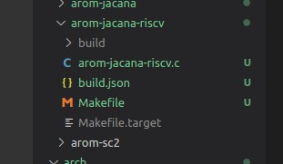
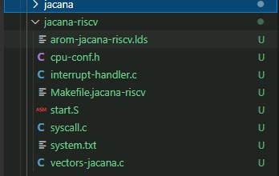
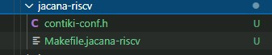
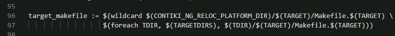

The Internet for server :

```html
https://sh2-cis01.asrmicro.com/guacamole/#/client/MjUAYwBwb3N0Z3Jlc3Fs
https://sh2-cis01.asrmicro.com/jenkins/view/gerrit/
```

[jenkins](https://sh2-cis01.asrmicro.com/jenkins/view/gerrit)  

[server](https://sh2-cis01.asrmicro.com/guacamole)

### 7.20

> 1. About Burn : Use  Aboot, click Release, choose correspond file, click download.  
> 2. How to know burn successsful? Add flag in log.  
> 3. Map network dirve. Click network, find ip in service.

---

### 7.21

1. burn craneG:
   
   - Use the compiled code in gerrrit, for the code in ubuntu cannot download in PC.
   - Run sscom.exe and press RESET buttton, then you can see the version.Replace the old file with the new file in version folder.  
   - Run Aboot.exe and click Release dashboard, choose the correspond chip, click Release button. After release finished, click the Download button. Specially, press the RESET button and the DOWNLOAD button in DKB and the chip will enter burn program mode.
   - Note: You can read the log output of sscom to check the code.  

2. git command:
   
   ```git
   git checkout . : back file to workspace
   git status -s  : view the file information  
   ```

3. cd command:  
   
   ```linux
   cd /        : root 
   cd ~        : home
   cd -        : return to before dir when enter this dir.
   cd ..       : return to the previous dir.
   cd ../..    : return to the dir before previous dir.
   ```

4. vim complier:
   
   - commamd mode : use i, a, o etc to enter input mode. ues '': ' to enter the last line mode.
   - input mode : edit
   - the last line mode : use q, w etc to quit the vim. **Note** the ESC can quit this mode anytime.

---

### 7.22

1. STAR PROCESSOR  
   
   - LSR : logical shift right
   
   - ASR : arithmetic shift right
   
   - ROR : rotote right
     
     > Note : the difference between LSR and RSR is the sign bit. ASR  sign bit is contant, while LSR donot have sign bit, and its highest bit is 0.

2. Saturating Instruction. This instruction is to prevent the calculation results overflow.

3. Contiki-NG OS.

---

### 7.25

1. Learn concepts and advs. about Contiki OS, and details log in notebook.
2. Create hello-world project. The initial OS has example folder, but also has hello-world.c file. Just follow the tutorial.

---

### 7.26

1. Complie project in Ubuntu, generate .out file and run the file.

2. Learn difference between and gcc and make. The first, gnu, used only for compling, but make inclues gcc command in makefile.

3. Git command. 
   
   - rm filename : delete filename in local PC.
   - git status -s : show file status in short.

4. PROCESS_THREAD used list type to design.

5. C
   
   - typedef : 
     
     ```c
     typedef unsigned int UINT; //replace UINT to int, the later replace the former
     
     typedef struct Count{
        int x;
        int y;
        int c;
     }NUM;    //NUM replace Count various.
     
     typedef struct Count{
        struct Count *p_Count;  //struct Count donot omit.
     }*pC;  //define struct Count point *pC
     ```

6. Function Pointer
   
   ```c
   int (*p)(int, int ) //The later brackets are parameters.
   // The * is return value.
   ```

---

### 7.27

Today did one thing: write a bug.

---

### 7.28

1. Do not use numbers in code; use the macro replace it. The numbers is called devil numbers.

2. "_A" : use in library function 
   
   ```c
   _func_ : const char type array, storage the current function name.
   _FILE_ : string type, storage file name.
   _TIME_ : string type, storage compile time.
   _LINE_ : int type, storage line number.
   _DATE_ : string type, storage complie data.
   ```

3. extern C : compile in C style.

4. ifdef : 
   
   ```c
   #ifndef _LOG_H_ //if it do not include __LOG__H__, then define ....
   #define _LOG_H_
   #endif
   ```

5. macro:
   
   ```c
   ... // args list
   _VA_ARGS_ ;//various macro
   ```

6. LOG : use output info via comport. Note: rank different log, then when accomplished can omit low-level log.

7. how to make pointer point address: int* p = (int *) 0x100;

> **Note：** Log detailed after today. 

### 7.29

1. Learn how to output log in flasher mode.
2. Read the revelant code in emmc, understand read codes and write codes.
3. Read macro code in project.

### 8.1

1. Make test code successful.

2. Be familiar with PROCESS, and make clear the PROCESS how to run.

3. The last task: test access 0xd1f00000 via DMA in eMMC.   
   **Note:** the most important part is accessing the memory via DMA, by means of read().  

4. TASK:
   
   > - ARM->RISC-V.

5. Details:
   
   - static various : just global variable, meaning the init of various. It's `changeable`.
   - macro : the replace various in code, it's unchangeable.

---

### 8.2

1. Read ARM-R/M cortex about startup and details write in future.
2. Modify test_process.c file
   - printf should not addr of *p at the same as printf content of *p.
   - 32bit OS, 0xAA, 0x00, 0x00, 0x00.
3. eMMC file write() and read() means write data to eMMC nor flash and read to assigned addr.

---

### 8.3

1. Do task same as yesterday.
2. > Note:
   > - probe is init in project.  
   > - make cmd: add cmd as `USEMODULE += FLASH` and `CFLAG += -DUSE` in makefile. 
3. >  Aboot:
   > - when burn in ③, press RST at the same time press DWL **all the time**.
   > - when burn in ②, press DWL **all the time** at the same time press RST.

---

### 8.4(Thu.)

1. Complete the work that was not done yesterday--test_process in boot2 successful.
2. There are many problems. But details is the key to accomplish work.
3. ```c
   if(cnt++)//cnt++ --> cnt += 1 This is a equation, that means is judged to be true.  
   ```

---

### 8.5(Fri.)

1. do nothing because of acid reflux.

---

### 8.8(Mon.)

1. ```c
   _attribute_((weak))//weak func.,means declare a func. If user define the func, compile user, or compile weak.
   ```
   
   void *p // no point type, means do not use the various
   void data //means do not use 
   
   char *p = 0 // means a null pointer
   char *p, p = 0

2. extern : use for declare static or global various, convenient for calling of other partition.

3. uintptr_t : unsigned int, alignment

4. typeof: receive the return value of the function.

---

### 8.9(Tue.)

1. ```c
   __attribute__(noinline)//no inline function
   ```

---

### 8.10(Wed.)

1. Read some summaries and write down.

---

### 8.11(Thu.)

1. New Targets: Replace cm4 in cpu/arch/jacana with RISC-V.

---

### 8.12(Fri.)

1. Read some material about RISC-V.

---

### 8.15(Mon.)

1. Learn the book named RISC-V Reader.   

---

### 8.16(Tue.)

1. Read book about RISC-V.
2. Write relevant content down.

---

### 8.17(Wed.)

1. Read book about asm.
2. Write relevant content down.

---

### 8.18(Thu.)

1. Install RISC-V compile environment.

---

### 8.19(Fri.)

1. Install RISC-V compile environment totally.
2. Run a test program in RVE.

---

### 8.22(Mon.)

1. Try to figure out the problem that raised in meeting yesterday.

---

### 8.23(Tue.)

1. Go on.(The task were not accomplished yesterday).

---

### 8.24(Wed.)

1. Go on.
2. Read RISC-V ISA.

---

### 8.25(Thu.)

1. Nothing.

---

### 8.26(Fri.)~9.1(Thu.)

1. Log in note book.

---

---

---

### 10.24(Mon.)

    Read makefile in arm, cortex-m, cm4.                                          

---

### 10.25(Tue.)

**书写Makefile总结：**

1. Makefile中PROJECT名称要跟该项目下的.c文件相同

2. 在Makefile中的include要记得看路径是否正确

---

### 10.26(Wed.)

1. 出现问题的地方可能与make的隐含规则或者默认规则有关
2. $(strip <string> )
   #名称：去空格函数——strip。
   #功能：去掉<string>字串中开头和结尾的空字符,并将中间的多个连续空字符(如果有的话)合并为一个空字符。
   #返回：返回被去掉空格的字符串值。
   #说明: 空字符包括　空格,tab等不可显示的字符
3. Try to make clear helloWord in contiki-os

---

### 10.27(Thus.)

1. Understand the helloworld in example how to work

2. The "contiki-conf.h" 在platform中native文件夹目录下

3. 代码规范：`.`(表示当下目录)最后单写一行，不然阅读时候很容易漏掉

---

### 10.28(Fri.)

contiki-os的使用：

1. 在app文件夹中建立自己的项目文件夹；

2. 文件夹中包含Makefile，Makefile.target,以及同项目名称的.c文件；如下：

3. 上图中的Makefile中应该包含如下代码:
   
   ```makefile
   #默认代码如下：
   CONTIKI_PROJECT = arom-jacna-riscv #此处名称要与改目录下的.c文件一致
   all: $(CONTIKI_PROJECT)
   
   CONTIKI = ../..
   include $(CONTIKI)/Makefile.include
   # 公司添加了一些版本号代码等
   ```

4. Makefile.target中应该包含：
   
   ```makefile
   TARGET = jacana-riscv
   ```

---

5. 在arch（架构）下建立文件夹，名称同4.中的TARGET名称，如下：
   

        其中，必须包含的有`.lds`、`Makefile.jacana-riscv`文件，其余的看情况添加

---

6. 在platform中同样建立同名文件夹，名称同4.中的TARGET名称，如下：
   

        其中，两个文件都是要包含的，其余的文件看情况添加

---

7. 下面说一下各个文件是怎么内嵌的：
   
   - 首先，app（即3.）项目文件下的Makefile中添加了`Makefile.incule`，该文件是CONTIKI-OS自带的——`Makefile.include`中实现了添加自带的所有Makefile，其中最有关联的是`Makefile.dir-variables`与`Makefile.identify-target`；
   
   - `Makefile.identify-target`中实现了找TARGET的功能，如果找到了TARGET，则使用定义的Makefile；若没找到，则使用`TARGET = native`；所以4.中定义了`TARGET=jacana-riscv`
   
   - 接着`Makefile.include`中通过以下命令在`platform`文件夹中找TARGET同名文件下的Makefile，如下：
   
     
     ```makefile
        target_makefile := $(wildcard $(CONTIKI_NG_RELOC_PLATFORM_DIR)/$(TARGET)/Makefile.$(TARGET) \
                    $(foreach TDIR, $(TARGETDIRS), $(TDIR)/$(TARGET)/Makefile.$(TARGET)))
     ```
   
   - 在`platform`中的`Makefile.jacana-riscv`（见6.）里面最后要包含arch(5.)中的`Makefile.jacana-riscv`路径，如下：
   
   
   - 在arch下的目标文件下Makefile(见5.)中要包含文件所用的架构（如arm、riscv等）的Makefile，如下：
   
   
   - 在`Makefile.riscv`中则定义了工具链，以及CFLGAS、LDFLAGS等编译参数
   
   - `Makefile.dir-variables`中则包含了`OS`中的所有路径文件，这对于编译项目很有用，项目中一定会用到`OS`的文件
